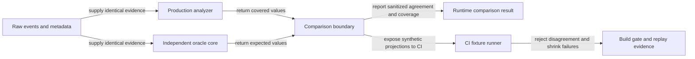

# Telemetry Internals

How telemetry is built, for people changing it. User-facing behavior is in
[Telemetry](../user/reference/telemetry.md).

## Modules

| Module | Owns |
| --- | --- |
| `scripts/cli/telemetry-capture.mjs` | The hot hook path, `roborepo telemetry capture`. A minimal-import module so every hook invocation does not pay to load the portal/config/analysis dependency graph — a `node` cold-start just to append one JSONL line. |
| `scripts/cli/telemetry-metrics.mjs` | The metrics registry: every formula, unit, and direction. UI components never define their own formulas. |
| `scripts/cli/telemetry-cohort.mjs` | The normalized cohort filter shared by the CLI and portal. |
| `scripts/cli/telemetry-compare.mjs` | Marker-relative comparison. |
| `scripts/cli/telemetry-analyze.mjs` | Analysis, including the exploratory midpoint `regression()`. |
| `scripts/cli/telemetry-policy.mjs` | Package telemetry policy validation and evaluation. |
| `scripts/cli/telemetry-markers.mjs` | `createMarker()`, shared by the CLI and the portal's marker dialog. |
| `scripts/cli/telemetry-task-infer.mjs` | An analysis-time task inference path with no live caller; outcome categories are always explicit. |

## Analytics Correctness

The analysis is one pipeline: `analyzeTelemetry()` normalizes events into observations, keeps one
representative row per operation (`canonicalFlowRows`), derives spikes, loops, read warnings and
tool costs from those rows, then always builds the conditions report from the same findings. There
is no second "legacy" rollup. Sessions are identified by `[harness, session_id]` everywhere; a bare
`session_id` is never a key, because providers reuse ids across harnesses.

Each rule below is an invariant a change must not break, with the code that holds it and the check
that fails if it breaks. When adding analytics, add the rule's check first.

| Invariant | Held by | Enforced by |
| --- | --- | --- |
| Correlation only, never causal wording | `buildFinding`, `comparisonPresentation`, `changePresentation` | `telemetry-compare-check`, `telemetry-conditions-presentation-check` |
| Unknown condition data is not absence; known presence is compared only with known absence | `aggregateCondition` cohorts; `unknown_condition` on change comparisons | `telemetry-conditions-matrix-check`, `telemetry-audit-tier1-check` |
| Thin evidence never yields a percentage or a direction (minimum cohort, minimum events, 20% display band) | `CONDITIONS_POLICY` in `telemetry-observations.mjs`; both presentation functions | matrix check, presentation check (equal, near-equal and below-floor cases) |
| Mirrored rows never double-count | `canonicalFlowRows` | `telemetry-conditions-check` (duplicate flows) |
| One session id under two harnesses stays two sessions; loops never cross harnesses | `sessionKeyOf` in `telemetry-analyze.mjs` | `telemetry-conditions-check` (collision, alternating-harness loop) |
| Midpoint per-call regression never divides equal timestamps; without a distinct time boundary it is unavailable | `regression` in `telemetry-analyze.mjs` | `telemetry-oracle-check` (fixed tie regressions) |
| Boundary sessions are excluded, not assigned; one rule for every marker | `splitObservationBoundary`, which `splitCohortsByMarker` delegates to | `telemetry-boundaries-check`, `telemetry-audit-tier1-check` (equivalence) |
| An unknown-scope marker is "can't compare fairly", not "too little data" | `compareObservationBoundary`, `compareAcrossMarker` | `telemetry-audit-tier1-check` |
| Ledger ties break on persisted order | ledger sort in `telemetry-conditions.mjs`, `ambientChanges` | `telemetry-audit-tier1-check` |
| A supersede names a real, active change marker | `assertSupersedable` in `telemetry-markers.mjs` | `telemetry-audit-tier1-check` |
| Marker corrections keep packages, skills and tags, and never move the boundary silently | `conditions-change-form.js` | portal UI spec "mark change records backdated scope" |
| Findings that cannot be tied to a session are counted, not silently dropped | `data_quality.findings_lost_to_fallback` | `telemetry-audit-tier1-check` |
| The demo must not confound the intervention with repo or model | `telemetry-conditions-demo.mjs` | `telemetry-conditions-presentation-check` |

Known limits, so they are not mistaken for bugs:

- The waste card counts each turn once (`telemetry-waste.mjs`): loops, redundant reads, spike excess
  and testing each nominate turns with a token amount, and the largest nomination wins, so category
  totals add up to the headline. The families still use different measurement bases (hook deltas vs.
  characters/4 for reads), and over-testing counts only full-suite reruns with no edit since the previous test run.
- Token tables skip captures with no token data; the session count includes them.
- Every comparison is an association. Task mix, model and repository can differ between cohorts.
- The bundled demo is synthetic and deterministic; it exercises the pipeline, not real usage.

### Independent oracle

The oracle protects against arithmetic errors by computing covered values again from raw events.
Its five core modules import only Node built-ins and each other. They share no production analysis
or presentation helpers, fixtures, logging, or filesystem reads.

| Module under `scripts/cli/` | Owns |
| --- | --- |
| `telemetry-oracle-observations.mjs` | Raw acceptance, operation deduplication, harness-scoped sessions, and independent repository identity resolution. |
| `telemetry-oracle-findings.mjs` | Spike, loop, and read-warning detection. |
| `telemetry-oracle-cohorts.mjs` | Condition rates, marker boundaries and exclusions, and locally encoded evidence policy. |
| `telemetry-oracle-regression.mjs` | Per-call regression at distinct timestamp boundaries. |
| `telemetry-oracle-run.mjs` | Independent calculation and evidence coverage inspection. |
| `telemetry-oracle-compare.mjs` | Black-box production invocation, covered projections, and sanitized comparison output. This boundary alone knows both implementations. |

The CI runner, `scripts/test/telemetry-oracle-check.mjs`, owns the bundled demo, fixed regressions,
seeded spools, and failure shrinking. It uses the independent core and the same comparison
projections as the runtime boundary. Synthetic failures retain detailed values and replayable
JSONL; live comparisons return only aggregate counts, fixed coverage categories, and disagreeing
field names. Exceptions yield a fixed error category rather than the original message.



An oracle pass establishes agreement on harness-scoped session and token-session counts, operation
deduplication, affected-session condition rates, marker cohorts and exclusions, evidence gating,
per-call regression, and harness-local loops. Unrelated dashboard totals, insight prose, marker
persistence, approximate waste attribution, and browser rendering retain their focused checks.

`compareTelemetryOracle()` reports one of four comparison statuses:

| Status | Meaning |
| --- | --- |
| `passed` | Covered values agree and supplied evidence has no coverage gaps. |
| `partial` | Covered values agree, but evidence is incomplete or unresolved. |
| `failed` | Comparable input produces disagreement on covered fields, even if coverage is incomplete. |
| `unavailable` | Input is empty or unsafe to compare, or a calculation throws. |

The portal does not yet invoke this comparison, retain its result, or expose a health endpoint or
badge. Scheduling, worker isolation, and freshness validation remain in the
[live observer plan](../plans/active/telemetry-analytics-oracle-live-observer.md).

### Verification layers

| Layer | Primary check | What a pass establishes |
| --- | --- | --- |
| Capture and schema | telemetry capture/schema checks | Persisted events have the supported shape and provider fields. |
| Analytics arithmetic | `telemetry-oracle-check` | Covered values agree with an independent raw-event implementation. |
| Oracle independence | `telemetry-oracle-core-check` | Imports respect the core boundary; calculations preserve inputs and evidence-policy behavior. |
| Live comparison contract | `telemetry-oracle-live-check` | Unsupported evidence prevents a pass; injected disagreements fail; output excludes raw values and exception text. |
| Presentation rules | conditions presentation checks | Thin evidence, neutral bands, and correlation-only language are presented honestly. |
| Browser integration | portal UI suite | The report reaches the Tokens page and its interactions render correctly. |

Run `npm run test:telemetry-oracle` for the deterministic comparison summary. Run
`node scripts/test/telemetry-oracle-core-check.mjs` and
`node scripts/test/telemetry-oracle-live-check.mjs` for the runtime boundary checks. All three belong
to the `ci` check group run by `npm run check`. The synthetic CI summary lists case and evidence
counts; a failure includes the seed, disagreement, metadata, and minimized replayable JSONL.

### Live evidence support

The independent acceptance rules follow the analyzer's raw acceptance boundary in
`telemetry-observations.mjs`, repository resolution in `telemetry-repository.mjs` and
`modules/repositories/associations.mjs`, and snapshot/marker condition semantics in
`telemetry-conditions.mjs` and `telemetry-boundaries.mjs`. Bare tool attribution was checked against
`mcpServerOf()` in `scripts/harnesses/transcript-parse.mjs`. These are reference sources, not imports
of the independent calculation modules.

| Raw evidence form | Independent handling and coverage |
| --- | --- |
| Capture schema absent/null, `2`, or `3` | Supported. Exact v3 calls deduplicate by harness/session/call; derived or missing calls use capture/content fallback. |
| Explicit schema `1`, other versions, non-object rows, unidentified sessions, invalid timestamps, malformed token fields | Explicit unsupported/malformed categories; live comparison is `unavailable`. Such rows never disappear into a pass. |
| Direct `repo.repository_id` | Supported and takes precedence over legacy hashes. Malformed values are unsupported. |
| `repo.normalized_remote_hash` with raw registry evidence | Independently hash each registry `normalizedRemote` with SHA-256, truncate to 24 hex characters, and resolve its canonical `id`. Conflicting hash identities make the input unavailable. |
| Missing repository data, unmatched normalized hash, `remote_hash`, `git_root_hash`, basename/label, or path-only evidence | Unresolved. Neither a label nor a path hash establishes canonical identity; agreeing calculations remain `partial`. |
| Token data absent/null | Supported absence; session and token-session counts remain distinct. |
| Missing model, missing referenced snapshot, unknown snapshot evaluability, or conflicting session condition evidence | Counted coverage gaps; agreeing calculations remain `partial`. A session that changes snapshot IDs is conservatively partial. |
| Snapshot schemas `1` and `2` | Independently evaluate package/skill arrays and v2 evaluability. Unknown schemas, malformed arrays, and duplicate IDs make input unavailable. |
| Native `Read`, `Grep`, `Glob`, `Bash`, `Edit`, `Write`, `NotebookEdit`, and prefixed `mcp__...` tool names | Supported. Other bare names, including production-recognized bare MCP aliases, are explicitly `unsupported_bare_tool`; independent alias support remains a possible later extension. |
| Marker schemas `1` and `2` | Supported arithmetic for active change markers watching spike, loop, and read-warning. Unknown scope, missing watched kinds, or unresolved supersede references prevent a pass. |
| Unsupported watched kinds such as `over-testing`, malformed/unknown markers, or duplicate marker IDs | Input unavailable. Phase, outcome, experiment, and note markers have no covered change projection. |
| Filtered analysis options or a caller-supplied production hash index | Unsupported. The live boundary accepts an unfiltered snapshot plus raw repository registry evidence. |
| Reader-skipped or malformed persisted records | The reader supplies nonnegative counts through `skippedEvidence`; any positive count prevents a pass. The planned worker must wire this contract. |

`inspectOracleEvidence()` counts supplied event rows and fixed coverage categories before analysis.
`compareTelemetryOracle()` compares the same full in-memory event array on both sides when its
shape is comparable; it does not filter away unsupported rows to manufacture agreement. An unsafe
shape returns `unavailable` without invoking analysis. Interpretable unknown conditions can still
be compared, but agreement returns `partial`.

The live comparison returns aggregate counts, coverage categories, and names of disagreeing
projection fields. CI uses the same core and comparison projections while retaining its synthetic
values, shrinker, and replay output. The comparison result describes agreement over the supplied input. A current health result also
requires the versioned schema, signature validation, and worker lifecycle planned in
[Phase 5](../plans/active/telemetry-analytics-oracle-live-observer.md#phase-5-isolated-live-observer).

## Configuration Snapshots

The snapshot builder is dynamic-imported only on `SessionStart`, to keep the hot capture path's
import graph small. `readConfigSnapshot()` has documented gaps (no full hook command strings, no MCP
server registration detail, no parsed Codex `config.toml`), recorded as `unavailable` dimensions.

## Portal Page

The `/tokens` page (`portal/tokens/`) is a frameworkless, dependency-free page polling `/api/data`
every 5 seconds. See `docs/internal/portal-architecture.md` for the shared portal architecture
(loopback bind, mutation-token contract, route dispatch). Telemetry-specific pieces:

- **Session detail** — model history, the session's configuration snapshot (id +
  packages/skills), a phase timeline, semantic operation totals, its explicit outcome/task category
  (marked `source: "explicit"`), markers within a 15-minute
  window of the session, and data-quality flags — alongside the "surface chat context" /
  copy-prompt / transcript-open actions.
- **Marker creation** — the conditions section's "+ Mark a change" dialog posts through
  the same validation/persistence path as the CLI (`createMarker` in `telemetry-markers.mjs`); no
  browser-side duplication of marker rules.

## API

- `GET /api/data?range=&end=&harness=&model=&repo=&marker_id=` — the full analysis report, cohort-
  scoped. Response includes `available_harnesses`/`available_models`/`available_repos`/
  `available_metrics`, window-scoped `markers`, `experiments`, `testing_efficiency`, `cohort`
  (present when a model/repo filter is active), and `marker_comparison` (present when `marker_id`
  resolves).
- `GET /api/session?id=&harness=&finding=&repo=` — bridges a flagged event to its transcript, plus
  `spool_context` (model history, config snapshot, phase timeline, operation totals, outcome, nearby
  markers, data-quality flags) derived from the spool alone, present even when the transcript itself
  is not found on disk.
- `GET /api/insights-llm` — on-demand LLM synthesis of deterministic facts (may take seconds).
- `GET/POST /api/telemetry/markers` — list or create a marker. POST reuses `createMarker()`.
- `GET/POST /api/telemetry/experiments`, `POST /api/telemetry/experiments/:id/end` — list, start, or
  end an experiment. Reuse `startExperiment()`/`endExperiment()`.
- `POST /api/telemetry/analysis` — `{ metric, marker_id }` for a marker-relative comparison, or
  `{ metric, cohort_a, cohort_b }` for a direct two-cohort comparison (no before/after language — no
  shared timestamp to split sessions around). Validates the metric id against the registry and
  returns `400` for an unknown one along with the full known-metric list.
- `GET /api/telemetry/guide` — server-rendered `docs/user/guides/telemetry.md`, backing the page's
  "view docs" popup (`portal/shared/doc-guide-modal.js`) so the popup and the on-disk guide are
  the same content, never a second copy. `renderMarkdown()` (`scripts/cli/markdown-render.mjs`)
  gives every heading a stable slug `id` so a panel's info icon can deep-link straight to its
  section; fenced ` ```mermaid ` blocks render as diagrams through the locally vendored mermaid
  runtime (`portal/shared/markdown-mermaid.js`), loaded lazily on first use.

All mutating routes are POST-only and use the portal's standard loopback-origin + mutation-token
guard (see `docs/internal/portal-architecture.md`).

See [Portal Architecture](portal-architecture.md) for the shared server, route, and mutation-token
architecture.
