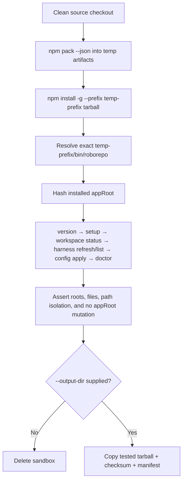

# RoboRepo Packaging 01: Prepare a Clean New-Mac Installation

## Scope ownership

This plan owns the immediate transition from developing RoboRepo on the current Mac to installing a
locally packed snapshot on a clean new Mac, validating that installation, and then continuing normal
development from a separate source checkout.

The packaging suite divides unresolved work across four non-overlapping owners:

| Replacement plan | Exclusive ownership |
| --- | --- |
| `infra-packaging-01-new-mac-install` | Local `npm pack` artifact, isolated real-package smoke test, retained transfer artifact, clean new-Mac installation, workspace migration, and packaged/development entry-point coexistence |
| `infra-packaging-02-install-lifecycle` | Repeatable install/update/repair/verify/uninstall behavior, backups and collision handling, PATH and shell integration, moved-checkout recovery, upgrade/downgrade safety, and preservation of user-owned data |
| `infra-packaging-03-npm-release` | npm package identity and metadata, beta/stable publication, release automation, registry verification, and npm-channel documentation |
| `infra-packaging-04-homebrew` | Homebrew tap and formula, release archive/checksum consumption, Cellar/libexec layout, brew upgrade/uninstall behavior, and Homebrew documentation |

No requirement should appear as executable work in more than one plan. Completed architecture—such
as the `appRoot`/`workspaceRoot`/`stateRoot` separation and package-mode write guards—remains
documented by the current code and durable architecture/install documentation rather than being
copied into another backlog checklist.

`package-cli-test-guide` is not part of this split. It remains a separate, optional end-to-end test
of custom content and CLI/portal behavior after installation. This plan also does not absorb or
block `antigravity-cli-provider-integration`, the future permissions production-readiness overhaul,
or package desired-vs-observed state reconciliation. Provider-specific defects may be visible after
installation, but they are not evidence that package installation itself failed.

## Summary

Create one repeatable, zero-dependency package-install smoke workflow that builds the same npm
tarball a user would receive, installs it into an isolated npm prefix and temporary home, runs the
minimum package-mode workflow, and proves runtime commands do not depend on or mutate the source
checkout.

The same runner will optionally retain the exact tarball that passed, together with a checksum and
small provenance manifest. Retained-artifact mode requires a clean Git worktree so the recorded
source commit describes the bytes being transferred. That artifact can be transferred to the new Mac
and installed before the repository is cloned. After the clean install is verified, the repository can be cloned separately
and development can continue through `./bin/roborepo` while the global `roborepo` command remains a
known packaged snapshot.

## Context

The package foundation already exists:

- `package.json` declares `codethings-roborepo-alpha` `0.1.0-beta.0`, the `roborepo` binary, an explicit
  `files` allowlist, ESM mode, and Node `>=20`.
- Package mode separates `appRoot`, `workspaceRoot`, and `stateRoot` and prevents runtime writes to
  the installed application root. This was verified against a real installed tarball: `setup` and
  `config apply` leave a hash of the installed `appRoot` byte-identical.
- An earlier manual packed-tarball installation exposed a broken artifact: the `files` allowlist
  omitted two runtime directories, so every command failed immediately on the installed package
  (`ERR_MODULE_NOT_FOUND` for `scripts/harnesses/registry.mjs`, imported by
  `scripts/cli/command-catalog.mjs`; and `modules/`, imported by `scripts/cli/plans.mjs`,
  `localhoster.mjs`, `repositories.mjs`, and `telemetry-capture.mjs`). Both entries were added to
  `package.json`'s `files` array in `e72a943` (`fix(package): ship missing runtime dirs and unify
  workspace resolution`), and the installed package now runs correctly: `version` reports package
  mode with an npm-owned `appRoot`, and `doctor` passes with no harness installed. Restoring a
  working tarball is therefore already done, not an open prerequisite of this plan.
- `scripts/test/test-roborepo.sh` exercises package-mode behavior against a constructed fake
  application root, while `scripts/test/package-install-smoke.mjs` now installs the actual npm
  tarball into an isolated prefix and temporary home.
- `.github/workflows/ci.yml` runs doctor, the repository test suite, and the package catalog and
  lifecycle checks on macOS and Linux, plus a Windows installer parse job, but it does not execute
  the globally installed package artifact.
- `package.json` defines `pack:dry-run`, `pack:smoke`, `test:package-install`, and
  `prepare:new-mac-install`. The package-install smoke runner exists and is the guard for the real
  transfer artifact.

The remaining transition risk is therefore not broad feature completeness. It is accidental
coupling to the checkout: omitted package files, a binary that resolves the wrong root, writes into
`appRoot`, hidden source-path references, or a shell resolving a development symlink instead of the
installed command.

## Current code touchpoints

| Path | Current responsibility | Expected change |
| --- | --- | --- |
| `package.json` | Package identity, `bin`, runtime file allowlist (`scripts/harnesses/` and `modules/` already present), Node requirement, and npm scripts | Register the smoke and retained-artifact commands; change the allowlist further only when the real install exposes another missing runtime file |
| `scripts/harnesses/` and `modules/` | Harness registry and the `plan-docs`/`localhoster`/`repositories` modules, both imported by the CLI at runtime | Already packaged (`e72a943`); no further change expected |
| `bin/roborepo` | Packaged executable entry point | No planned behavior change; the smoke runner invokes the installed copy directly |
| `scripts/cli/roots.mjs` and `scripts/cli/paths.mjs` | Resolve package/development mode and application, workspace, state, and harness paths | Consume through command output; fix only if the real artifact reports an incorrect root |
| `scripts/cli/workspace.mjs` | `setup`, workspace initialization/status/import, and package-mode workspace behavior | Exercised by the smoke workflow; no speculative rewrite |
| `scripts/doctor.sh` | Repository and installed-package health checks | Exercised from the installed artifact; preserve package-mode skipping of development-only files |
| `scripts/test/test-roborepo.sh` | Fast repository and simulated-package behavior coverage | Remains separate; do not embed the slower global-prefix installation in this runner |
| `scripts/test/package-install-smoke.mjs` | Real-artifact orchestrator | Maintains pack, isolated install, command execution, hashing, assertions, cleanup, zero-harness PATH isolation, and optional artifact retention |
| `manifests/platform/source-files.tsv` | Declares source/runtime files and package-mode applicability | Update only when the smoke test proves a required packaged file is missing or mis-scoped |
| `.github/workflows/ci.yml` | macOS/Linux repository validation matrix | Add one explicit package-install smoke step to both legs |
| `docs/user/guides/install-workflows.md` | User-facing installation choices | Add the implemented local-tarball/new-Mac workflow after behavior is verified |

## Goals

- Test the real packed artifact, not a simulated package directory.
- Install without writing to the machine's real npm prefix, home directory, harness homes, or
  RoboRepo state.
- Prove the package works before any RoboRepo source checkout exists in the test environment.
- Run `version`, `setup`, `workspace status`, `harness refresh`, `harness list`, `config apply`,
  and `doctor` from the installed binary.
- Prove `appRoot` is inside the isolated npm prefix and remains byte-identical after runtime
  commands.
- Prove workspace and state are created outside `appRoot` under the temporary home.
- Prove generated state and configuration do not contain the source checkout path or fragile references to a version-specific npm installation directory.
- Retain the exact tested tarball, SHA-256 checksum, and source-commit/package-version provenance
  when preparing the new-Mac transfer.
- Document the old-Mac preparation, clean new-Mac install, later workspace migration, development
  checkout, and rollback paths.
- Keep provider-specific failures distinguishable from package-installation failures.

## Non-goals

- Publishing to npm or preparing a public beta.
- Creating a Homebrew formula.
- Declaring RoboRepo feature-complete or production-ready.
- Fixing Antigravity paths or capabilities.
- Reworking permissions, approval policy, or package-state reconciliation.
- Exercising the full custom MCP, custom skill, package toggle, and portal workflow.
- Copying the entire existing `stateRoot` to the new Mac.
- Proving upgrade and downgrade behavior between released versions.
- Supporting Windows in this machine-transition story.

## Proposed design

### Command surface

There is no top-level `roborepo apply`. The root commands are `doctor`, `update`, `version`, `web`,
and `web-stop`. Re-applying configuration is `roborepo config apply`
(`manifests/platform/cli/command-definitions/config/apply.command.json`). `roborepo update` aliases
to `config apply` in package mode and prints a notice that it does not download packages, so the
smoke runner uses `config apply` directly to test the applying behavior without the alias
indirection.

### One runner, two modes

Add `scripts/test/package-install-smoke.mjs` as a Node ESM orchestrator with no third-party
dependencies.

```text
npm run test:package-install
```

runs entirely in temporary directories and deletes its output after success or failure.

```text
npm run prepare:new-mac-install -- --output-dir <artifact-dir>
```

runs the same smoke path but retains the already-tested tarball and writes:

```text
<artifact-dir>/
  codethings-roborepo-alpha-<version>.tgz
  codethings-roborepo-alpha-<version>.tgz.sha256
  install-manifest.json
```

`install-manifest.json` records the package name, version, source commit, tarball filename, checksum,
and the smoke commands that passed. The retained artifact must be the same file installed during
the smoke run; do not pack a second untested tarball afterward.

### Smoke workflow



The runner must invoke the exact executable under the isolated prefix. It must not rely on whichever
`roborepo` happens to appear first on the developer's `PATH`.

This shape is already known to work; the runner is an automation of it:

```sh
sandbox="$(mktemp -d)"
tgz="$(npm pack --pack-destination "${sandbox}" --json | node -p 'JSON.parse(require("fs").readFileSync(0,"utf8"))[0].filename')"
npm install -g --prefix "${sandbox}/prefix" --cache "${sandbox}/cache" "${sandbox}/${tgz}"
HOME="${sandbox}/home" ROBOREPO_MODE=package ROBOREPO_PRESETS_ONBOARD=skip \
  "${sandbox}/prefix/bin/roborepo" version
```

The installed application root is `<prefix>/lib/node_modules/@codethings/roborepo`, which is the path to
hash for the immutable-root assertion.

### Assertions

The runner should fail with a focused message when any invariant is false:

| Invariant | Required assertion |
| --- | --- |
| Real package artifact | `npm install` consumes the `.tgz` emitted by the current run |
| Package entry point | the invoked executable is `<prefix>/bin/roborepo` on macOS/Linux |
| Package mode | `roborepo version` reports package mode |
| Installed application root | reported `appRoot` resolves inside the isolated npm prefix and not inside the checkout |
| User-owned roots | reported `workspaceRoot` and `stateRoot` resolve under the temporary home and outside `appRoot` |
| Workspace initialization | `workspace.json` and required workspace directories exist after `setup` |
| Normal application | `config apply` and `doctor` complete without requiring a source checkout or an installed harness |
| Immutable application | a deterministic hash of `appRoot` before and after runtime commands is identical |
| No source coupling | files created under the temporary home do not contain the absolute source-checkout path |
| No version-specific install coupling | generated harness files and workspace records do not retain the concrete versioned npm package directory; `~/.roborepo/install-state.json` is excluded (see below) |
| Artifact provenance | retained checksum and manifest describe the exact tarball that passed |

#### `install-state.json` is an intentional exception

The version-specific-path scan must exempt `install-state.json`. Its `repo` field is not a cache of
the current application root — it records **which installation last wrote files into the home
directory**, and its value is expected to go stale.

roborepo installs by placing symlinks in harness homes (`~/.claude`, `~/.codex`) that point back at
the installing root. `uninstall` and `repair` later have to decide whether a given link in a user's
home directory is roborepo's to remove. `is_managed_link` in `scripts/install/uninstall-lib.sh`
answers that by matching the link target against the current `repo_root`, the recorded prior root,
the skill cache, or a dangling target. The recorded prior root is what lets a *new* install reclaim
links left behind by an *older* one, which is exactly the npm-upgrade case: after
`0.1.0-beta.0` → `0.1.0-beta.1`, harness homes still hold links into the previous versioned
directory, and `recorded_repo` is how `repair_cleanup_target` in `scripts/install/repair.sh`
recognizes and re-points them instead of returning early and leaving them stale.

So "stable command or application-root resolution" is not sufficient here: remembering a root that
is deliberately no longer current is the field's purpose. Asserting against it would fail the smoke
run on correct behavior. The strict assertion still applies to generated harness configuration and
workspace records, which a real run confirms are free of the versioned path today, so the check
keeps its value as a regression guard.

Use Node filesystem traversal and `crypto` hashing rather than platform-specific `find`, `sed`, or
checksum flags. Keep the top-level orchestration near the top of the module and place focused helper
functions below it. If the file grows beyond the repository's normal size boundary, split hashing,
process execution, and output-manifest responsibilities by ownership rather than creating generic
utility buckets.

### Verified baseline

The workflow below was executed by hand against a real tarball (packed with the two allowlist
entries added, installed into an isolated `--prefix` with a temporary `HOME`). Implementation should
reproduce these results, not rediscover them:

| Check | Observed result |
| --- | --- |
| `version` on the unpatched tarball | fails with `ERR_MODULE_NOT_FOUND` for `scripts/harnesses/registry.mjs` |
| `version` with `scripts/harnesses/` + `modules/` packaged | succeeds; `mode: package`, `appRoot` inside the isolated prefix |
| `setup` | exit 0; creates workspace and state under the temporary `HOME` |
| `config apply` | exit 0; reports `updated root config claude` / `updated root config codex` |
| `doctor` with no harness installed | exit 0, `doctor passed (98 checks)` |
| `appRoot` hash across `setup` + `config apply` | byte-identical before and after |
| Temporary-home scan for the checkout path | zero matches |
| Temporary-home scan for the versioned npm path | one match: `.roborepo/install-state.json` (`repo` field, expected) |
| Harness configs written into `HOME` | `.claude` and `.codex` present and free of the versioned path |

The `doctor` result matters most for the transition: it is the zero-harness case on a machine where
no Claude, Codex, or Gemini executable exists yet, which is the state of a new Mac before any agent
tooling is installed.

### Deterministic environment

The smoke runner creates separate temporary locations for:

- npm install prefix;
- `HOME`;
- `ROBOREPO_STATE_ROOT`;
- `ROBOREPO_WORKSPACE_ROOT`;
- npm cache;
- neutral working directory outside the checkout.

Set `ROBOREPO_PRESETS_ONBOARD=skip` (honored by `scripts/install/main.sh`) and any existing
noninteractive controls required by `setup` and `config apply`. Set `ROBOREPO_MODE=package`
explicitly: `scripts/cli/roots.mjs` otherwise infers mode by probing for `.git` and `local/skills`,
and the assertion should not depend on that heuristic.

Construct a minimal process environment that exposes only the current Node/npm toolchain and
required system utility paths, and assert that `claude`, `codex`, and `gemini` are not resolvable.
The zero-harness case is the transition baseline: an absent or unsupported harness must not prevent
RoboRepo itself from installing and initializing.

### CI placement

Register:

```json
{
  "test:package-install": "node scripts/test/package-install-smoke.mjs",
  "prepare:new-mac-install": "node scripts/test/package-install-smoke.mjs"
}
```

`--output-dir <artifact-dir>` is the single switch that selects retained-artifact mode: supplying it
retains, omitting it cleans up. There is no separate `--retain-artifact` flag, so the two modes
cannot disagree about whether retention was requested. Retained mode additionally requires a clean
Git worktree. Both npm scripts call the same implementation; only the caller-supplied output
directory differs.
Add `npm run --silent test:package-install` to the existing macOS/Linux CI matrix as its own step.
Do not bury this slower process-install test inside every invocation of
`scripts/test/test-roborepo.sh`; keep the fast repository suite and real artifact smoke test visible
as separate checks.

## Machine-transition workflow

### 1. Prepare the old Mac

Before creating the artifact:

1. Confirm the intended source commit is on `main` or another explicitly recorded branch.
2. Inspect `git status`, `git worktree list`, unpushed commits, untracked files, and stashes. Push or
   copy every piece of work that must survive the move.
3. Run repository validation:
   ```sh
   npm test
   npm run pack:dry-run
   npm run test:package-install
   bash scripts/doctor.sh --quiet
   ```
4. Record the current workspace location with:
   ```sh
   ./bin/roborepo workspace status
   ```
5. Preserve authored workspace content separately when it exists. Do not blindly archive all of
   `stateRoot`; enabled selections, caches, telemetry, and install metadata are machine-local unless
   a separate migration decision says otherwise.
6. Create the transfer bundle:
   ```sh
   npm run prepare:new-mac-install -- --output-dir <artifact-dir>
   ```

### 2. Verify the clean package install on the new Mac

Install Node `>=20` and npm first. Before cloning RoboRepo or importing the old workspace:

1. Transfer the artifact directory and verify its SHA-256 checksum.
2. Install the tarball:
   ```sh
   npm install -g <artifact-dir>/codethings-roborepo-alpha-<version>.tgz
   ```
3. Confirm command resolution and roots:
   ```sh
   command -v roborepo
   roborepo version
   roborepo setup
   roborepo workspace status
   roborepo harness refresh
   roborepo harness list
   roborepo config apply
   roborepo doctor
   ```
4. Confirm `appRoot` points into the npm global installation and no source checkout is needed.
5. Record any provider-specific findings separately. Known Antigravity or permissions limitations
   do not invalidate the package install unless they prevent the core commands above from running.

Run this clean check before copying an old workspace so a migrated file cannot hide an installation
or default-initialization defect.

### 3. Restore portable content deliberately

After the clean baseline passes:

- when portable content already lives in a dedicated workspace, restore it and select it with the
  existing workspace command;
- when portable content is mixed into an older checkout or legacy layout, exercise
  `roborepo workspace import <old-checkout-or-workspace>` and review the imported-content report;
- rerun `roborepo workspace status`, `roborepo config apply`, and `roborepo doctor`;
- compare enabled packages and custom resources with the old-Mac inventory;
- investigate differences instead of copying the complete old `stateRoot` over the new state.

### 4. Resume development from a separate checkout

Clone the repository after the packaged baseline is established:

```sh
git clone git@github.com:kirinmurphy/roborepo.git
cd roborepo
./bin/roborepo version
```

The expected entry points are intentionally distinct:

| Invocation | Code used | Purpose |
| --- | --- | --- |
| `roborepo` | globally installed tarball snapshot | stable comparison and normal package-mode use |
| `./bin/roborepo` | current checkout | active development and unreleased testing |

Use `command -v roborepo` and `type -a roborepo` to detect an old development symlink shadowing the
package executable. Do not relink the checkout globally while evaluating package mode.

That table holds only while the checkout's own installer has not run. `scripts/install/main.sh`
relinks `~/.local/bin/roborepo` to the checkout with `ln -sfn`, so running it after cloning makes
`roborepo` mean the checkout, not the packaged snapshot.

**Decision: do not run the checkout installer on the new Mac.** The global `roborepo` stays the
packaged snapshot and development runs through `./bin/roborepo`, which keeps a known-good reference
available to compare against while a branch is mid-change. The cost is remembering `./bin/roborepo`
when testing branch code; `roborepo version` names which copy ran whenever that is in doubt.

Note the limit of that separation: it isolates *code*, not *configuration*. Both entry points write
the same `~/.roborepo`, `~/.claude`, and `~/.codex`, so a branch's `config apply` still reconfigures
the live machine. Isolating configuration as well requires an explicit sandbox:

```sh
HOME=/tmp/probe ROBOREPO_STATE_ROOT=/tmp/probe/.roborepo ./bin/roborepo config apply
```

Confirm which state the machine is in with:

```sh
command -v roborepo
roborepo version   # the appRoot and mode lines name the copy that actually ran
```

### 5. Roll back safely

If the package installation itself is unusable:

```sh
npm uninstall -g codethings-roborepo-alpha
```

Keep transferred workspace content and the source checkout. Remove a newly initialized
`~/.roborepo` only after confirming it contains no restored or newly authored data. A package
uninstall must not be treated as permission to delete personal workspace content.

## Implementation plan

### Phase 1 — Isolated real-artifact smoke runner

- [x] Restore a working tarball: `scripts/harnesses/` and `modules/` are already in the `files`
      allowlist in `package.json` (landed in `e72a943`). Installing the tarball and running
      `version`/`doctor` already confirms these two entries are the complete fix; nothing further
      needed here.
- [x] Resolved: `manifests/platform/source-files.tsv` / `doctor`'s `check_file` (`scripts/doctor.sh`)
      asserts against the **repo checkout**, not the npm tarball's contents — `[[ -e ... ]]` on a
      repo-relative path. `scripts/harnesses/` and `modules/` always existed in the checkout; the
      original bug was that `package.json`'s `files` allowlist omitted them from what `npm pack`
      *ships*, a fact this checklist has no way to observe regardless of whether it gains rows for
      these directories. Adding entries here would not have caught the original bug and would not
      catch a recurrence — that protection is what `scripts/test/package-install-smoke.mjs` now
      provides, by installing the real tarball and running commands against it. No manifest change
      needed; this was a wrong-tool mismatch, not an open scope decision.
- [x] Add `scripts/test/package-install-smoke.mjs` using explicit ESM imports and named functions.
- [x] Pack with `npm pack --json --pack-destination <temp-dir>` and read the tarball name from the
      parsed JSON (`[0].filename`) rather than guessing it. `--pack-destination` is required:
      `npm pack` otherwise writes into the current working directory, i.e. the checkout.
- [x] Install the tarball under a temporary `--prefix` and invoke its exact binary path.
- [x] Run `version`, `setup`, `workspace status`, `harness refresh`, `harness list`,
      `config apply`, and `doctor` from a neutral directory.
- [x] Assert package, application, workspace, and state roots.
- [x] Hash `appRoot` before and after runtime commands.
- [x] Scan generated files under `dirs.home`, `dirs.workspaceRoot`, and `dirs.stateRoot` for
      references to the checkout path and fragile version-specific npm application paths, exempting
      `install-state.json` only within the `home` scan and asserting the exemption is narrow: the
      scan must name the files it skipped so a new leak cannot hide behind the exception.
- [x] Guarantee cleanup through `try`/`finally`, preserving useful failure output.

### Phase 2 — Retained transition artifact

- [x] Add the explicit retained-output mode without duplicating the smoke workflow.
- [x] Refuse retained-artifact creation when the Git worktree is dirty, and record the exact source
      commit in the manifest.
- [x] Write the SHA-256 checksum with Node's `crypto` APIs.
- [x] Write `install-manifest.json` from measured values, not hardcoded package metadata.
- [x] Print exact transfer, checksum-verification, install, and uninstall commands after success.

### Phase 3 — Repository and CI integration

- [x] Add `test:package-install` and `prepare:new-mac-install` scripts to `package.json`.
- [x] Add the real-artifact smoke step to both existing CI operating-system legs (single step on
      the shared `os` matrix in `.github/workflows/ci.yml`, covers macOS and Linux).
- [x] Keep `pack:dry-run` as the quick package-content inspection command.
- [x] Beyond the known `scripts/harnesses/` and `modules/` gaps fixed before this plan started,
      update the package source allowlist only when the smoke test proves a runtime file is
      missing; do not broaden it speculatively. No further gaps found: the smoke runner passes
      against the current allowlist.

### Phase 4 — Transition documentation and real-machine verification

- [x] Add the final old-Mac/new-Mac workflow to `docs/user/guides/install-workflows.md` after commands and
      output names are implemented.
- [x] ~~Generate a retained artifact on the old Mac from the recorded source commit.~~
      **Dropped 2026-08-22.** This existed to bridge one migration, and that migration happened by
      a better route: the new machine installed from the npm registry. A retained tarball is a
      stale file carried between machines, and the packing path it would have exercised is already
      covered continuously by `npm run test:package-install`, which packs a fresh tarball from the
      current tree on every run. Nothing is lost by removing it.
- [x] Install and validate on the new Mac before cloning the repository. **Confirmed on real
      hardware 2026-08-22:** installed with `npm install -g codethings-roborepo-alpha`, launched,
      loaded as expected, and `roborepo doctor` passed. The repository was never cloned there, so
      the clean baseline held.
- [x] Restore a dedicated workspace or exercise `roborepo workspace import <old-checkout-or-workspace>` only after the clean baseline passes.
- [x] ~~Clone the repository and verify packaged and development entry points coexist.~~
- [x] ~~Verify package mode and checkout mode share `workspaceRoot` and `stateRoot` while reporting
      different `appRoot` values.~~
      **Both descoped 2026-08-22.** npm is the primary workflow and that machine is npm-only for
      now. Coexistence is a real question, but it is not this plan's — it belongs to whoever first
      puts a development checkout on a package-installed machine, and answering it now would mean
      creating the very state the clean baseline exists to avoid. `docs/user/guides/infra/root-domains.md`
      documents the intended contract; verifying it moves to that future work.
- [x] Record actual results, known provider-specific findings, and anything not verified in this
      plan's final `Verification` section before completion. **Done 2026-08-24.** The Phase 4 table
      below records the real-hardware run, including the uninstall failure it found; the section
      after it records the container suite that now pins that machine shape. Both name what remains
      unverified rather than only what passed — the two open items are the workspace-import
      checklist line above and the CI step, which still has not run in GitHub Actions.

## Validation

Automated acceptance requires:

- `npm test` passes.
- `npm run pack:dry-run` passes.
- `npm run test:package-install` passes locally on macOS and proves no harness executable is
  available in the smoke environment.
- The package-install CI step passes on `macos-latest` and `ubuntu-latest`.
- Re-running the smoke command leaves no persistent package installation or temporary home.
- Retained mode produces one tested tarball, one matching checksum, and one provenance manifest.
- Deliberately removing a required runtime file from the npm `files` allowlist makes the smoke test
  fail before the change can be considered complete.
- Deliberately writing a file into `appRoot` during `setup` or `config apply` makes the
  immutable-root assertion fail.
- Deliberately persisting the checkout path or concrete versioned npm package directory into
  generated harness configuration or workspace records makes the path-isolation assertion fail,
  while the documented `install-state.json` exception continues to pass.

### Verification (Phases 1-3, this implementation pass)

Run from worktree `infra-packaging-01-new-mac-install`, commits `da322ff` → `c23842b`:

- `npm test` → 392 passed, 0 failed.
- `npm run pack:dry-run` → passes, 525 files, 1.7 MB package / 6.1 MB unpacked.
- `npm run test:package-install` → `ok: package install smoke (ephemeral)`; confirmed no sandbox
  directory survives under `$TMPDIR` after a passing run.
- `npm run prepare:new-mac-install -- --output-dir <dir>` → `ok: package install smoke (retained)`;
  produced exactly one `.tgz`, one `.sha256`, and `install-manifest.json` with measured (not
  hardcoded) name/version/commit/checksum; correctly refused with a clear assertion message when
  the worktree was dirty.
- Regression guard: manually removed `scripts/harnesses/` from the `files` allowlist and reran
  `npm run test:package-install` — failed with the expected `ERR_MODULE_NOT_FOUND` chain,
  confirming the smoke test is a real guard, not a no-op. Reverted after confirming.
- Immutable-`appRoot` guard was verified by code inspection, not a live sabotage run: the check is
  a plain `assert.equal` on a recursive content hash of `appRoot`, so any write during `setup` or
  `config apply` mechanically fails it.
- Doctor: `bash scripts/doctor.sh --quiet` → 104 checks passed in the worktree.
- CI step (`.github/workflows/ci.yml`) was added to the existing `os: [ubuntu-latest, macos-latest]`
  matrix and reviewed for correctness, but **has not actually run in GitHub Actions** — nothing from
  this branch has been pushed. That acceptance line is unverified pending a real CI run.
- `manifests/platform/source-files.tsv` directory-coverage question (Phase 1) left open, recorded as
  deferred in the Phase 1 checklist above — not a blocker for the smoke runner.
- Phase 4 (real old-Mac/new-Mac hardware transition, `docs/user/guides/install-workflows.md` update) not
  attempted this pass; remains open.

### Verification (Phase 4, real hardware, 2026-08-22)

The transition happened, but not by the route this plan designed. The new Mac installed from the
npm registry rather than from a carried tarball, which is the distribution path that matters and
made the retained-artifact step unnecessary rather than incomplete.

| Observation | Result |
| --- | --- |
| `npm install -g codethings-roborepo-alpha` on a machine that had never run RoboRepo | Installed, launched, loaded as expected |
| `roborepo doctor` | Passed |
| Repository cloned on that machine | No — the clean baseline was never contaminated |
| Harnesses installed at first run | **None.** This is the zero-harness state no development machine can produce, and it behaved correctly |
| Workspace restore / `workspace import` | Not attempted yet |
| `roborepo uninstall` | **Failed** — left its own binary behind and the surviving binary re-ran onboarding. Root-caused and fixed; see `test-clean-machine-install-sandbox.md` (`qk4mz7t2`) |

The zero-harness result is the one worth keeping. Every stage of `infra-packaging-02`'s matrix
above zero can be simulated, but "a machine with no agent harness at all" is the state a developer
machine cannot reach, and it is now confirmed rather than assumed.

Old-Mac gates were re-run on this checkout the same day: `pack:dry-run`, `test:package-install`, and
`doctor.sh --quiet` all pass; `test-roborepo.sh` reports 418 passed with 2 failures traced to an
unrelated in-flight edit to `portal/config/onboarding-state.js`, not to packaging.

### Verification (clean-machine container suite, 2026-08-24)

`roborepo uninstall` failing on real hardware is the finding above that had no automated guard.
`scripts/test/clean-machine-container-check.mjs` (commit `6197756`) now supplies one, and the
Phase 4 machine shape is continuously testable rather than reachable only by owning a fresh Mac.

- `npm run test:clean-machine` → all six scenarios pass: default prefix with zero harnesses,
  colliding npm prefix, and harness-count matrix stages 1, 2, 3, and N.
- **Sabotage-verified, not assumed.** Reverting both halves of `778ac00` fails the colliding-prefix
  scenario with the original symptom, `FAIL: binary survived at the colliding prefix`. The fix was
  restored and the suite re-run green afterward.
- **A known blind spot, recorded deliberately.** Reverting *only* the shell half
  (`is_npm_owned_cli`) does **not** fail this suite. `check_no_active_remnants` is the last
  statement in `uninstall.sh`, so it only sets the exit status; with the CLI half intact the npm
  handoff is ungated and removes the binary regardless, and the scenario asserts the binary is
  absent. The shell half's own regression is `testNpmOwnedCliIsNotARemnant` in
  `managed-uninstall-check.mjs`, confirmed to fail with `an npm-owned binary must not be reported
  as a remnant` when that half is reverted. Each test covers one half; neither covers both.
- Not verified: the CI step added in the same commit is Linux-gated and **has not run in GitHub
  Actions** — nothing on this branch has been pushed. Same standing caveat as the Phases 1-3 CI
  line above.
- Not closed by this: `infra-packaging-02`'s matrix items are written as real-hardware acceptance.
  The stub-executable stages make those states continuously testable so hardware confirms rather
  than discovers; they do not substitute for it.

Manual transition acceptance requires:

- The tarball installs on the new Mac before the repository is cloned.
- `roborepo version` reports package mode and an npm-owned `appRoot`.
- `setup`, `workspace status`, `config apply`, and `doctor` run from the global command.
- The new installation starts with a newly initialized workspace and state.
- Portable workspace content can be restored or imported afterward without replacing all machine-local state.
- Package and checkout modes share `workspaceRoot` and `stateRoot` while `roborepo version` clearly
  reports distinct application roots and modes, and running `config apply` from either entry point
  leaves content authored through the other in place.
- A later clone runs through `./bin/roborepo`, and the resolution of the bare `roborepo` command is
  known and deliberate rather than assumed — see the checkout-shadowing risk below.
- The transition verifies package-manager removal does not delete personal workspace content; implementation of general RoboRepo uninstall behavior remains owned by `infra-packaging-02-install-lifecycle`.

## Risks

- **PATH shadowing:** an old repo symlink can make a test appear to pass against checkout code.
  Always invoke the isolated prefix binary in automation and inspect all shell resolutions manually.
- **The checkout installer overwrites the packaged command:** `scripts/install/main.sh` runs
  `install-global-commands.sh`, which does `ln -sfn <checkout>/bin/roborepo ~/.local/bin/roborepo`.
  The `-f` replaces whatever is already there, and `~/.local/bin` typically precedes the npm prefix
  on `PATH`. So cloning the repository on the new Mac and running the installer silently converts
  the global `roborepo` from the packaged snapshot into the checkout — after which "verify the
  packaged install still works" is testing checkout code. Decide explicitly whether step 4 runs the
  checkout installer at all; if it does, re-check `command -v roborepo` and `roborepo version`
  afterward and expect development mode. This is the concrete mechanism behind the PATH-shadowing
  risk above, not a hypothetical.
- **False clean-room test:** restoring the old workspace before initial validation can mask missing
  defaults or package files. Establish the empty-workspace baseline first.
- **Source-path leakage:** generated hooks, links, or state may silently reference the old checkout.
  Scan the temporary home and assert no occurrence of the checkout path.
- **Provider noise:** a known broken provider can produce findings unrelated to package installation.
  Classify findings by boundary and require only the core package workflow for this transition.
- **Artifact drift:** repacking after the smoke run creates an untested transfer file. Retain the
  exact artifact that was installed and hashed.
- **Over-copying state:** copying all of `~/.roborepo` can import stale install metadata, caches, or
  absolute paths. Move authored workspace content deliberately and rebuild machine state by default.
- **A development machine is not a fresh install:** `config apply` adds and updates but does not
  remove resources the application has stopped declaring, so a machine that has switched between
  builds accumulates orphaned skills and commands. Never treat the old Mac's applied state as
  evidence that a clean install produces the same result — that is what the isolated npm prefix and
  temporary home in this plan's smoke runner exist to establish. The defect itself is recorded in
  `infra-packaging-02-install-lifecycle` under "Known defect: `apply` does not remove orphaned
  resources".
- **Node-manager differences:** npm global prefixes vary between Homebrew, nvm, and other managers.
  Resolve paths from npm and command output; never hardcode `/opt/homebrew` or `/usr/local`.
- **Packing from the wrong directory:** `npm pack` resolves the package from the current working
  directory and writes the tarball there. A runner that changes into its sandbox before packing will
  either pack the wrong thing or drop the artifact outside the sandbox. Pass the repository root
  explicitly and always set `--pack-destination`. This was hit while validating this plan.
- **Silent allowlist regressions:** a missing `files` entry does not fail `npm pack`, `npm test`, or
  any current CI job — it only surfaces when the installed package runs. The smoke test is the sole
  guard, which is why it belongs in CI rather than in a developer's manual routine.
- **Mutating tracked files during packing:** if the runner ever edits `package.json` to pack a
  variant, it must restore the original even on failure, or a dirty worktree will silently block
  retained-artifact mode and can leak an unintended change into a commit.

## Decisions

- The transition artifact is local and unpublished.
- The clean install happens before the source checkout is cloned and before an old workspace is
  restored.
- Package installation and provider correctness are separate acceptance boundaries.
- The packaged and development entry points coexist; neither replaces the other.
- Full release-channel, version-upgrade, Antigravity, and permissions work remain separate plans.
