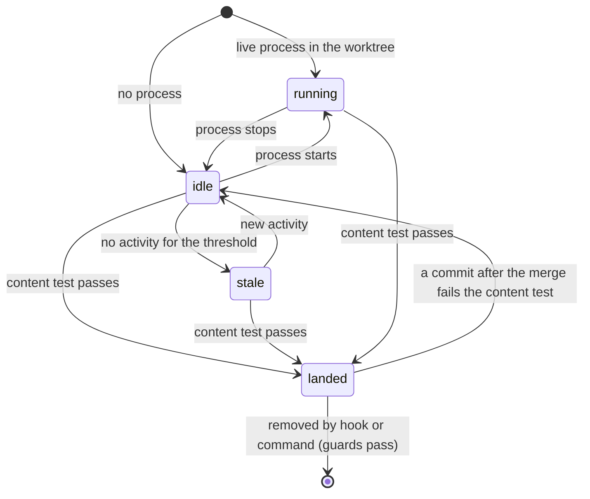

# Retire Story Worktrees When Their Work Lands

## Summary

Each story gets its own linked worktree, created by `plan-start`, and the work stays there until
its branch merges. Nothing removes the worktree afterward, and Home stops showing a worktree as soon
as nothing is running in it. The result is the state this repository was in when this plan was
written: seven linked worktrees and twelve local branches, four of those branches already landed in
`main`, and every worktree without a running process missing from Home.

This plan gives every worktree a lifecycle state that Home shows, removes landed and clean
worktrees automatically when `main` is pulled, and suggests removal for worktrees that have gone
untouched past a configurable threshold. It works on plain Git; the GitHub CLI is not required.

## Goals

- [ ] Show every linked worktree of a known repository on Home, running or not, so a story's
      worktree and its associated plan stay visible for the whole story.
- [ ] Derive one lifecycle state per worktree: `running`, `idle`, `stale`, or `landed`.
- [ ] Decide "landed" from content, so squash and rebase merges count, without the `gh` CLI.
- [ ] Remove landed, clean worktrees and their local branches automatically, along with landed
      local branches that have no worktree, behind the guards in this plan.
- [ ] Suggest stale worktrees for removal after a threshold that defaults to 7 days and is
      configurable in settings and through an environment variable.
- [ ] Trigger automatic removal from an opt-in Git `post-merge` hook, so a pull of `main` after a
      GitHub merge cleans up.

## Non-goals

- Deleting remote branches. GitHub's **Automatically delete head branches** repository setting
  owns that, and `fetch.prune` keeps local remote-tracking refs in step with it.
- Automatically removing a stale worktree. Stale means not merged; it is only ever suggested.
- Installing a global `core.hooksPath`. That would disable every repository's own hooks.
- Plan closeout. Completing a plan stays with `plan-docs`; see Relationship to `q4vn2xk8`.
- Requiring the `gh` CLI, or treating its presence as changing which worktrees are eligible.

## Current State

Verified on `main` at `14b1ed6`.

### Home shows only running worktrees

For a running repository, the Runtime snapshot lists each checkout that has a live member plus the
main checkout, and nothing else (`modules/developer-runtime/snapshot.mjs`, the `idleMainCheckouts`
loop: "other stopped worktrees stay off the card"). Home's checkout list is built from those roots
in `scripts/cli/repository-overview-sources.mjs#projectWorkspace`.

The plan↔worktree association from `wk7p4n2` joins only against those listed checkouts (its
decision 6), so a plan whose worktree has nothing running falls back to Additional Plans. Observed
on 2026-10-02: Home listed `main` plus the two worktrees with listeners (ports 59468 and 4317), while
`codex/telemetry-analytics-oracle` and `claude/plan-worktree-home-association` existed on disk with
nothing running and did not appear.

### What is already persisted

| Fact | Where | Granularity |
| --- | --- | --- |
| Checkouts seen, with `firstSeenAt` / `lastSeenAt` | `modules/repositories/schema.mjs` (`localRoot`, `localRootPath`) | per checkout |
| `active` / `idle` / `stale` lifecycle, 30-day age-out | `modules/repositories/lifecycle.mjs` (`deriveLifecycle`, `AGE_OUT_MS`) | per repository |
| Agent session events with `repository_id` and `branch` | `scripts/cli/telemetry-capture.mjs` | per event |

Checkouts are recorded only by `recordRepositoryDiscovery` in `scripts/cli/developer-runtime.mjs`,
for projects Runtime sees running, so a worktree used only for editing is never recorded at all.

### Nothing removes a worktree, and nothing hooks Git

No skill, command, or script runs `git worktree remove` or deletes a merged branch outside test
fixtures. `integration-check` refuses cleanup during its checks and only lists the evidence a
user-requested deletion needs afterward. The repository installs no Git hooks and never sets
`core.hooksPath`.

### Ancestry cannot see squash merges

This repository squash-merges pull requests, so a landed branch's commits are never ancestors of
`main`. A content test settles it instead:

```bash
git merge-tree --write-tree origin/main <branch>   # prints a tree id on its first line
git rev-parse origin/main^{tree}                   # equal ⇒ everything on <branch> is in main
```

Run against every local branch at `14b1ed6`:

| Branch | Worktree | Content test |
| --- | --- | --- |
| `claude/plan-worktree-home-association` | yes | landed |
| `claude/localhost-runtime-ui-updates-14cbbd` | yes | landed |
| `claude/plan-localhoster-row-layout-2b92cb` | no | landed |
| `claude/runtime-row-layout-skill-f8086e` | no | landed |
| 8 other branches | 4 with worktrees | not landed |

A detached worktree (`.claude/worktrees/runtime-row-layout-skill-f8086e`) sits on the same commit
as a landed branch.

The test is conservative: `codex/portal-repository-home-and-detail`, merged as #22, reports not
landed, plausibly because `main` later changed the same lines. A false "not landed" keeps a
worktree; it never removes one.

`git merge-tree --write-tree` needs Git 2.38 or later; the machine these measurements came from runs
2.50.1.

### Overlap with `q4vn2xk8`

`plan-lifecycle-closeout-and-repo-sweep` (`q4vn2xk8`) proposes a user-invoked `/tear-down` sweep
whose eligibility is "branch merged into the default branch" and whose rule is that every removal
is confirmed. See Relationship to `q4vn2xk8` for how the two divide the work.

## Proposed Design

### 1. Inventory every linked worktree

For each known repository with a readable main checkout, run `git worktree list --porcelain` and
record every linked worktree: path, branch or detached commit, locked flag. This replaces "seen
running" as the way a worktree becomes known, so a story worktree is listed from the moment
`plan-start` creates it.

### 2. Decide "landed" from content, never from a fresh branch

A branch with no work of its own trivially passes the content test, because its tree already
equals `main`. A brand-new story worktree would therefore read as landed and be removed. Landed
requires both conditions:

| Condition | Test |
| --- | --- |
| The branch carried its own work | at least one commit in `<start>..<branch>` is not on `<base>`'s first-parent history (`git rev-list --first-parent <base>`) |
| That work is in the base | `git merge-tree --write-tree <base> <branch>` exits 0 and prints `<base>`'s tree |

`<start>` is where the branch began: the oldest entry of its reflog (`git reflog show <branch>`),
falling back to `git merge-base <base> <branch>` when the reflog has expired or never existed.
`<base>` is the remote's default branch (`refs/remotes/origin/HEAD`), falling back to the local
default branch.

How the own-work condition classifies common histories:

| History | Own work? | Why |
| --- | --- | --- |
| Fresh worktree, no commits | no | `<start>..<branch>` is empty |
| `plan-start` fast-forwarded a fresh worktree to its transition commit | no | that commit is on `main`'s first-parent history |
| Created from another branch's tip, no commits since | no | `<start>..<branch>` is empty |
| Squash- or rebase-merged on GitHub | yes | the branch's own commits never reach `main` |
| Merged with a merge commit, reflog present | yes | its commits are reachable from `main` only through a second parent |
| Merged with a merge commit, reflog expired | no | the fallback `<start>` is the branch tip, so the range is empty; it ages into `stale` instead |
| Fast-forwarded into `main` locally | no | its commits are now first-parent history; it ages into `stale` instead |
| Merged into another feature branch (stacked PR) | yes | own work exists, but the content test fails against `<base>`, so not landed |

### 3. One state per worktree



| State | Meaning | Home | Automatic action |
| --- | --- | --- | --- |
| `running` | A Runtime member runs in it | today's row | none |
| `idle` | No process, recent activity, not landed | dimmed row; its plan attaches | none |
| `stale` | Idle past the threshold, not landed | dimmed row, "suggested for removal" | none; suggestion only |
| `landed` | Passes §2 | row marked "landed" | removed when every guard passes |

`landed` takes precedence over the others, but a running landed worktree is never removed (see
§5).

### 4. Last activity is the latest of several signals

"Last run" alone would mark a story stale while it is being edited without a dev server.

| Signal | Source |
| --- | --- |
| Runtime last saw a member running in it | registry `localRoot.lastSeenAt` |
| Last commit on the branch | `git log -1 --format=%cI <branch>` |
| Last agent session on the branch | telemetry events matching `repository_id` and `branch` |

The threshold defaults to 7 days. Precedence: the `ROBOREPO_WORKTREE_STALE_DAYS` environment
variable, then a settings value, then the default. A non-positive or non-numeric value is rejected
with a finding rather than silently ignored.

### 5. Removal guards

Automatic removal applies only to `landed` worktrees and only when every guard passes. A failed
guard skips the worktree, keeps it `landed`, and records the reason Home shows.

| Edge case | Guard |
| --- | --- |
| Brand-new worktree with no commits | §2's own-work condition |
| Commits made after the merge | content test fails, so not landed |
| Uncommitted or untracked changes | `git status --porcelain` must be empty |
| Valuable ignored files (`.env*`, local databases, `.claude/settings.local.json`) | `git status --ignored --porcelain` may list only paths on a disposable list (`node_modules/`, build output, caches) |
| The hook runs inside this worktree (merging `main` into a feature branch) | never remove the current worktree or the main checkout |
| A dev server or agent session is using it | skip when Runtime reports a live member, or an agent session touched the branch within the last hour |
| Worktrees another tool manages, such as the desktop app's `.claude/worktrees/` | remove automatically only worktrees under the repository's `worktreeRoot` from `docs/plans/plans-config.json`; suggest the rest. A repository without that setting gets suggestions only |
| Detached HEAD, locked, or with submodules | suggest only |
| Its plan is still `active` | remove, and flag "branch landed, plan not completed" |
| Another session changed the state after the survey | re-read Git state immediately before each removal |
| Two cleanups start together (quick successive pulls, or pulls in two worktrees) | a per-repository lock file under the state root; a second run exits when the lock is held |

Removal runs `git worktree remove <path>` (never `--force`), then `git branch -D <branch>`, because
squash-merged branches need `-D`. A landed local branch with no worktree is deleted the same way,
unless it is checked out anywhere. Each removal appends path, branch, and commit to a removal log
under the state root, so `git branch <branch> <commit>` and `git worktree add <path> <branch>` can
restore it.

### 6. Triggers

| Trigger | When it fires | Does |
| --- | --- | --- |
| `post-merge` hook (opt-in) | after `git merge` completes, which includes the merge step of `git pull` | starts the cleanup detached, with output to a log, and returns at once |
| `roborepo` cleanup command | when invoked | dry run by default; applies with an explicit flag |
| Runtime refresh | each snapshot | derives and displays states; never removes |

The hook does not fire on `git fetch`, on the GitHub merge button itself, or on a merge stopped by
conflicts. Its behavior on a fast-forward `git pull` is expected but unmeasured here, and on
`git pull --rebase` it is unverified; Phase 4 measures both. Because worktrees share one hooks
directory, the hook also fires in feature worktrees, which is why the current-worktree guard exists.

Installation is per repository and opt-in. The installer writes into the repository's hooks
directory, which is `core.hooksPath` when that is set (Husky sets it, for example) and the common
Git directory's `hooks/` otherwise. If a foreign `post-merge` hook is already present, the installer
does not overwrite it; it prints the one line to add instead.

The hook calls absolute paths to `node` and the roborepo CLI entry, recorded at install time.
Git clients run hooks with their own `PATH`, and GUI clients often omit the npm prefix where
`roborepo` lives.

### 7. Relationship to `q4vn2xk8`

This plan owns worktree and branch lifecycle: the inventory, the landed test, the guards, and
removal. `q4vn2xk8` keeps plan closeout (the `Not tested` section and the `complete` mode). Its
`/tear-down` should take worktree and branch candidates from this plan's inventory rather than
define a second eligibility test.

On 2026-10-02 the user chose automatic removal for landed, clean worktrees. That supersedes
`q4vn2xk8`'s "every removal is confirmed" rule for that one class only; everything else
`/tear-down` removes stays confirmed.

## Affected Repository Files

| Area | Path | Change |
| --- | --- | --- |
| Inventory and landed test | `modules/repositories/worktree-inventory.mjs` | New: execution functions for §1 and §2 |
| State derivation | `modules/repositories/worktree-state.mjs` | New: §3 and §4, a pure function of inventory, activity, threshold, and clock |
| Guards and removal | `modules/repositories/worktree-removal.mjs` | New: §5 guards as single-purpose checks, removal, removal log, lock |
| Cleanup orchestration | `scripts/cli/worktree-cleanup.mjs` | New: the command and hook entry; sequences inventory → state → guards → removal |
| Registry | `modules/repositories/schema.mjs` | Allow recording linked worktrees found by inventory |
| Runtime snapshot | `scripts/cli/developer-runtime.mjs`, `modules/developer-runtime/snapshot.mjs` | The CLI reads the inventory and injects it, as it already injects `idleMainCheckouts`; the snapshot adds those worktrees as roots |
| Home projection | `scripts/cli/repository-overview-sources.mjs` | Carry worktree state and the guard reason |
| Home and Runtime rows | `portal/shared/repository-row-template.js`, `portal/developer-runtime/repository-root-row.js`, `portal/developer-runtime/styles.css` | Dimmed idle row; stale and landed markers as template slots |
| CLI | `manifests/platform/cli-commands.json` | Register the cleanup command and hook install/uninstall |
| Settings | `modules/developer-runtime/settings-schema.mjs` or the repositories config | Stale threshold |
| Checks | `scripts/test/worktree-lifecycle-check.mjs` (new), `scripts/test/check-groups.json`, `scripts/test/portal-ui/portal-ui.spec.mjs` | Fixture-repository coverage in the `ci` group; Home rows |
| Docs | `docs/user/reference/repositories.md` | Worktree states, the hook, the threshold |

## Implementation Plan

### Phase 1 — Inventory and landed test

- [ ] Add `modules/repositories/worktree-inventory.mjs` with the inventory from §1 and the landed
      test from §2.
- [ ] Add `scripts/test/worktree-lifecycle-check.mjs`, building temporary repositories for every
      row of §2's classification table, plus detached and locked worktrees and an expired reflog.
- [ ] List the check in the `ci` group of `scripts/test/check-groups.json`, which `npm run check`
      runs through `scripts/test/ci.sh`.

### Phase 2 — States, activity, and threshold

- [ ] Add `modules/repositories/worktree-state.mjs` deriving the four states from §3 and §4, taking
      the clock as an argument so the check can age a worktree without waiting.
- [ ] Add the threshold setting and `ROBOREPO_WORKTREE_STALE_DAYS`, with a finding for invalid
      values; cover default, setting, and environment precedence in the check.
- [ ] Record inventoried worktrees in the registry so Runtime and Home share one list.

### Phase 3 — Home and Runtime presentation

- [ ] Inject the inventory from `scripts/cli/developer-runtime.mjs` and add idle, stale, and landed
      worktrees as roots in the Runtime snapshot.
- [ ] Add the dimmed idle row and the stale and landed markers to the shared row template, keeping
      `repository-root-row.js` free of Plans knowledge.
- [ ] Add Home cases to `portal-ui.spec.mjs` using `patchRoboRepo`: an idle worktree is listed with
      its plan beneath it, and stale and landed rows show their markers, selected by role and text.

### Phase 4 — Removal and triggers

- [ ] Add `modules/repositories/worktree-removal.mjs` with every guard in §5 and the lock,
      re-reading Git state before each removal.
- [ ] Add `scripts/cli/worktree-cleanup.mjs` as the orchestrator the command and the hook share.
- [ ] Add the cleanup command: dry run by default, apply on an explicit flag, one line per worktree
      with its state and any guard that blocked it.
- [ ] Add hook install and uninstall, honoring `core.hooksPath` and refusing to overwrite a foreign
      hook.
- [ ] Measure whether `post-merge` fires on a fast-forward `git pull` and on `git pull --rebase`
      with no local commits, and record both results in this plan.
- [ ] Write the removal log and document restoring from it.
- [ ] Extend the check with a bare remote and a clone: install the hook, squash-merge on the remote
      side, `git pull` in the clone, and assert the landed worktree is removed and logged while the
      worktree the pull ran in survives.

### Phase 5 — Verify against this repository

- [ ] Dry run here, against the worktrees and branches deliberately kept for this. Expected:
      `claude/plan-worktree-home-association` (worktree under `worktreeRoot`) and the two landed
      branches without worktrees are removed; `claude/localhost-runtime-ui-updates-14cbbd`, whose
      worktree is under `.claude/worktrees/`, is suggested only; no unlanded branch is offered.
- [ ] Install the hook, merge a throwaway PR on GitHub, pull `main`, and confirm the worktree is
      removed and logged.
- [ ] Update `docs/user/reference/repositories.md`.

## Validation

- [ ] A fresh worktree with no commits is never `landed`.
- [ ] Squash- and rebase-merged branches are `landed`, and so is a merge-commit-merged branch
      whose reflog is present; with its reflog expired it is not.
- [ ] A branch with a commit after its merge is not `landed`.
- [ ] A landed branch with no worktree is deleted and logged; one checked out in any worktree is
      kept.
- [ ] Each guard in §5 skips its worktree with the stated reason, in the fixture check.
- [ ] The candidate list is identical with `gh` absent from `PATH`.
- [ ] Home lists every linked worktree of a known repository, including ones with nothing running.
- [ ] `ROBOREPO_WORKTREE_STALE_DAYS=1` makes a two-day-idle worktree `stale`; unset, it is `idle`.
- [ ] In the fixture check, the hook removes a landed worktree after `git pull` and never removes
      the worktree it runs in.
- [ ] A second cleanup started while one holds the lock exits without acting.
- [ ] `npm run test:portal-ui` and `npm run check` pass.

## Risks

| Risk | Mitigation |
| --- | --- |
| Automatic removal deletes work that only looks landed | Content test plus own-work condition; clean-tree and ignored-file guards; never `--force`; removal log |
| Deleting a large `node_modules` blocks `git pull` | The hook backgrounds the cleanup and returns immediately |
| The content test misses old merges | Accepted: a miss keeps the worktree, which then ages into `stale` |
| Telemetry is off, so session activity is unknown | Activity falls back to commits and Runtime; worktrees may read stale sooner |
| Listing idle worktrees crowds a repository card | Open question below |

## Open Questions

- Should Home collapse idle and stale worktrees behind a count when a repository has many? The
  multi-member fixture already has seven worktrees.
- Should the disposable list for ignored files be configurable per repository, or fixed?
- Should `/tear-down` from `q4vn2xk8` be rescoped to call this plan's cleanup command once it
  exists, or stay a separate entry point that only shares the inventory?
