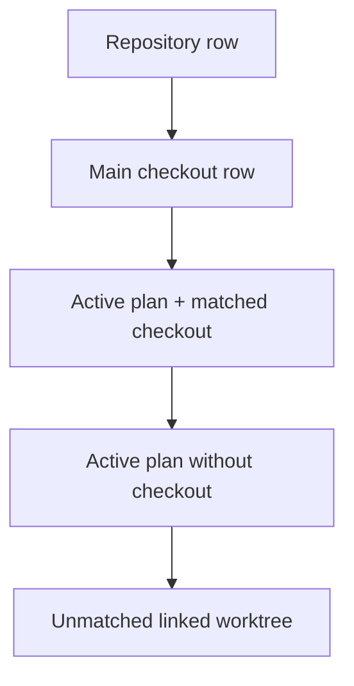

# Make Plans Primary Without Hiding Checkout Activity

## Summary

Change each repository card on Home from a checkout-owned plan hierarchy to a hybrid flat list. Keep the repository row and main checkout row unchanged. Beneath main, render every active plan first. When a plan has one safe linked-worktree match, render that plan using the existing checkout-row structure: the plan becomes the primary left-side identity, worktree/branch details move into a compact dropdown, and the row keeps the checkout's existing right-side process controls unchanged.

After the active plans, render every linked worktree that was not consumed by a plan association exactly as Home renders it today. This keeps Home useful for repositories that do not use Plans at all while still making plans the preferred organizing layer when they exist.

A plan title opens the existing plan popup dialog. A matched plan gets a worktree-details dropdown. An unmatched plan gets a **not started** badge. Remove the **Additional Plans** section; plans no longer move between separate plan and checkout presentation buckets.

The server-side join remains exact and conservative, but its output becomes a reference from each matched active plan to an existing Runtime checkout. Runtime keeps the complete checkout list. Home uses those references to render matched checkouts as plan rows and then renders the remaining worktrees normally.

## Goals

- Keep the repository row and main checkout row visually and behaviorally unchanged.
- Render every active plan exactly once, before unmatched linked-worktree rows.
- Preserve every linked worktree on Home: matched worktrees appear through their plan row; unmatched worktrees remain normal checkout rows.
- Make Home remain fully useful when a repository has no Plans data or no active plans.
- Make the plan title the primary left-side identity and open the existing plan popup dialog.
- Move matched worktree and branch identity into a compact worktree dropdown rather than a separate checkout row.
- Preserve the matched checkout row's existing right side exactly: primary port/origin link, Links dropdown, and their current show/hide behavior come from the same checkout rendering path used today.
- Show **not started** when an active plan has no current safe checkout association on Home. This is presentation language for association state, not a plan lifecycle state.
- Let the worktree dropdown expose the full branch name and Git administrative worktree name, each with its own copy action.
- Reuse the existing shared copied behavior and confirmation rather than introducing a second clipboard or timer implementation.
- Include a small high-level Git/worktree summary in the dropdown without reproducing the full Runtime tooltip.
- Preserve the existing exact-name association rules and repository-wide plan counts.

## Non-goals

- Changing the repository row, repository menu, or main checkout row.
- Changing plan frontmatter or the meaning of `worktree`.
- Inferring associations from branch names, filesystem paths, plan titles, or prose.
- Adding a replacement **Additional Plans** section or an **Active Plans** heading.
- Hiding linked worktrees merely because they have no plan.
- Reimplementing checkout process controls for plan rows. Port/origin and Links behavior must continue to come from the current checkout-row path.
- Changing the plan popup dialog or Plans page.
- Showing the full worktree tooltip inside the new dropdown.
- Changing plan lifecycle semantics. The **not started** badge does not mean `backlog`; it means Home has no current safe Runtime checkout match for that active plan.

## Current State

The completed work in [[wk7p4n2]] made worktrees the presentation hierarchy on Home.

- `scripts/cli/repository-overview-projections.mjs#associatePlans()` consumes the full active-plan list. A unique exact match becomes `checkout.plan`; every other active plan becomes `plans.additionalActive`.
- `portal/home/templates.js` renders every Runtime checkout through `buildRootSection()`. A matched worktree receives the plan as a Home-owned footer beneath that checkout row.
- `portal/home/domains.js` renders `plans.additionalActive` inside a separate **Additional Plans** domain row.
- `portal/home/index.html#tpl-plan-item` renders the current plan title plus completion state, and `tpl-checkout-plan` provides the subordinate worktree-plan row.
- `portal/developer-runtime/repository-root-row.js#buildRootSection()` already owns the checkout-row structure, including branch/worktree identity on the left and the primary origin/port plus Links control on the right.
- The checkout tooltip includes full branch identity, directory/path, checkout state, members, and detailed Git facts.
- `portal/shared/copy-menu.js` owns generic copy-dropdown behavior. `portal/shared/copy-button.js` owns clipboard writes and the shared in-place copied confirmation.

The current API sends each active plan to the browser only once by partitioning plans around checkouts. The hybrid design instead keeps Plans and Runtime as complete lists and records only the safe association between them.

## Proposed Design

### 1. Keep Plans and Runtime as complete parallel lists

Replace the current checkout-owned partition with a non-destructive association. The join rules remain the same:

- only active plans participate;
- only linked worktrees with a nonempty `worktreeName` participate;
- exactly one active plan and exactly one linked worktree with the same name produce a match;
- duplicate plan claims, duplicate Runtime names, stale names, missing worktrees, and empty names produce no match;
- main checkouts never match;
- unavailable Plans or Runtime data never invents a relationship.

Keep the complete active plan list as `plans.active`. Keep the complete Runtime checkout list as `runtime.checkouts`. For a safe match, add only a checkout reference to the plan, preferably the existing opaque `rootId`:

```text
plan.checkoutRootId = matchedCheckout.rootId
```

Do not copy branch, path, process, Links, or Git status fields into the plan projection. Home can resolve the referenced checkout from the Runtime list it already has. This keeps one authoritative checkout object and guarantees that plan-associated rows use the same current checkout data as ordinary worktree rows.

Remove the Home-specific `checkout.plan` and `plans.additionalActive` fields.



### 2. Build one hybrid display list on Home

Home derives display rows from the two complete inputs:

1. Render the main checkout first, unchanged.
2. Render all active plans in their existing plan order.
3. For each plan with `checkoutRootId`, resolve the matching Runtime checkout and mark that checkout as consumed.
4. After the plans, render every remaining linked worktree in the existing Runtime order using the current checkout-row renderer.

The result is flat rather than nested:

```text
repository
main branch
plan A        [worktree ▾]                      [port] [Links ▾]
plan B        [not started]
plan C        [worktree ▾]
unmatched worktree / branch                     [port] [Links ▾]
unmatched worktree / branch
```

There is no **Active Plans** or **Additional Plans** header.

This fallback is intentional. With zero active plans, every linked worktree remains visible exactly as it is today. If Plans data is unavailable, Home still renders the complete checkout activity from Runtime rather than becoming mostly empty.

### 3. A matched plan row is still a checkout row

Do not build a separate row system for plan-associated worktrees. Start from the existing `buildRootSection()` checkout row so the operational behavior remains identical.

For a matched plan:

- use the matched Runtime checkout as the row's `root`;
- keep the existing right-side rendering untouched;
- replace the left-side primary identity with the plan icon and underlined plan title;
- move the checkout's branch/worktree identity into the new worktree-details dropdown;
- keep process availability behavior unchanged: if the checkout has a current `primaryEntrypoint`, its origin/port remains visible; if it does not, no replacement placeholder is added;
- mount the existing Links dropdown through the same `onMountLinks` path and only when the checkout currently qualifies for it.

The plan title opens the existing plan popup dialog.

Keep shared Runtime components plan-agnostic. Prefer a generic identity/leading-content hook on `buildRootSection()` only if Home cannot safely decorate the returned row. Do not add Plan-specific imports or logic to `portal/developer-runtime/repository-root-row.js`.

For an active plan with no matched checkout, render the same plan-row visual rail without checkout process controls and show **not started** on the right side of the identity area.

### 4. Preserve unmatched worktrees exactly as they are today

A linked worktree is rendered as a normal Home checkout row when no active plan safely claims it.

Do not alter its:

- branch/worktree identity;
- tooltip;
- copy affordance;
- primary origin/port link;
- Links dropdown;
- current row ordering relative to other unmatched worktrees.

The only filtering is de-duplication: a worktree referenced by a rendered plan row is not rendered a second time below the plans.

This makes the hybrid behavior degrade cleanly:

| Repository state | Home below main |
| --- | --- |
| Active plans with matched worktrees | Plan rows with checkout controls, then unmatched worktrees |
| Active plans without worktrees | Plan rows with **not started**, then all worktrees |
| No active plans | All linked worktrees exactly as today |
| Plans unavailable | All linked worktrees exactly as today |
| Runtime unavailable | Active plans remain visible, but none receive checkout controls |

### 5. Add the matched-plan worktree dropdown

Add a Home-owned worktree-details control for matched plan rows. The closed trigger is the tree/worktree icon plus a dropdown caret. Its accessible name should identify the plan context, for example `Worktree details for <plan title>`.

Author the dropdown structure as real `<template>` markup in `portal/home/index.html`; do not construct the nested panel structure with runtime `createElement()` chains or HTML strings.

The open panel follows the visual language of the current worktree tooltip but uses smaller text and less data. The first two rows are copyable identities:

```text
[BRANCH_ICON]   feature/example                         [COPY]
[WORKTREE_ICON] example                                [COPY]
```

Use the full, untruncated values inside the panel. The branch line uses the current branch identity, including detached-HEAD handling. The worktree line uses the exact Git administrative `worktreeName`, not the directory basename or filesystem path.

Below those rows, render only useful high-level facts already present on the Runtime checkout:

- checkout state/reason when it is not normal;
- clean vs. dirty working tree;
- upstream ahead/behind when nonzero;
- base-branch drift when nonzero.

Omit empty/default facts. Do not duplicate the port/origin or Links dropdown in this panel; those remain in the row's existing right-side controls.

### 6. Reuse shared copied feedback with a row presentation

The identifier rows should not create their own clipboard implementation or copied-state timer. Reuse the behavior currently owned by `portal/shared/copy-button.js`.

Add the smallest shared presentation hook/config needed for the worktree panel so a successful copy can use this row-level face:

```text
[BRANCH_ICON]   Copied
```

During confirmation, hide the identifier value and its copy control and render the shared **Copied** confirmation in their place. Keep the leading branch/worktree icon so the user still knows which value was copied. After the existing copied duration, restore the original value and copy control.

Keep the default `<portal-copy-button>` behavior unchanged for current callers. The new configuration must reuse the same clipboard path, success state, duration, and accessibility semantics instead of duplicating them in the Home worktree control.

## Implementation Sequence

### Phase 1 — Change association output without losing either source list

- [ ] Update `scripts/cli/repository-overview-projections.mjs` so active plans remain in `plans.active` and Runtime checkouts remain complete.
- [ ] Replace `checkout.plan` / `plans.additionalActive` with a plan-side reference such as `checkoutRootId` for unique exact matches.
- [ ] Keep the existing exact/unique worktree matching rules and leave main checkouts unmatchable.
- [ ] Do not duplicate checkout details into the plan projection.
- [ ] Update `scripts/test/repository-overview-check.mjs` for matched, unmatched, stale, duplicate-claim, duplicate-worktree, main-checkout, partial, and unavailable cases.

### Phase 2 — Build the hybrid Home row list

- [ ] Update `portal/home/templates.js` to render the main checkout first, then all active plans, then unmatched linked worktrees.
- [ ] Resolve each matched plan's checkout from the existing Runtime list and suppress only that checkout's duplicate normal row.
- [ ] Keep unmatched worktrees on the existing `buildRootSection()` path unchanged.
- [ ] Remove the associated-plan footer path from Home checkout construction.
- [ ] Remove **Additional Plans** rendering from `portal/home/domains.js` while preserving other domain rows and partial-coverage messaging where applicable.
- [ ] Add a focused Home plan-row renderer, splitting it into `portal/home/plans.js` if that keeps plan ownership clearer than growing `templates.js` or `domains.js`.

### Phase 3 — Reuse checkout rows for matched plans

- [ ] Render a matched plan from the same checkout/root data used by `buildRootSection()` today.
- [ ] Preserve the row's current primary origin/port and Links controls without duplicating their logic.
- [ ] Replace only the left-side identity with plan icon/title plus the worktree-details trigger.
- [ ] Keep `portal/developer-runtime/repository-root-row.js` free of Plan-specific knowledge; add only a generic presentation hook if Home cannot decorate the row cleanly.
- [ ] Render unmatched active plans without checkout controls and with the **not started** badge.
- [ ] Update `portal/home/index.html` and `portal/home/styles.css` for the plan identity treatment while preserving current checkout-row alignment.

### Phase 4 — Add the worktree-details dropdown and shared copy presentation

- [ ] Add Home-owned dropdown markup/behavior with tree-icon/caret trigger, popover positioning, outside-click handling, and Escape handling.
- [ ] Render branch name and administrative worktree name as separate copyable rows.
- [ ] Extend the existing shared copy-button behavior with the minimum backwards-compatible configuration needed for row-level copied feedback; do not duplicate clipboard/timer logic.
- [ ] Render only non-default high-level checkout/Git facts below the identity rows.
- [ ] Keep port/origin and Links outside the dropdown in their existing right-side row positions.

### Phase 5 — Regression coverage and cleanup

- [ ] Update `scripts/test/portal-ui/portal-ui.spec.mjs` around user-visible hybrid Home behavior.
- [ ] Remove tests and helpers that assert the old **Additional Plans** / worktree-footer hierarchy.
- [ ] Remove dead Home templates/styles/functions from the old layout.
- [ ] Confirm the no-Plans case still exposes every linked worktree and its current process actions.

## Validation

### Repository projection

`node scripts/test/repository-overview-check.mjs` must prove:

- every active plan remains present exactly once in `plans.active`;
- every Runtime checkout remains present in `runtime.checkouts`;
- a unique exact `worktree`/`worktreeName` match adds only the expected checkout reference to the plan;
- unmatched and ambiguous plans receive no checkout reference;
- repository plan counts remain unchanged;
- `checkout.plan` and `plans.additionalActive` are absent from the new Home contract.

### Home behavior

`npm run test:portal-ui` must cover the behavior through semantic roles/names:

- the repository row remains unchanged;
- the main branch row remains visible and keeps its existing actions;
- every active plan title appears once and opens the existing plan popup dialog;
- no **Active Plans** or **Additional Plans** heading is rendered;
- matched plan rows appear before unmatched worktree rows;
- a matched plan exposes the worktree-details trigger;
- the matched plan row keeps the same primary origin/port link and Links dropdown that its checkout row would have shown before association;
- an inactive matched checkout does not gain fake process controls or placeholders;
- an unmatched plan shows **not started** and no checkout process controls;
- the dropdown shows the branch and worktree names with separate copy actions;
- copying either value replaces that value/copy control with **Copied** and restores it after the shared confirmation interval;
- compact dirty/drift/state facts appear only when applicable;
- a worktree with no associated active plan still renders as the same checkout row used today, including its port/origin and Links controls;
- a matched worktree is not rendered a second time below the plans;
- with zero active plans, linked-worktree presentation is unchanged from the current Home page;
- with Plans unavailable, Runtime checkout activity still renders normally;
- partial plan coverage can still be communicated without adding a section heading.

### Final checks

Run `npm run check` after the focused projection and Portal UI tests. If a command is blocked by the environment, record the exact command and reason rather than treating it as passed.
