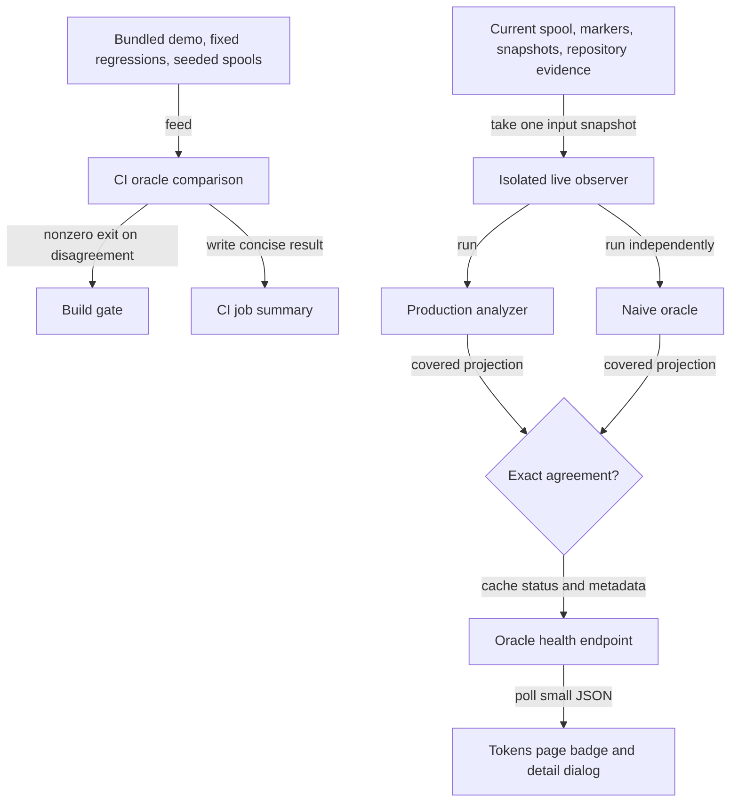
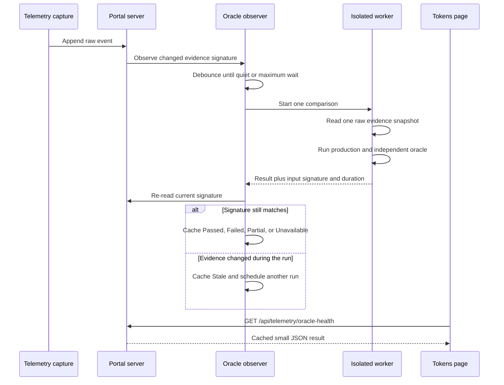

# Live confidence for telemetry analytics

## Summary

Turn the telemetry analytics oracle from a CI-only correctness test into two complementary
confidence signals:

1. a deterministic CI gate that independently recomputes covered analytics from bundled and
   seeded evidence; and
2. a live observer that compares the production analyzer with the independent oracle over the
   current local telemetry spool, caches the result, and exposes it as a subtle status badge on the
   Tokens page.

The existing CI oracle remains the release guardrail. The live observer adds evidence about the
data the user is looking at now. A green badge means both implementations agreed over the same
supported input snapshot; it does not claim that capture is complete, that every dashboard metric
is independently verified, or that any observed condition caused an outcome.

This plan includes the work already completed for the oracle and marks it complete. Remaining work
starts at the extraction of a reusable independent oracle core and ends when the live status,
documentation, privacy boundaries, CI visibility, and browser behavior are verified.

## Context

The Tokens report previously relied on focused fixtures that exercised production analysis helpers
directly. Those checks were useful but could not catch an error repeated in both the fixture's
expectation and the implementation. The oracle closes that gap by starting again from raw events,
using deliberately direct calculations, and comparing its covered results with
`scripts/cli/telemetry-analyze.mjs`.

The current oracle is `scripts/test/telemetry-oracle-check.mjs`. It runs one bundled demo, two fixed
regression cases, and six deterministic seeded spools. It has no runtime endpoint or persisted
status. The Tokens page polls `/api/data` every five seconds, while the server keeps the production
report warm with an incremental spool reader and a debounced background recomputation. Running the
naive oracle synchronously on that request path would block the portal, so the live observer must
run outside the server's main event loop and publish only a cached result.

### Terms

| Term | Meaning |
| --- | --- |
| Production analyzer | The implementation that supplies the CLI report and Tokens dashboard. |
| Oracle | An independent, intentionally obvious recomputation from raw event fields. It does not import production normalization, condition, boundary, finding, or metric helpers. |
| Live observer | The scheduler and isolated runner that execute production and oracle analysis over one current input snapshot. |
| Health result | A small, privacy-safe cached record describing agreement, freshness, scope, duration, and coverage. |
| Evidence signature | A change token covering every input that can affect checked values: spool files, markers, snapshots, and repository identity evidence. |

## Goals

- Preserve an independent implementation for harness-scoped sessions, token coverage, mirrored
  operation deduplication, affected-session condition cohorts, marker boundaries and exclusions,
  evidence gating, per-call regression, and harness-local loop detection.
- Keep the deterministic oracle in the normal CI gate and make its successful result visible
  without searching through the full log.
- Run the same comparison over supported live spool evidence without delaying `/api/data`, page
  navigation, telemetry capture, or other portal routes.
- Show `Oracle health: Passed` only when the checked evidence signature is still current and all
  rows needed by the covered calculations were independently interpretable.
- Explain the status, checked scope, evidence counts, latest run time, duration, and limitations in
  a user-facing dialog and durable documentation.
- Keep live failure details privacy-safe while retaining deterministic seeded and minimized JSONL
  diagnostics in CI.

## Non-goals

- Replacing the focused telemetry, presentation, route, and browser checks. The oracle is one
  confidence layer, not a substitute for the rest of the suite.
- Independently verifying unrelated dashboard totals, generated insight prose, marker persistence,
  approximate waste attribution, transcript lookup, or browser rendering in the first live version.
- Turning correlation into causal language or changing the Tokens page's analytical wording.
- Making the naive oracle incremental. Full recomputation is slower but easier to audit and less
  likely to share a state-management bug with production.
- Sending telemetry, oracle results, or failure evidence off the machine.
- Showing raw events, prompts, file paths, command output, or minimized live-spool JSONL in the
  browser.
- Claiming that the most recent GitHub CI job ran from the installed local build. The live badge
  reports local runtime agreement; CI remains a separate build-time signal.

## Current state

### Completed correctness scope

The oracle now recomputes these values without importing production analysis helpers:

| Covered invariant | Independent calculation |
| --- | --- |
| Session identity | One session per `[harness, session_id]`, plus the subset with usable token data. |
| Operation identity | Mirrored schema-v3 captures collapse by harness, session, and call; fallbacks remain deterministic. |
| Condition comparisons | Spike, loop, and read-warning affected-session rates for model, repository, harness, packages, and skills, with present, absent, and unknown cohorts. |
| Change boundaries | Before and after cohorts use `effective_at ?? ts`; touching, spanning, and ambiguous sessions are excluded and counted. |
| Evidence policy | Minimum cohort `10`, minimum affected events `3`, and display band `20%` are encoded locally rather than imported. |
| Regression | Per-call before/after averages split only at a distinct timestamp within one comparable stream. |
| Loop isolation | Repetition is detected within a harness-scoped session and never across harnesses. |

### Disagreements found

| Comparison | Resolution |
| --- | --- |
| Production midpoint regression split calls with equal timestamps across before and after cohorts. | Confirmed as a production bug. `regression()` now chooses the closest distinct timestamp boundary and reports unavailable when no temporal ordering exists. Two fixed oracle regressions pin both cases. |
| Bundled demo and six seeded random spools | No remaining arithmetic disagreement after the timestamp fix. |

### Current limitations

- The checker is test-owned and cannot be imported safely by the running portal without also
  executing its fixtures.
- The CI result exits nonzero on disagreement and therefore breaks the build, but a successful
  summary is still nested inside the full CI log.
- The live portal does not run the oracle, retain its latest result, or expose a health endpoint.
- Real spools can include legacy or partially resolvable repository evidence. The live observer
  needs an explicit support/coverage result before it can label those inputs `Passed`.
- The current failure shrinker is appropriate for small deterministic cases. Applying its repeated
  full analysis to a large personal spool would be expensive and could produce sensitive output,
  so it must remain test-only.

### Preliminary performance evidence

These are feasibility measurements, not permanent performance budgets:

| Input | Production analysis | Independent oracle | Observation |
| --- | ---: | ---: | --- |
| Deterministic CI suite, 879 total events | Included across nine comparisons | about 0.20 seconds for the full check | Small enough for the normal suite. |
| Current 4 MB spool, 1,845 events | about 55 ms | about 292 ms average | Safe off-thread; noticeable if placed on the request path. |
| Synthetic 12 MB spool, 5,535 events | not measured | about 0.99 seconds | Full recomputation scales with raw evidence size. |
| Synthetic 24 MB spool, 11,070 events | not measured | about 2.2 seconds and about 28 MB temporary heap growth | Requires one-run-at-a-time isolation and cache-only HTTP responses. |

The naive implementation sorts serialized evidence and evaluates sessions across discovered
conditions. Its practical cost is approximately `N log N` in event volume, with additional work
proportional to sessions × condition cardinality and sessions × watched markers. The live design
must not assume constant-time behavior.

## Proposed design

### Confidence layers



CI and live results answer different questions. CI protects committed behavior against a broad,
repeatable test corpus. The live observer checks the installed analyzer against the current local
evidence. Neither result should be presented as the other.

### Module ownership

| File or area | Responsibility |
| --- | --- |
| `scripts/cli/telemetry-oracle-observations.mjs` | Independently accept raw rows, deduplicate operations, and build harness-scoped sessions. It imports only Node built-ins and other independent oracle modules. |
| `scripts/cli/telemetry-oracle-findings.mjs` | Independently identify spike-, loop-, and read-warning-affected sessions from oracle observations. |
| `scripts/cli/telemetry-oracle-cohorts.mjs` | Independently evaluate present/absent/unknown conditions, marker boundaries, exclusion counts, and the written evidence policy. |
| `scripts/cli/telemetry-oracle-regression.mjs` | Independently compute per-call regression at distinct timestamp boundaries. |
| `scripts/cli/telemetry-oracle-run.mjs` | Orchestrate the independent modules and return the oracle's covered projection. It does not import the production analyzer or presentation formatters. |
| `scripts/cli/telemetry-oracle-compare.mjs` | Invoke production analysis as a black box, project its covered fields, compare them with `telemetry-oracle-run.mjs`, and shape sanitized disagreement metadata. This is the only shared runtime module allowed to know both implementations. |
| `scripts/test/telemetry-oracle-check.mjs` | Deterministic fixtures, seeded generation, regression pins, shrinking, black-box invocation of production analysis, and rich CLI/CI output. |
| `scripts/cli/telemetry-oracle-worker.mjs` | Read one live evidence snapshot, run production and oracle calculations over the same raw inputs, compare covered projections, and return a privacy-safe result. |
| `scripts/cli/telemetry-oracle-observer.mjs` | Own one-worker-at-a-time scheduling, debounce, timeout, stale-result rejection, cached state, and shutdown. It receives change-signature and worker dependencies rather than embedding portal routing. |
| `scripts/cli/telemetry.mjs` | Wire the observer into portal startup/shutdown and provide the complete evidence signature. Do not put oracle arithmetic here. |
| `scripts/cli/portal-routes-telemetry.mjs` | Expose a read-only `/api/telemetry/oracle-health` route that serializes only cached status. |
| `portal/tokens/oracle-health.js` | Poll the small health endpoint, render status, and control the singleton details dialog. |
| `portal/tokens/index.html` | Own the badge and dialog markup as real HTML/template structure. JavaScript fills existing slots instead of assembling a nested dialog tree at runtime. |
| `portal/tokens/styles.css` | Subtle status badge, accessible color treatment, and dialog layout. |

### Live execution sequence



The observer should reuse the production report scheduler's established cadence: check the cheap
signature every two seconds, wait for a 12-second quiet period, and run after at most 60 seconds
under continuous capture. Give a worker 30 seconds before terminating it as unavailable. The
oracle runs at most once at a time. A new signature seen during a run marks that result stale and
schedules the latest evidence; it never queues every intermediate signature.

The worker reads raw evidence once and supplies that same in-memory input to production analysis and
the oracle calculation. Production may use its normal repository resolution; the oracle must derive
its corresponding interpretation directly from raw repository evidence. The final signature check
guards against files changing while the isolated read or calculation was in progress.

### Status contract

The health endpoint returns a versioned object with no raw evidence:

```json
{
  "schema": 1,
  "status": "passed",
  "checked_at": "2026-10-01T18:22:31.000Z",
  "duration_ms": 347,
  "evidence_signature": "sha256:…",
  "event_count": 1845,
  "session_count": 7,
  "operation_count": 912,
  "coverage": {
    "supported_events": 1845,
    "unsupported_events": 0,
    "checks": ["sessions", "operations", "conditions", "boundaries", "gating", "regression", "loops"]
  },
  "summary": "Production and oracle calculations agree for the current supported evidence."
}
```

Counts above illustrate shape only; runtime values always come from the checked snapshot.

| Status | Badge | Required meaning |
| --- | --- | --- |
| `passed` | Green | Exact agreement, complete support for the covered calculations, and result signature equals the current evidence signature. |
| `checking` | Blue/neutral | A comparison is running and no current result is available. |
| `stale` | Amber | Evidence changed after the last accepted result or during the current run. A prior pass may be shown in details but never as current. |
| `partial` | Amber | Covered values agreed for supported rows, but one or more rows or condition inputs could not be interpreted independently. |
| `unavailable` | Gray | No usable evidence, the worker could not start, or the observer cannot form a comparable input snapshot. |
| `failed` | Red | Production and oracle disagree on at least one covered projection for a current input signature. |

Worker crashes and timeouts are operational errors, not analytics disagreements. They produce
`unavailable` with a short error category. They must not turn the badge red or green.

### Dashboard presentation

Place the badge in the Tokens report header beside its existing freshness metadata. It applies only
to telemetry analytics, so it does not belong in the shared global portal header or footer.

The badge label is `Oracle health: <status>`. Color is secondary to visible text and an accessible
status name. The adjacent info icon opens a singleton dialog containing:

- a one-sentence explanation of independent recomputation;
- current status and whether the evidence is current;
- last checked time, duration, event/session/operation counts, and supported/unsupported coverage;
- the covered invariant list;
- a privacy-safe mismatch or operational error summary when applicable;
- what the result does not verify; and
- a link to the user guide's Oracle health section.

The UI module polls the cached endpoint on the same five-second cadence as the report and pauses
when the page is not active if the existing page lifecycle exposes that signal. It does not trigger
a computation itself. The existing report stays usable when the health endpoint is unavailable.

### Privacy and failure evidence

- CI fixtures may continue printing the seed, snapshots, markers, disagreement, and minimized
  replayable JSONL because those inputs are synthetic and checked in or generated.
- The live endpoint exposes only aggregate counts, coverage categories, field names, and sanitized
  mismatch summaries. It never returns raw rows or transcript-derived content.
- Live minimization does not run automatically. The existing shrinker can be quadratic in event
  count and is designed for small fixtures.
- If maintainers later add an explicit local diagnostic export, it must be a separate user action,
  write with restrictive permissions, disclose that it contains telemetry, and have a bounded
  retention policy. That capability is outside this plan.

### Performance behavior

- Signature checks and cached endpoint reads stay on the main event loop; analysis does not.
- The observer starts no more than one worker and retains no queue of obsolete signatures.
- The worker terminates after each result so its large temporary heap can be reclaimed.
- A timeout terminates the worker and reports `unavailable`; it does not leave a background task
  consuming CPU indefinitely.
- The first Tokens render does not wait for the observer. It may show `Checking` while the normal
  report is already interactive.
- The endpoint response remains small and is not embedded in the cached multi-megabyte `/api/data`
  report, because observer state changes independently of report serialization.

## Implementation plan

### Phase 1: Independent oracle foundation — completed

- [x] Create the isolated `codex/telemetry-analytics-oracle` branch and worktree from the Tokens
      conditions-report branch.
- [x] Read the telemetry internals, portal logic audit, analyzer/normalization/condition/boundary
      modules, focused checks, and deterministic demo evidence before implementation.
- [x] Define the oracle boundary: raw event shape may be shared; production analysis helpers may
      not be imported into the independent calculations.
- [x] Implement harness-scoped session and token-session counts.
- [x] Implement one-row-per-operation mirror deduplication and operation counts.
- [x] Implement affected-session rates for spike, loop, and read-warning findings across model,
      repository, harness, package, and skill conditions, preserving unknown as distinct from
      absence.
- [x] Implement before/after cohorts using `effective_at ?? ts`, including counts for touching,
      spanning, and ambiguous boundary exclusions.
- [x] Encode the written evidence policy locally: minimum cohort 10, minimum affected events 3,
      and 20% display band.
- [x] Implement per-call regression and harness-local loop detection.
- [x] Compare the bundled demo evidence with production analysis.
- [x] Add six deterministic seeded spools covering shared session IDs across harnesses, mirrored
      rows, missing tokens, missing models, boundary-spanning sessions, and events exactly at a
      boundary.
- [x] Print the seed and shrink failures to a replayable minimal JSONL case.

### Phase 2: Disagreement resolution and regression evidence — completed

- [x] Investigate the production/oracle disagreement around equal midpoint timestamps instead of
      assuming either side was correct.
- [x] Fix production regression splitting so equal timestamps remain together at the closest
      distinct temporal boundary.
- [x] Make regression unavailable when every comparable call has the same timestamp.
- [x] Pin both timestamp cases as fixed regressions.
- [x] Record the covered oracle scope and remaining gaps in
      `docs/internal/telemetry-internals.md`.
- [x] Merge the updated main branch and resolve the `portal/tokens2` to `portal/tokens` path and
      surrounding telemetry conflicts without restoring removed legacy surfaces.

### Phase 3: CI integration, richer output, and current documentation — completed

- [x] Add `npm run test:telemetry-oracle` as the focused entry point.
- [x] Add `telemetry-oracle-check.mjs` to the explicit `ci` check group so a disagreement exits
      nonzero and breaks the normal build gate.
- [x] Expand successful output with case counts, evidence counts, marker comparisons, regression
      groups, seeds, covered invariants, and failure-evidence expectations.
- [x] Add an internal Mermaid diagram and confidence-layer table explaining capture, analytics,
      presentation, and browser checks.
- [x] Run the focused oracle, telemetry-filtered suite, portal browser suite, repository health
      gate, full `npm run check`, and whitespace validation successfully after the changes.
- [x] Measure the current and synthetic-spool performance summarized in this plan to establish that
      synchronous request-path execution is unacceptable and isolated execution is feasible.

### Phase 4: Reusable independent core and live support accounting

- [ ] Extract independent calculations and covered-result projection from the test runner into the
      observation, finding, cohort, regression, and run modules named in the ownership table. Keep
      fixtures, random generation, shrinking, and console formatting in
      `scripts/test/telemetry-oracle-check.mjs`.
- [ ] Preserve the rule that oracle calculation modules import no production observation,
      condition, boundary, finding, metric, or analysis helpers; add an import-boundary assertion
      so future refactors cannot silently erase that independence.
- [ ] Remove the checker's imports of production condition presentation formatters. Recompute any
      oracle-owned display-band state from the written policy, and leave production presentation
      behavior to its existing focused presentation checks.
- [ ] Make both CI and live callers use the extracted oracle core, and prove the deterministic
      suite's expected results and rich output remain unchanged.
- [ ] Inventory every raw schema and repository identity form accepted by the current production
      analyzer. Add independent handling or an explicit unsupported category for each form.
- [ ] Add coverage accounting that prevents `passed` when required live evidence was skipped,
      unresolved, malformed, or dependent on an unsupported shape.
- [ ] Keep live comparison output separate from the CI shrinker and synthetic replay output.

### Phase 5: Isolated live observer

- [ ] Implement the versioned health-result schema and pure status transition rules.
- [ ] Implement a worker entry point that reads one evidence snapshot, invokes the production
      analyzer as a black box, invokes the independent oracle, and compares only the oracle's
      declared projections.
- [ ] Extend the existing evidence signature to cover spool files, markers, snapshots, and
      repository identity evidence used by either side.
- [ ] Implement an observer controller with startup scheduling, two-second signature checks,
      12-second quiet debounce, 60-second maximum deferral, one worker at a time, 30-second timeout,
      stale-result rejection, retry, and clean shutdown.
- [ ] Ensure a changing spool coalesces to the newest pending signature rather than creating a
      worker queue.
- [ ] Cache only the latest privacy-safe result in the portal process; do not persist a green status
      across process restarts before it has been recomputed.
- [ ] Add deterministic observer tests with fake signatures, clocks, and worker outcomes for
      `checking`, `passed`, `stale`, `partial`, `unavailable`, `failed`, timeout, crash, coalescing,
      and shutdown behavior.

### Phase 6: Health endpoint and Tokens badge

- [ ] Add `GET /api/telemetry/oracle-health` to the telemetry route table and wire it to the cached
      observer result. The handler must perform no analysis or spool read.
- [ ] Add `scripts/test/telemetry-oracle-route-check.mjs` to prove the route returns cached state,
      performs no computation, and preserves the versioned privacy-safe schema.
- [ ] Add static badge and dialog/template markup to `portal/tokens/index.html` with accessible
      names and live-status semantics.
- [ ] Add `portal/tokens/oracle-health.js` to poll, render, and control the singleton dialog without
      expanding the already-large page orchestrator or assembling nested markup in JavaScript.
- [ ] Style text-plus-color states for light, dark, high-contrast, desktop, and mobile layouts.
- [ ] Show status, freshness, duration, counts, coverage, checked invariants, latest privacy-safe
      output, limitations, and user-guide link in the info dialog.
- [ ] Keep the Tokens report functional when the endpoint is unavailable and ensure the badge never
      converts missing data into `Passed` or `Failed`.
- [ ] Add browser tests that mock each status, use role/name selectors, verify dialog content and
      accessibility, and prove the badge updates without re-rendering the report.

### Phase 7: Visible CI result and durable documentation

- [ ] Surface the concise oracle result in the GitHub Actions job summary while retaining nonzero
      exit behavior and the detailed log/minimal reproduction on failure.
- [ ] Add a user-guide section defining the oracle, live observer, status meanings, freshness,
      scope, privacy behavior, and limits.
- [ ] Expand the internal Mermaid documentation to include the isolated runtime observer, cached
      endpoint, and stale-signature path without removing the existing CI confidence diagram.
- [ ] Link the badge dialog to the user-facing explanation rather than exposing internal-only docs.
- [ ] Record the final measured runtime at representative small and near-cap spool sizes and update
      this plan's preliminary table or the telemetry performance reference with reproducible
      commands.

## Validation

### Oracle and observer checks

```bash
npm run test:telemetry-oracle
node scripts/test/telemetry-oracle-observer-check.mjs
node scripts/test/run-checks.mjs --filter telemetry
```

Expected results:

- deterministic fixtures still compare exactly and failures retain seed plus minimized synthetic
  reproduction;
- the import-boundary assertion rejects production analysis-helper imports from oracle modules;
- observer state tests prove stale results cannot become green and obsolete signatures coalesce;
- unsupported live rows produce `partial` or `unavailable`, never `passed`.

### API and browser checks

```bash
node scripts/test/telemetry-oracle-route-check.mjs
node scripts/test/portal-ui/run.mjs
```

Expected results:

- the health endpoint returns cached JSON without invoking analysis;
- all status labels remain understandable without color;
- the info icon opens the latest-output dialog using accessible role/name queries;
- the report remains usable while status is checking, stale, partial, unavailable, or failed;
- a later cached status updates the badge without forcing a full report render.

### Performance and privacy checks

- Instrument a worker run to prove no oracle calculation executes in the HTTP handler or main
  portal event loop.
- Assert one worker at a time and one accepted result per evidence signature.
- Exercise a near-cap synthetic spool while repeatedly requesting a lightweight portal endpoint;
  requests must continue while the observer runs.
- Assert the health JSON and rendered dialog contain no raw event object, prompt text, transcript
  text, file path, command output, or raw JSONL reproduction.
- Confirm the worker exits after success, disagreement, timeout, and crash.

### Repository completion gate

```bash
bash scripts/doctor.sh --quiet
npm run check
git diff --check
```

Because this plan changes CI orchestration, shared server behavior, and browser UI, the full local
parity gate is required before handoff. Report any command that cannot run rather than substituting
a narrower check and claiming completion.

## Success criteria

- The deterministic oracle remains independent, deterministic, fast enough for the normal suite,
  and build-breaking on disagreement.
- GitHub CI exposes a concise pass/fail oracle summary without requiring users to search the full
  log.
- The live observer compares production and oracle calculations over one current supported evidence
  snapshot outside the portal's main event loop.
- `Passed` is impossible when the evidence changed during the run or when required rows are
  unsupported.
- The Tokens page shows a subtle, accessible `Oracle health: <status>` badge and an info dialog with
  freshness, counts, coverage, latest privacy-safe output, and limitations.
- Live failures do not expose raw personal telemetry or run the expensive fixture shrinker.
- The badge and endpoint degrade safely without hiding or blocking the report.
- Focused telemetry checks, browser checks, repository health, the full parity gate, and whitespace
  validation pass.

## Risks

| Risk | Mitigation |
| --- | --- |
| The live oracle blocks portal requests. | Run calculation in an isolated worker; serve only cached state from HTTP handlers. |
| Continuous capture starts too many comparisons. | Debounce, allow one worker, coalesce to the latest signature, and reject stale results. |
| A green badge overstates coverage. | Require zero unsupported required evidence and an exact current signature; otherwise use `partial`, `stale`, or `unavailable`. |
| The oracle becomes production logic in disguise. | Enforce import boundaries, keep direct calculations, and compare projected outputs only at the runner boundary. |
| Live diagnostics expose sensitive telemetry. | Return aggregate metadata and sanitized differences only; keep raw shrinking synthetic and test-only. |
| Worker memory grows near spool caps. | Terminate workers after each run, never overlap them, retain no raw worker snapshot in the portal process, and measure near-cap behavior. |
| Runtime status is confused with remote CI status. | Label the badge as live local oracle health and explain CI as a separate confidence layer. |
| Portal startup becomes slower. | Bind and render normally; start observation after server startup and show `Checking` asynchronously. |

## Open questions

No product decision currently blocks implementation. During Phase 4, any live event shape that
cannot be interpreted independently without sharing production semantics must remain `partial` or
`unavailable`. Expanding the definition of `Passed` to tolerate such rows would be a product
decision and must return for review rather than being assumed during implementation.
