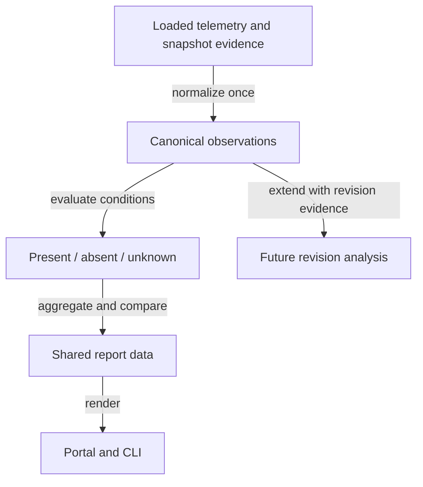

# Tokens Conditions Report: Events × Conditions Correlation on /tokens

## Summary

Extend the /tokens report from "what problems happened" to "what problems happened, under
which conditions, and what changed beforehand." The page already tracks EVENTS (spikes,
loops, read warnings, over-testing); this plan adds the CONDITIONS dimension (model, repo,
harness, ambient configuration), relative per-model token metrics, and a unified event ledger.

All conclusions are association-only. The system never converts missing condition telemetry
into a control group, never counts duplicate telemetry rows as independent observations, and
never presents partial token coverage as complete data. Every report surface consumes the same
normalized observation layer rather than interpreting raw telemetry independently.

The approved UX is specified in
`portal/mockups/tokens-connectivity-vision.html`. Use it for section placement and interaction
states. Its illustrative numbers and future-phase rows must follow the evidence and delivery
boundaries below; they are not proof that current telemetry supports those examples.

## Context

The current dashboard in `portal/tokens2/` renders a waste decision line, action items,
Investigate evidence sections, and an agent-ready prompt. The next goal is to associate the
events already tracked with the conditions observed around them, and to add relative metrics
such as tokens-per-call and input:output mix that make model/tool behavior easier to compare.

This plan intentionally separates three concepts:

1. **Observed condition state** — model, repo, harness, configured ambient resources.
2. **Observed problem/event** — spike, loop, read warning, over-testing.
3. **Change/revision boundary** — a manual marker, an ambient-state change, or later a
   fingerprinted file revision.

The first two ship without requiring the third.

### Design decisions

| # | Decision | Detail |
|---|---|---|
| 1 | Problem-first | Warnings open evidence; the ledger and history support investigation, they are not the front door. |
| 2 | Organizing frame | EVENTS × CONDITIONS → observed associations. Relative token metrics are a separate descriptive surface. |
| 3 | Sequencing | Ship model/repo/harness conditions first; markers and ambient changes follow; exact file revisions remain a separate follow-up. |
| 4 | Visual placement | Condition context folds into Investigate rows; one "Do problems follow a condition?" section; relative model metrics live in Investigate. |
| 5 | Mark change | One form, two intents (suspected prior cause = backdated, response = now); watching-kinds declared per marker. |
| 6 | Review view | Marker rows use honest states: recorded → collecting → comparison available → can't compare fairly. |
| 7 | Ledger over chart | A chronological ledger replaces the marks-only strip. Comparable persisted order breaks timestamp ties; otherwise boundary placement is ambiguous. |
| 8 | Marker management | "Your changes" is the canonical marker management surface. |
| 9 | Conditions report | Condition cards compare known presence with known absence. Use **Fewer with condition / More with condition**, never Better/Worse and never silently substitute a category mean. Percent deviation requires a minimum event-count floor; otherwise show raw rates and both cohort denominators. |
| 10 | Copy diet | One-line subtitles; dense explanations live in tooltips/popups. |
| 11 | Condition scope tiers | AMBIENT conditions affect the session continuously; INTERACTION-SCOPED conditions exist only for a specific invocation. |
| 12 | Observation unit | Each metric declares its observation unit. Tool/capture-derived metrics collapse telemetry to one operation flow using persisted `(harness, session_id, call_id)`; session-derived metrics use one session. Multiple rows from one flow are never independent samples. |
| 13 | Unknown is first-class | "Without condition" means known absence. Missing/unresolvable condition data is `unknown`, excluded from with-vs-without deltas and shown as coverage. |
| 14 | Token coverage is first-class | Relative token metrics carry `valid / eligible` coverage. Partial or unavailable token data is visible and never silently treated as complete. |
| 15 | Shared semantics | Portal, marker comparison, CLI/report output, and future revision analysis consume one pure normalized telemetry analysis API. No surface reimplements dedupe, condition-state, or denominator rules. |

### Condition scope tiers

| Tier | Primitives | Rationale |
|---|---|---|
| Ambient | `rules`, `hooks`, `permissions`, `codex_tool_approvals`, MCP registration, `plugin`, `harness-config`, `service`, `runtime-asset` | Installed state that shapes behavior continuously. |
| Interaction-scoped | `skill`, `slash-command` / `cli-command`, MCP tool calls | Exists only during an invocation. Exposure/configuration is not equivalent to use. |

A package's ambient footprint is its ambient primitives; its interaction surface is its skills,
commands, and MCP calls. Enabling or disabling a package produces an ambient ledger row only
when the effective ambient surface actually changes. A skills-only package produces no ambient
row.

### Honesty and data-quality constraints

- **Correlation, never causation.** Wording is "associated with," "observed with," "fewer with
  condition," etc.
- **Known absence is not missing telemetry.** Internally, condition evaluation separates
  `evaluable` from `present`. The user-facing states derive as:
  - `evaluable=true, present=true` → `present`
  - `evaluable=true, present=false` → `absent`
  - `evaluable=false` → `unknown`
  Only present/absent observations participate in deltas.
- **One observation is not one telemetry row.** Capture/tool events that share
  `(harness, session_id, call_id)` are reconciled to one operation flow before
  frequency, token, or success-like metrics are computed. A missing identifier falls back to
  the narrowest stable unit available and is labeled in data quality.
- **Canonical observation identity is explicit.** Each normalized observation receives a
  deterministic identity derived from the narrowest stable logical boundary available. One
  logical observation contributes at most once to any condition denominator, regardless of
  raw event count or event order.
- **Reports consume observations, not raw rows.** Raw telemetry is normalized once; all report,
  portal, marker, and future revision surfaces consume that normalized representation.
- **Model is state, not a switch event.** Capture stores the latest observed model; non-Codex
  mixed-model sessions are approximate. Codex transcripts contain turn-level model state, but captures retain only the latest observed model. Exact flow attribution requires a proven join to that turn; the latest model alone is approximate.
- **Config snapshots are SessionStart-only.** A snapshot change means "first observed by this
  session," not the exact edit time.
- **Snapshot identity currently hashes IDs and configuration objects, not file content.** Exact skill/rule revisions are
  supplied by the separate fingerprinting plan `f0j4j8y2`.
- **Exposure ≠ invocation.** Snapshot-derived resources are labeled `configured` or
  `available`; only invocation telemetry may be labeled `used`.
- **Legacy/incomplete data defaults to unknown, not absent.** If the system cannot prove a
  condition was evaluable for an observation—missing snapshot, unsupported harness, incomplete
  capture, old schema—the condition is `unknown`.
- **Token payloads are parsed centrally and deterministically.** Analysis must reuse one
  accepted-shape parser rather than ad hoc per-report extraction. Counts must be finite,
  non-negative `Number.isSafeInteger()` values.
- **Token double-counting is prohibited.** When more than one telemetry row in one operation
  flow exposes usage, a single deterministic precedence/reconciliation rule chooses the
  canonical usage record. Flow totals are not the sum of duplicate mirrors of the same usage.
- **Token coverage travels with every token aggregate.** At minimum report
  `eligible_observations`, `valid_token_observations`, `coverage`, and
  `coverage_state` (`available`, `partial`, `unavailable`).
- **Condition coverage is dimension-specific.** Model, repo, harness, package/resource, and
  revision coverage are reported independently when their evaluability differs. A combined
  coverage number may appear only when the requested dimensions share the same eligible set.
- **Success is not task quality.** Hook/tool execution success may be reported only as
  `operation_success` when explicitly available. It must not be surfaced as "quality,"
  "effectiveness," or task success.
- **Cross-category and multi-resource metrics are non-additive.** The same observation may
  appear under a model, repo, harness, and multiple configured resources. Totals across those
  cards must not be summed as if they were disjoint attribution buckets.
- **Ordering is deterministic.** Ledger display uses timestamps, but persisted spool order
  (or an explicit monotonic sequence when added) is authoritative for same-timestamp ordering.
  Marker-boundary observations that cannot be deterministically placed before/after are
  excluded from that comparison and counted as ambiguous.

## Goals

- Show the observed conditions around each Investigate event.
- Answer whether known presence of a condition is associated with a different event rate than
  known absence, with explicit denominators and unknown coverage.
- Provide relative model token metrics with frequency normalization and token-data coverage.
- Unify problems and later change records in a deterministic event ledger.
- Record manual behavioral changes with effective time, repo scope, and watching-kinds.
- Preserve exact legacy report behavior when none of the new condition/change surfaces are
  requested.
- Keep exact file-revision detection separate from this plan.

## Non-goals

- Exact skill/rule file-content revision fingerprinting (separate follow-up plan).
- Mid-session config refresh in the hot capture path.
- Causal claims, task-quality scoring, dollar-cost modeling, or volume-over-time charts.
- Treating unknown condition data as a baseline/control cohort.
- Runtime LLM prose.

## Current state

| Capability | Location | Gap for this plan |
|---|---|---|
| Flagged-event strip | `portal/tokens2/app.js` `renderTimelineStrip` | Superseded by the ledger after the ledger ships |
| Marker persistence + endpoints | `scripts/cli/telemetry-markers.mjs`, `scripts/cli/portal-routes-telemetry.mjs` `/api/telemetry/markers` | Existing `repo` is a Git basename; add canonical scope, effective time separate from recorded `ts`, watching-kinds, and finding attachment |
| Before/after comparison | `scripts/cli/telemetry-compare.mjs` `compareAcrossMarker` | Session cohorts only; marker-spanning sessions excluded; should consume the shared normalized analysis layer rather than remain a separate semantic implementation |
| Per-model data | `capture.session.model`; cohort filter `models` dimension | Not surfaced per event; mixed-model attribution can be approximate |
| Capture record | schema v3 with `config_snapshot_id` | Snapshot not currently joined for /tokens display |
| Mock pipeline | `portal/tokens2/mock-spool.jsonl` + seeding scripts | Needs unknown/partial coverage, cohort-denominator, and honesty-state fixtures |

### Verified integration touchpoints

| Area | Existing files and required work |
|---|---|
| Capture identity | `scripts/cli/telemetry-capture.mjs`, `scripts/cli/telemetry-schemas/capture-schema-v3.mjs`: v3 persists `capture_id` and `call_id`, including `derived_` fallback IDs. It does not persist `request_id` or `tool_use_id` as separate fields. |
| Usage and model provenance | `scripts/harnesses/transcript-parse.mjs`: Claude usage is accumulated; Codex reads `total_token_usage`. Capture `tokens` is cumulative session usage, and `delta_tokens` is a scalar change since a prior capture, not an input/output usage record attributable to a tool call. |
| Snapshot evidence | `scripts/cli/telemetry-schemas/snapshot-schema.mjs`, `scripts/cli/config.mjs`: snapshot v1 includes enabled package/installed skill IDs and hook counts, but builds `rules: []`, empty commands/flags, and explicit unavailable fields. Those empty placeholders do not prove absence. |
| Snapshot storage | `scripts/cli/telemetry-schemas/persistence.mjs`: readers, validators, dedupe and retention need mixed-version and missing/evicted-snapshot handling. Snapshot identity excludes harness/model and currently also excludes `unavailable`; never infer provider coverage from a reused snapshot's harness label. |
| Shared analysis | `scripts/cli/telemetry-analyze.mjs`, `scripts/cli/telemetry-cohort.mjs`, `scripts/cli/telemetry-metrics.mjs`, `scripts/cli/telemetry-insights.mjs`, `scripts/cli/telemetry-session-findings.mjs`: join observations to existing findings and preserve legacy output when the new analysis is not requested. |
| I/O and cache | `scripts/cli/telemetry.mjs`: supply snapshot indexes to CLI and portal analysis outside pure functions; extend analysis cache invalidation to snapshot availability/content and new options, including changes without a new capture. Retain background refresh and bounded reads. |
| Repository scope | `scripts/cli/telemetry-repository.mjs`: reuse canonical repository resolution; basename labels are display metadata and cannot distinguish repositories with the same name. |
| Marker schema | `scripts/cli/telemetry-schemas/marker-schema.mjs`, `scripts/cli/telemetry-markers.mjs`: preserve append/supersede history and experiment consumers when adding Phase 2 fields. |
| Portal and fixtures | `portal/tokens2/app.js`, `portal/tokens2/index.html`, `portal/tokens2/styles.css`, `portal/tokens2/mock-spool.jsonl`, `scripts/cli/telemetry-seed-demo.mjs`, `scripts/cli/portal-routes-telemetry.mjs`: wire real and mock data through the same report contract. |

### Delivery and follow-up boundary

Phase 1 is independently shippable. This plan is complete after Phase 2 and the revision
extension contract are verified; exact fingerprints belong to [[f0j4j8y2]], which depends on
this plan completing. Snapshot schema changes here must preserve unknown/evaluability evidence
and leave a versioned extension point for provider-aware revision records. The follow-up must
extend the schema version actually shipped here rather than assume the current version is still v1.

The backlog plan [[telemetry-analyze-single-pass-perf]] overlaps `telemetry-analyze.mjs` but is
not a dependency. Its output-equality baseline must be the report contract present when that
optimization starts; this feature does not include a broad performance rewrite.

## Proposed design

### 1. Shared observation normalization

Before condition/report aggregation, normalize raw telemetry into comparison observations.

- Current v3 tool/capture rows use `(harness, session_id, call_id)` as the flow key.
  A future richer `(session_id, request_id, tool_use_id)` boundary may be used only when
  persisted evidence exists. Scope identities by harness to prevent cross-provider collisions.
- Mark `derived_` call IDs as approximate identity. When no trustworthy call key exists,
  retain a stable capture identity as a labeled fallback; never merge all missing IDs into one
  flow or label those fallback rows as exact independent calls. Conflicting mirrors make the
  affected attribution unavailable. Use persisted provenance, never input-array position.
- Session-derived findings remain one observation per session.
- Duplicate/mirrored token-bearing rows inside one flow resolve to one canonical token record.
- Every aggregation declares its denominator unit in the output (`flow`, `session`, or another
  explicit stable unit).
- Missing correlation identifiers are not discarded silently; analysis reports how many
  observations used a fallback identity.
- Normalization is deterministic: reordering equivalent raw telemetry rows does not change the
  normalized observation set or aggregate output.

Implement this as one pure analysis boundary, for example:



The exact module split may be one file initially or separate normalization/comparison modules,
but the semantic API must be shared. DOM rendering, CLI formatting, and filesystem reads stay
outside this layer.

### 2. Capture and condition surfaces

- **Model:** retain model on capture/session records and expose exact turn-level model where a
  harness supplies it.
- **Context snapshot join:** resolve `config_snapshot_id` to enabled package/resource state at
  report time. Snapshot-derived labels are `configured` / `available`, not `used`.
- **Ambient context hash (Phase 2):** hash the supported, evaluable ambient configuration
  at SessionStart, partitioned by canonical repo and harness. Compare successive observed states
  within that scope, not unrelated sessions from different repos. Exclude app-version-only and
  skills-only changes. Unknown or incomplete evidence is a coverage change, not proof of an edit.
  Current snapshots cannot detect same-ID rules content edits; those rows wait for [[f0j4j8y2]].
- **Condition state:** every requested condition resolves from evaluability + presence into
  `present`, `absent`, or `unknown`.
- **Legacy behavior:** old or incomplete records without enough evidence to evaluate a
  condition resolve to `unknown`; they never become implicit absence.

### 3. Deterministic token normalization

Use one token-normalization helper for all report surfaces.

Current persisted token shape is `{input, output, cache_creation, cache_read, total}` on a
capture, with session-cumulative semantics. The normalizer must distinguish cumulative,
incremental, and directly attributed usage before counting it. Never copy a session total to
each flow or divide it evenly among tools. Cache components and provider total overrides need
explicit reconciliation fixtures; summed components and aggregate totals must also remain safe
integers. Model attribution and token availability are separate quality dimensions.

The helper must:

- enumerate and test the accepted payload shapes used by supported harnesses;
- accept only finite, non-negative safe integers;
- reconcile duplicate usage mirrors within one flow;
- return `input`, `output`, `total`, and per-flow availability state;
- never synthesize zero for missing usage.

Aggregate output includes:

```json
{
  "eligible_observations": 120,
  "valid_token_observations": 114,
  "coverage": 0.95,
  "coverage_state": "partial"
}
```

If provider pricing is added later, priced cost must be explicitly named as partial coverage
(e.g. `priced_token_cost_usd`), never as an implied all-in total.

### 4. Conditions aggregation

For each category/item/event-kind combination:

- count total observations in scope;
- split condition state into `withCondition`, `withoutCondition`, and `unknownCondition`;
- define `knownCondition = withCondition + withoutCondition`;
- calculate event rates only for the two known cohorts;
- calculate the association delta from **with-condition vs known-without-condition** rates;
- expose both cohort denominators, unknown count, total count, and known-data coverage;
- apply the minimum-sample/event floor before rendering percent deviation;
- below the floor, render raw rates + both denominators;
- include the observation unit in the report shape.

A recommended aggregate shape is:

```json
{
  "with_condition": 12,
  "without_condition": 64,
  "unknown_condition": 2,
  "known_condition": 76,
  "total_observations": 78,
  "coverage": 0.974,
  "observation_unit": "session"
}
```

Each result also needs `event_kind`, per-cohort affected-observation counts, rates, delta and
comparison availability. A condition is evaluated across all eligible observations, including
those without a finding; selecting only problem rows would make the rates meaningless. For
example, 3 affected / 12 with-condition sessions versus 32 / 64 without-condition sessions
means 25% versus 50%, a relative delta of -50%. Two unknown sessions affect coverage only.
Repeated findings of the same kind within one observation count once for that rate.

Declare the unit for each finding kind before implementation: flow-linked findings may use
flows, session findings use sessions, and report-wide testing warnings must first gain supported
session/flow evidence or remain report-wide. Never attach a global warning to every session.
A missing known cohort yields an unavailable comparison; a zero baseline yields raw rates,
not an infinite percentage. Filters apply equally to both cohorts; filtering to the selected
model can remove the without-model cohort and must show unavailable rather than change scope.
The working ±20% band controls display only, not statistical significance. Centralize sample
and event floors with the report policy and show their values in comparison detail.

Critical invariant: `unknownCondition` never enters the rate denominator. Categories overlap.
The same event can support several cards; those cards are descriptive, not additive
attribution.

### 5. Relative model metrics

**Pending product decision:** current captures support session totals but not reliably
attributable per-flow usage. Recommendation: ship clearly labeled session metrics in Phase 1,
with flow metrics only where directly attributable usage exists. Alternative: expand capture
and its schema to guarantee the required flow usage before shipping Phase 1. The flow-specific
requirements below describe the intended surface when supported; they are not a license to
reinterpret cumulative session counters. Resolve this choice before implementation.

For each model with supported flow usage:

- tokens per canonical operation flow;
- input:output mix;
- call/flow frequency;
- eligible flows;
- valid-token flows;
- valid-token coverage;
- exact-vs-approximate model attribution counts/coverage where available.

The portal should show a model only when the configured minimum sample is met. Partial token
coverage remains visible even when the model passes the sample floor.

### 6. Markers and change boundaries (Phase 2)

Manual markers gain:

- explicit effective time;
- explicit repo scope;
- watching-kinds;
- optional finding attachment.

Marker comparisons reuse the same normalized observation/comparison layer as condition cards.
Capture spool files and the marker log are separate stores, so their local line numbers do
not establish a common sequence. Preserve source provenance for deterministic display ties;
use sequence for comparison only when it is genuinely comparable across both records. Stable
ID sorting provides display order, not evidence that an event happened before a marker.
A backdated marker uses effective time, not append time. Session observations spanning the
boundary remain excluded and counted separately from ambiguous ties.
Boundary ordering follows deterministic persisted order where comparable. Same-timestamp observations that
cannot be ordered relative to the marker are `ambiguous_boundary`, excluded from the delta,
and exposed as a count alongside before/after denominators.

The eventual combination of a condition selector and a change boundary is valid: "compare this
condition before vs after this marker" is a useful Phase 2 operation. Phase 1 may leave that
combination unsupported, but the data model must not define the two concepts as fundamentally
incompatible.

### 7. Revision tracking remains separate

`telemetry-content-fingerprints-revision-tracking.md` answers **which exact content revision
was observed**. This plan answers **what conditions/events were observed and when state
boundaries occurred**.

Do not manufacture revision labels. A content hash proves that content changed; semantic
labels such as `v1.1 → v1.2` may appear only when source metadata actually provides them.
Revision-condition analytics inherit this plan's normalized observation, evaluability,
coverage, and denominator rules.

## Portal changes

### Investigate

Each event row shows:

- model;
- repo;
- harness;
- configured/available ambient resources;
- dimension-specific condition-data coverage when incomplete;
- nearby change records when available.

The popup repeats those facts and distinguishes configured state from observed invocation.

### Do problems follow a condition?

Each category card uses:

- **Fewer with condition**
- **More with condition**

The comparison is always known condition presence vs known condition absence. Never "Better
outcomes" / "Worse outcomes" and never silently substitute a category mean.

Cards show only deviations; the category popup includes every item, including approximately
no-difference and unknown-data rows. Each comparison carries both known-cohort denominators and
known-data coverage. When event counts are below the configured floor, show raw rates rather
than unstable percentages.

Marked-change cards are a special case: their internal columns are **Fewer after** /
**More after**, because the comparison is before-vs-after rather than condition presence-vs-
absence.

### Relative model metrics

When supported by attributable usage, an Investigate panel shows model token usage per operation with:

- average tokens / flow;
- input:output mix;
- eligible flows;
- valid-token flows;
- coverage state;
- exact-vs-approximate model attribution counts/coverage when applicable.

Preferred copy is `418 valid / 432 eligible flows`, not `418 / 432 valid flows`.

### Event ledger

Newest first for display, deterministically ordered by persisted provenance for display ties. Display order alone does not establish boundary placement.

- Phase 1: problem rows only.
- Phase 2: manual markers and coarse auto-tracked ambient-change rows.
- Exact skill/rule revision rows wait for `f0j4j8y2`.
- Before fingerprints land, show only ambient changes supported by captured configuration
  evidence. Same-ID rules content edits are currently invisible and produce no change row.
- Package enable/disable rows appear only when the effective ambient footprint changes; a
  skills-only package produces no ambient ledger row.

### Your changes

Marker cards use direction-of-observation copy:

- "3 spikes/wk before → 1 spike/wk after"
- "12 before / 18 after · 1 ambiguous boundary"
- "comparison available"
- "still collecting"

Avoid "improved because of" or equivalent causal language.

## Implementation checklist

### Phase 1 — real-data conditions + relative metrics

Execute in order: lock representative capture/snapshot fixtures and finding units; build the
pure normalization and condition API; wire CLI/portal I/O and cache invalidation; add aggregates;
then render the report and verify real/mock parity. Put shared pure helpers in focused ESM
modules, keeping orchestration in existing entry points. New multi-element portal markup belongs
in HTML templates with data filled by JavaScript.


- [ ] Add shared pure observation normalization / flow dedupe API
- [ ] Add deterministic observation identity and fallback-identity metadata
- [ ] Add condition evaluability + presence model; derive present / absent / unknown
- [ ] Add deterministic token normalization + safe-integer validation
- [ ] Add token coverage metadata (`eligible`, `valid`, `coverage`, state)
- [ ] Analysis: per-event model/harness/repo join
- [ ] Analysis: category roll-up with with/without/unknown cohorts, both known denominators,
      coverage, event floor, and observation-unit field
- [ ] Analysis: relative model metrics using the approved unit and canonical usage records
- [ ] Analysis: exact-vs-approximate model attribution coverage
- [ ] Analysis: extend findings with condition context
- [ ] Refactor existing portal/marker comparison logic to consume shared analysis semantics
- [ ] Portal: Investigate condition lines + popup facts
- [ ] Portal: condition report cards + popup, with cohort denominators, coverage, and overlap caveats
- [ ] Portal: relative model metrics with token coverage
- [ ] Portal: problem-only ledger with deterministic tie ordering
- [ ] Mock: reconcile `portal/mockups/tokens-connectivity-vision.html` with supported data units and phases; replace its unsupported Phase 2 rules-content-change example
- [ ] Tests: duplicate-flow token records do not double-count; unknown condition is not
      baseline; safe-integer validation; partial/unavailable token coverage; category math;
      mixed-schema reads; mixed-model attribution state; raw event reordering does not change output

### Phase 2 — marker semantics + change rows

- [ ] Version snapshot/marker extensions and support mixed-version reads; prove old records stay unknown where evidence is missing
- [ ] Capture ambient context hash at SessionStart
- [ ] Add ambient-change records with deterministic sequence / observed boundary
- [ ] Markers: effective time, repo scope, watching-kinds, finding attachment
- [ ] Analysis: marker verdict state machine through shared comparison layer
- [ ] Analysis: condition + marker boundary comparison supported
- [ ] Boundary tests: comparable sequence resolves same-timestamp ties; separate-store or backdated ties without ordering evidence stay ambiguous and are counted
- [ ] Portal: Your changes, mark-change dialog, marker and ambient ledger rows

### Phase 3 groundwork only

- [ ] Keep snapshot material backward-compatible so fingerprint data can be added by
      `f0j4j8y2` without another report redesign

## Validation

For implementation, extend the existing focused checks first:

- `node scripts/test/telemetry-capture-v3-check.mjs`
- `node scripts/test/telemetry-schemas-check.mjs`
- `node scripts/test/telemetry-metrics-check.mjs`
- `node scripts/test/telemetry-cohort-check.mjs`
- `node scripts/test/telemetry-compare-check.mjs`
- `node scripts/test/telemetry-marker-cli-check.mjs`
- `node scripts/test/telemetry-portal-state-check.mjs`
- `npm run test:telemetry`

Add dedicated normalization/conditions checks to `scripts/test/run-checks.mjs` as needed, then
run `npm run test:unit` for the shared analysis change and `npm run test:portal-ui` for browser
coverage. These are implementation gates, not evidence that the feature already exists.

- Snapshot/cache fixtures: unavailable placeholders never prove absence; shared snapshot IDs
  across harnesses do not imply provider coverage; missing/evicted snapshots become unknown;
  snapshot-only changes invalidate cached reports; same-name repos remain distinct.
- Legacy fixture: the full existing report remains equal when the new surfaces are not requested.
- Ambient fixtures: cross-repo/harness sessions never create false transitions; skills-only and
  app-version-only changes create no ambient row; same-ID rules edits remain invisible until
  fingerprints exist; first observation establishes a baseline rather than a change.
- Observation-normalization fixtures:
  - several raw telemetry rows for one logical flow count once;
  - missing flow IDs use documented fallback identity;
  - session-level findings remain session-level;
  - reordering equivalent raw events does not change normalized observations or aggregates;
  - re-running aggregation is deterministic.
- Condition fixtures:
  - present → with-condition;
  - complete/evaluable snapshot with condition missing → absent/without-condition;
  - incomplete, unsupported, or legacy state → unknown;
  - unknown excluded from both rate denominators;
  - all-unknown cohorts yield unavailable rate, not 0%;
  - mixed known/unknown cohorts compute rates from known observations and coverage from total;
  - percent floor falls back to raw rates;
  - overlapping categories remain non-additive.
- Token fixtures:
  - accepted payload shapes;
  - negative, fractional, unsafe, infinite values rejected;
  - duplicate usage mirrors reconciled once;
  - available / partial / unavailable coverage.
- Marker fixtures:
  - effective-time and scope stamping;
  - deterministic boundary ordering;
  - ambiguous boundary exclusion and explicit ambiguous count;
  - condition + marker comparison;
  - observations cannot leak into both before and after cohorts.
- Revision compatibility fixture:
  - a condition/revision introduced later does not retroactively turn older unevaluable
    observations into `absent`.
- Portal checks:
  - no "Better/Worse outcomes" copy;
  - no condition-card "vs mean" copy;
  - both with/without denominators visible in comparison detail;
  - configured vs used labels are distinct;
  - coverage visible where partial;
  - exact/approximate model attribution surfaced where relevant;
  - skill-revision rows absent until fingerprint support exists.
- Playwright:
  - cards, ledger, popups, both themes;
  - seeded fixtures exercise complete, partial, unavailable, unknown, and ambiguous-boundary states.

## Risks

- **Small samples.** Mitigate with event/sample floors and raw-rate fallbacks.
- **Cross-category confounding.** Mitigate with standing overlap caveat and no attribution
  language.
- **Unknown telemetry accidentally becoming baseline.** Mitigate by separate evaluability and
  presence state plus regression tests.
- **Semantic drift between portal/report/comparison code.** Mitigate by one shared pure
  normalized analysis API.
- **Token double-counting.** Mitigate by canonical flow normalization before aggregation.
- **Partial token coverage.** Mitigate by first-class coverage in report and UI.
- **Ambient-hash noise.** Hash only behaviorally relevant ambient material, dedupe consecutive
  identical states, and cap visible auto rows if needed.
- **Ledger ordering.** Timestamps alone are insufficient; only comparable persisted sequence resolves boundary ties. Independent log offsets are not comparable.
- **Schema evolution.** Mixed-version fixtures are mandatory.

## Resolved / remaining questions

- **Phase 1 token-metric scope (material, pending):** session metrics with supported-flow detail,
  or expanded capture required before release. Recommendation and tradeoff are in section 5.

- **No-difference band and percent floor:** keep ±20% as a working visual band; only render
  percent deviation when the event/sample floor is satisfied. Confirm against real data.
- **Condition comparison baseline:** resolved as known presence vs known absence, not category mean.
- **Ledger retention:** follows telemetry retention; no separate pagination unless render size
  becomes a problem.
- **Mixed-session model attribution:** exact only with a proven observation-to-turn join;
  otherwise approximate or unknown, with visible attribution status.
- **Marker watching-kinds:** fixed vocabulary of spike, loop, read warning, over-testing.
- **Accepted token payload shapes:** must be enumerated in the shared normalizer tests before
  Phase 1 is considered complete.
