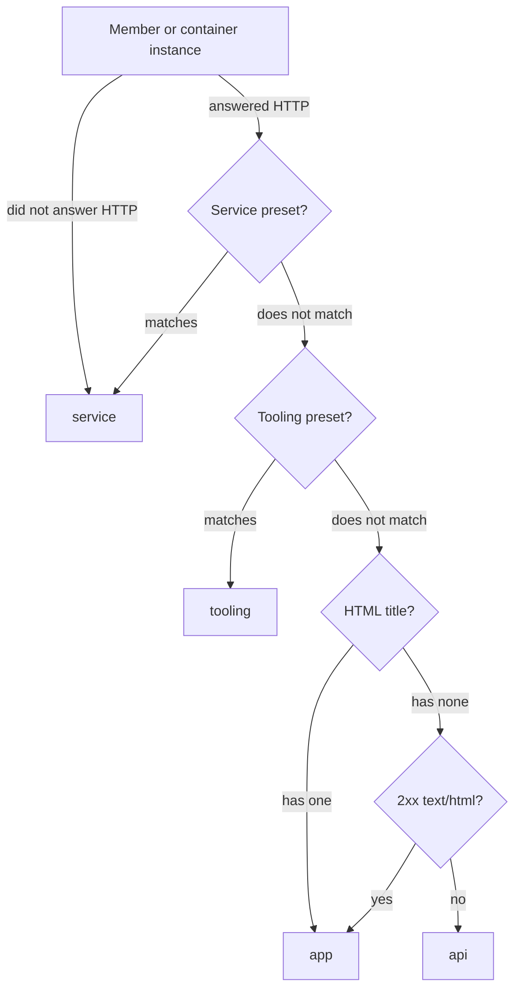

# Scannable Repository Rows with an Automatically Chosen App Link

## Summary

The Runtime page (`/runtime`) lists one card per repository, with one row per checkout. Its main job is to
let a developer scan the page and click straight into the user-facing app they are testing. Today
those rows pack a branch, copy menu, warning, port, info icon and member count into one line, and
the app URL for the main checkout sits in the card header while worktree URLs sit in their rows.
The cards are dense and hard to parse.

This plan restructures each checkout row into two columns: identity on the left and actions on the
right. Every checkout's app link appears in the same place. The link is chosen without any
configuration, by classifying each running member into a role (app, tooling, API, or service) and
ranking user-facing apps first.

## Context

Terms used throughout:

| Term | Meaning |
| --- | --- |
| Repository card | One card per repository (`tpl-repository-card` in `portal/developer-runtime/index.html`) |
| Checkout row | One row per checkout of that repository — the main checkout, then each linked worktree (`tpl-repository-root`) |
| Member | One running process in a checkout, or one Compose stack. Several ports held by one PID are folded into a single member by `collapseByPid` in `modules/developer-runtime/snapshot.mjs` |
| Entrypoint | A member whose port answered the HTTP probe with an HTML `<title>` (`entrypoint: Boolean(instance.title)` in `toMember`) |
| Role | New in this plan: the member's classification — `app`, `tooling`, `api`, or `service` |
| Promoted link | New in this plan: the one `:PORT` link a checkout row shows, taken from its highest-ranked `app` member |
| Opaque key | The snapshot-scoped key (`instance.opaqueKey`) the portal uses to fetch an instance's history and discovered routes. Listener and Compose container instances both carry one |

Members fall into three tiers of user interest:

| Tier | Roles | What it holds | How it is used |
| --- | --- | --- | --- |
| App | `app` | Pages a user of the product would visit | Supplies the promoted link |
| Secondary | `tooling`, `api` | Human-readable tooling (Storybook, Supabase Studio, Mailpit) and APIs | Clicked occasionally, from the member list |
| Context | `service` | Databases, caches, sockets, other non-human-readable ports | Listed so the developer can see what is running |

The Workspace Model plan (`h4tqm2wz`) built the persistent repository/checkout structure these rows
render; this plan changes only how a row presents it and which member it promotes.

## Goals

- Every checkout row reads as two columns: branch identity on the left, the app link and controls
  on the right.
- Each checkout's user-facing app link sits at the same position in its own row, main checkout
  included.
- The promoted link is chosen automatically, and prefers a user-facing app over tooling, APIs, and
  infrastructure without any per-repository setting.
- Compose stacks can supply the promoted link when one of their services is the user-facing app.
- The row is less dense: fewer icons, fewer separators, and no redundant headings.

## Non-goals

- Changing what a member card contains. Member cards changed shape during review (see
  Implementation notes), but they carry the same facts and actions as before, apart from the promoted
  member losing its duplicate Links dropdown.
- Changing standalone cards' layout. Shared-service Compose cards and unmatched instance cards keep
  the shared git row, its branch icon, and the 20-character branch cap. Unrecognized listeners did
  lose three actions that no longer applied to them (see Implementation notes).
- A manual "make primary" override or click-based preference learning.
- Changing what the Links panel lists for listener apps; only its label and mount point change.
  The one new variant is the discovered-only panel for a promoted Compose container.
- Building CI status. The Remote Branch Status plan (`developer-runtime-remote-branch-status`) will tint
  this plan's checkout glyph; this plan only has to leave the glyph a single element that can take
  a tint.
- Showing a promoted link for a checkout that runs no user-facing app.

## Current state

### Layout

```text
roborepo  GitHub↗  —  127.0.0.1:4317  ⓘ                                   ⋮
    ⑂ main branch  ⓘ                                           1 member ⌄
  WORKTREES
    ⑂ codex/tele…ns-report  ⧉⌄ · ⚠ 13d behind main (2)  :56183  ⓘ  1 member ⌄
    ⑂ worktree-r…time-page  ⧉⌄  :4400  ⓘ                        1 member ⌄
```

(`⑂` is the current branch icon, `⧉⌄` the copy menu.)

| Element | Current location | Source |
| --- | --- | --- |
| Main checkout URL | Card header, full `host:port`, after a `—` separator. Every titled member of the main checkout gets a header link, not only the first | `repositoryCard`, `[data-slot=entrypoint]` |
| Worktree URL | Worktree row, `:PORT`, first titled member only | `buildRootSection`, `[data-slot=root-entrypoint]` |
| Branch icon | Leading every git row, on checkout rows and standalone cards alike | `tpl-git-row` (`git-badge-icon`), filled by `applyGitBadge` |
| Branch label | A disabled `<button>` inside the shared git row; `mountCopyDropdown` strips its copy role and adds the copy control beside it | `tpl-git-row`, `mountCopyDropdown` |
| Checkout info icon | After the port, outside the git row; its tooltip is a sibling `<template>` | `[data-slot=root-info]` in `tpl-repository-root` |
| "WORKTREES" heading | Between the main row and worktree rows. The "Shared services" heading reuses its class | `repositoryCard`, `.repository-worktrees-heading` |
| Pages/Routes dropdown | Listener member cards only. Compose container rows have none: `composeProjectActions` passes `onMountRoutesTrigger`, but no Compose template consumes it | `mountRoutesTrigger` in `portal/developer-runtime/app.js` |
| Member count + chevron | Row end, plain text inside `<summary>`; the whole `<summary>` toggles the member list | `[data-slot=root-meta]` |
| Idle checkout text | "Inactive", "checkout missing", "checkout unreadable", or "no active members" (departed members only) in place of the count | `buildRootSection` and `checkoutStateLabel` |
| Branch name cap | 20 characters, middle-truncated, shared by every git row | `BRANCH_NAME_MAX_LENGTH` in `portal/developer-runtime/templates.js` |

### Member ordering

`compareMembers` in `modules/developer-runtime/snapshot.mjs` sorts entrypoints first, then alphabetically
by member name, then by port. The header links every entrypoint of the main checkout in that order,
and each worktree row links its own first one.

Member names come from `memberName`: the app name, then the Compose service or container name, then
the process command. The "Web" name is not a detected role. It is the default app slot the snapshot
auto-assigns (app id `web`, rendered by `labelFromId`) only when a project identity has a single
instance shape. Once a second kind of server runs beside it, neither gets the slot unless the user
has associated one, and both are named by process command.

Two consequences:

- Between two entrypoints, the process command decides. A Python app (`Python`) and a Node
  Storybook (`node`) sort with `node` first, so Storybook wins the promoted slot.
- Compose container ports live in `root.composeGroups`, not `root.members`, so a Compose-only
  repository never promotes a URL.

Two facts constrain the new ranking:

- Supabase CLI containers set no Compose service label, so their member name is the container name
  (`supabase_db_<project>`), not `db`. The fixture in
  `scripts/test/developer-runtime-repository-merge-check.mjs` mirrors this.
- `buildRepositories` resolves the repository name after it sorts each checkout's members, so the
  name is not yet final when `compareMembers` runs.

### Probe fields

`toInstance` in `modules/developer-runtime/instance-shape.mjs` carries the probe's `status`, `tls`, and
`title`. A listener behind an untrusted TLS certificate reports `tls: "untrusted"` with a null
`status` and no title: it did answer, but its body could not be read. `probeOrigin` in
`modules/developer-runtime/probe.mjs` does not record the response content type.

## Proposed design

### Row layout

```text
roborepo  GitHub↗  ⓘ                                                                  ⋮
 ┃ │ main branch ⓘ                                  :4317  [Links ⌄]  ⌄
 🌳 │ codex/telemetry…ditions-report ⓘ  ⧉⌄  unhealthy :56183  [Links ⌄]  ⋮
    │ ⚠ 13d behind main (2)
```

(`┃` stands in for the home glyph, `🌳` for the new tree glyph.)

| Region | Content |
| --- | --- |
| Row 1 (card header) | Repository name, provider link, repository info icon, CPU concern badge, lifecycle badge, ⋮ menu. No URL and no `—` separator. |
| Checkout row, icon column | Home glyph for the main checkout, tree glyph for every linked worktree. Replaces the branch icon. |
| Checkout row, column 1 | Branch label and info icon as one tooltip trigger, then copy options, then the drift warning. Wraps onto a second line instead of pushing column 2. |
| Checkout row, column 2 (right-aligned, no wrap) | Health and CPU badges (folded rows only, and only when something is wrong), promoted `:PORT` link, Links dropdown, then either the member toggle or the folded member's ⋮ menu. |

Rules:

- The main checkout row always renders, whether or not anything is running in it.
- The "WORKTREES" heading is removed; the icon column carries that distinction. The "Shared
  services" heading stays, because shared stacks are not checkouts, and keeps the
  `.repository-worktrees-heading` style it shares today.
- A checkout whose only member is its promoted app folds that member into the row: no toggle, the
  member's ⋮ menu at the end of column 2, the member's facts in the checkout tooltip under an "App"
  group, and a health badge beside the port only when the member is starting, degraded, or
  unhealthy. Its card would otherwise repeat the row, adding only those parts.
- Every other checkout with members gets a bare caret toggle — no border, no text — in the same
  place. Its accessible name and hover title say what it opens: "Show 2 members", "Show 4
  containers" (a Compose-only checkout), "Show 1 stopped", or combinations such as "Show 2 members ·
  1 stopped". It carries `aria-expanded`, and it is the only control that opens the member list;
  clicks elsewhere on the row no longer toggle it.
- The ⋮ menu and the caret share one fixed-width last cell, present even when empty, so the port
  and Links columns line up down the card.
- A checkout with no members shows nothing in column 2: no toggle, and no "Inactive",
  "checkout missing", or "no active members" text.
- A checkout whose directory is absent or unreadable says so in its tooltip, in a State line,
  instead of in the row.
- The row head moves out of `<summary>`. A button inside a `<summary>` is interactive content nested
  in interactive content, and the summary would still be a focusable disclosure named by the whole
  row. The row element keeps `data-root-id`, and the open-state carry-over in `reconcileSection`
  (`portal/developer-runtime/app.js`), which today reads `<details>.open` by `data-root-id`, follows
  whichever element now holds the open state.
- Below the width where both columns fit, column 2 moves under column 1.
- The branch cap on checkout rows rises from 20 to 30 characters, since the drift warning now
  wraps rather than competing for the same line.

### Branch label and tooltip

The branch label and the info icon form one trigger: one span wraps both and carries the
`data-tip-html` attribute that `portal/shared/tooltip.js` binds to, so hovering either part, or
focusing the info icon, opens the tooltip. The copy options sit outside the trigger.

Checkout rows stop using the shared git row. `tpl-git-row` and `applyGitBadge` also render the git
row on standalone Compose cards and unmatched instance cards, so the row builds its own branch
label and reuses `applyGitDrift` and `applyGitTooltipFields` for the drift warning and tooltip
fields. The label drops the native `title` that `applyGitBadge` sets, which would otherwise show a
second tooltip over the new one.

The tooltip leads with the untruncated identity, set larger than the fields below it:

| Tooltip line | Main checkout | Linked worktree |
| --- | --- | --- |
| Heading | Full branch name (`main`) | Full branch name (`codex/telemetry-tokens-conditions-report`) |
| Subheading | Checkout directory name (`roborepo`) | Worktree directory name (`telemetry-tokens-conditions-report`) |
| Existing fields | Path, Members, Tracking, Commit, Working tree, Drift, Fetched | Same |
| State | Only when the checkout is absent or unreadable | Same |

A checkout with neither git data nor a resolved path renders no tooltip, as today.

### Member roles

Each member, and each Compose container instance, gets a `role` computed in the snapshot. The
classifier takes the probe result and naming hints. A member "answered HTTP" when it has a `status`
or reports `tls: "untrusted"`:



The 2xx `text/html` branch covers app shells that set their title only from JavaScript. It needs
the response content type, which the probe does not record today: `probeOrigin` in
`modules/developer-runtime/probe.mjs` adds `contentType` to its result, and `toInstance` in
`modules/developer-runtime/instance-shape.mjs` carries it onto the instance beside `title`. When the probe
followed a loopback redirect, the content type is the one that goes with the title it kept. An
untitled `app` always ranks below a titled one (see Ranking), so it is promoted only when the
checkout has no titled app.

Presets match on page title, port, or name. A name matches when any token of the app name, process
command, Compose service name, or container name (split on `_`, `-`, and `.`) equals a preset
entry, so `supabase_db_<project>` matches `db`:

| Preset | Examples |
| --- | --- |
| Service | Names `db`, `postgres`, `redis`, `kong`, `rest`, `realtime`, `auth`, `storage`, `meta`; Supabase API `54321` and database `54322` ports |
| Tooling | Names `storybook`, `studio`, `mailpit`, `mailhog`, `inbucket`, `ngrok`; titles containing Storybook, Supabase Studio, Mailpit, MailHog, Prisma Studio, Drizzle Studio, Swagger UI, ngrok; ports `6006`, `5555`, `8025`, `4040`, `4983`, `54323` |

The presets live in their own module, so adding "Grafana is tooling" is a one-line change.

### Ranking

Members sort by role, then by tie-breakers inside a role:

| Order | Role | Rendered as |
| --- | --- | --- |
| 1 | `app` | Normal weight; eligible for the promoted link |
| 2 | `tooling` | Normal weight |
| 3 | `api` | Normal weight |
| 4 | `service` | Dimmed (`is-support`) |

Tie-breakers, applied in order:

1. The member has a page title. Only `app` can hold both titled and untitled members.
2. The page title contains the repository name, case-insensitively.
3. The name matches an app-like word: `web`, `app`, `frontend`, `client`, `site`. This mostly
   decides between Compose services and user-named apps, whose names are chosen rather than taken
   from a process command.
4. The port is a common app default: `3000`, `3001`, `4200`, `4321`, `5173`, `8000`, `8080`.
5. Lowest port.

Tie-breaker 2 needs the final repository name, so `buildRepositories` resolves the name before it
sorts members, and the comparator takes that name as context.

`entrypoint` stays on the member record unchanged; `role` is added beside it.

### Promoted link

Each checkout gets a server-computed `primaryEntrypoint`: the highest-ranked `app`-role candidate
drawn from both `root.members` and the container instances of `root.composeGroups`, as
`{ kind, opaqueKey, origin, port }`, where `kind` is `listener` or `container`. When no candidate
has the `app` role, the field is null and column 2 shows no link. The portal reads the field and
applies no ranking of its own. It finds the promoted member by `opaqueKey` when it needs the full
record, for the Links dropdown.

### Links dropdown

"Pages/Routes" is renamed "Links" in every user-visible string and code comment. Every checkout
row with a promoted link mounts the Links dropdown through `mountRoutesTrigger`:

| Promoted member | Links panel | Member card |
| --- | --- | --- |
| Listener | Full panel, as member cards show it today: discovered pages and APIs, plus saved links with add, edit, capture, and delete | Omits its own Links dropdown; other member cards keep theirs |
| Compose container | Discovered pages and APIs only. `mountRoutesTrigger` passes no `userLinks`, `onAddLink`, `onEditLink`, `onDeleteLink`, or `captureLink`, which `buildRoutesDropdown` already treats as optional | Unchanged; Compose container rows have no dropdown today |

A Compose instance's opaque key already resolves through `findCurrentInstanceByOpaqueKey`, so
`/api/developer-runtime/metadata` serves its discovered routes. Saved links cannot follow yet: they are
keyed by project identity and app id in `settings.projects`, and `currentLinks` in
`portal/developer-runtime/state.js` reads only listener projects. Saved Compose links need a settings key
for Compose apps, which is a persistent schema change and a separate plan.

`buildRoutesDropdown` shows "No pages yet." only when it offers Add, so the discovered-only panel
gets its own empty message for a Compose app with nothing discovered.

### Code placement

| Change | Location |
| --- | --- |
| Response content type | `probeOrigin` in `modules/developer-runtime/probe.mjs` and `toInstance` in `modules/developer-runtime/instance-shape.mjs` |
| Role presets | New `modules/developer-runtime/member-role-presets.mjs`: frozen tables of service and tooling titles, ports, and names, plus the app-like names and common app ports the tie-breakers read |
| Role classifier and comparator | New `modules/developer-runtime/member-role.mjs`: `classifyMemberRole` and the role comparator, reading the presets module; under 150 lines |
| Role assignment, sort, `primaryEntrypoint` | `modules/developer-runtime/snapshot.mjs` — `toMember`, the Compose instance loop in `buildDeveloperRuntimeSnapshot`, `compareMembers`, and the per-root loop in `buildRepositories`, with repository-name resolution moved ahead of the sorts |
| Checkout row rendering | New `portal/developer-runtime/repository-root-row.js`, taking `buildRootSection` and `mountCopyDropdown` out of `portal/developer-runtime/templates.js` (1,538 lines) instead of growing it |
| Row markup | `tpl-repository-root` and `tpl-repository-card` in `portal/developer-runtime/index.html`, still filled through the existing `<template>` + slot-fill convention. `tpl-git-row` is unchanged |
| Open-state carry-over | `reconcileSection` in `portal/developer-runtime/app.js` |
| Discovered-only Links panel | `mountRoutesTrigger` in `portal/developer-runtime/app.js`, and the empty message in `buildRoutesDropdown` in `portal/developer-runtime/suggestions-view.js` |
| Tree glyph (the home glyph already exists) | `portal/shared/icon.js` |
| Row styles | `portal/developer-runtime/styles.css` |
| Layout tests | New `scripts/test/portal-ui/developer-runtime-rows.spec.mjs`. The existing `portal-ui.spec.mjs` is scoped to the Home page acceptance, and the suite's `**/*.spec.mjs` match picks up the new file |

## Implementation plan

### Phase 1 — Member roles and ranking

- [x] Extend `scripts/test/developer-runtime-repository-merge-check.mjs` with the ranking scenarios
      listed under Validation, and confirm the Storybook and Compose-only scenarios fail against the
      current `compareMembers`.
- [x] Add `scripts/test/developer-runtime-member-role-check.mjs` covering each classifier branch, the
      name-token match, and each tie-breaker.
- [x] Add a `contentType` case to the probe tests in `scripts/test/developer-runtime-check.mjs`, then
      record `contentType` in `probeOrigin` and carry it through `toInstance`.
- [x] Add `modules/developer-runtime/member-role-presets.mjs` with the preset tables.
- [x] Add `modules/developer-runtime/member-role.mjs` with `classifyMemberRole` and the role comparator.
- [x] Set `role` in `toMember` and on each Compose container instance record.
- [x] Move repository-name resolution in `buildRepositories` ahead of the member sorts.
- [x] Replace the body of `compareMembers` with the role comparator.
- [x] Compute `root.primaryEntrypoint` in the per-root loop of `buildRepositories`.
- [x] Run `node scripts/test/run-checks.mjs --filter developer-runtime` and confirm the existing ordering
      assertions still pass unchanged.

### Phase 2 — Checkout row layout

- [x] Create `scripts/test/portal-ui/developer-runtime-rows.spec.mjs` with the layout scenarios listed
      under Validation, except the Links one, using the stub described under Validation, and
      confirm they fail against the current row.
- [x] Add the tree glyph to `portal/shared/icon.js`; the main checkout reuses `home`.
- [x] Move `buildRootSection` and `mountCopyDropdown` into
      `portal/developer-runtime/repository-root-row.js`.
- [x] Rework `tpl-repository-root` into icon column, column 1, and column 2, with the row head
      outside `<summary>` and the branch label built by the row instead of `applyGitBadge`.
- [x] Update the open-state carry-over in `reconcileSection` to the new open-state element.
- [x] Wrap the branch label and info icon in one tooltip trigger, and add the heading, subheading,
      and State lines to the checkout tooltip.
- [x] Render the promoted `:PORT` link in column 2 for every checkout, main included, from
      `root.primaryEntrypoint`.
- [x] Remove the entrypoint link and `—` separator from `tpl-repository-card` and
      `repositoryCard`.
- [x] Remove the "WORKTREES" heading.
- [x] Replace the root meta text with the member toggle (a bare caret, per Decisions), make it the only toggle, and hide
      it when the member list is empty.
- [x] Apply the 30-character branch cap to checkout rows and let the drift warning wrap within
      column 1.
- [x] Apply `is-support` to `service`-role members only.
- [x] Stack column 2 under column 1 at narrow widths.

### Phase 3 — Links dropdown

- [x] Rename "Pages/Routes" to "Links" in `portal/developer-runtime/app.js`, and update the "Pages &
      Routes panel" comments in `portal/developer-runtime/index.html` and
      `portal/developer-runtime/templates.js`.
- [x] Add the Links scenario listed under Validation to
      `scripts/test/portal-ui/developer-runtime-rows.spec.mjs` and confirm it fails before the move.
- [x] Mount the full Links dropdown in the checkout row when the promoted link is a listener
      member, and omit it from that member's card.
- [x] Mount the discovered-only Links dropdown when the promoted link is a Compose container, with
      its own empty message.

## Implementation notes

Implemented on branch `claude/localhost-runtime-layout-b3215c`, based on `main`, starting from
commit `d51cf4f`. The primary checkout (`main`) does not have this plan yet, so status updates live
only in this branch's copy until it merges.

Decisions made during implementation:

| Decision | Why |
| --- | --- |
| Tooling presets also match names (`storybook`, `studio`, `mailpit`, `mailhog`, `inbucket`, `ngrok`) | Supabase CLI containers carry only a container name, so `supabase_studio_<project>` needs a name match; the ngrok process is named, not titled |
| The comparator's last tie-breaker is the port alone; alphabetical member-name order is gone | Ports are unique within a checkout, and the old name ordering is exactly what let `node` outrank `Python` |
| The checkout row is a `<div>` with an `is-open` class; `isCheckoutRowOpen` and `setCheckoutRowOpen` in `repository-root-row.js` are what `reconcileSection` uses | A plain element avoids a button nested in `<summary>`; exporting the two helpers keeps the open-state rules in one module |
| `repository-root-row.js` and `templates.js` import each other | Only functions cross the boundary, called at render time, so the cycle is safe; moving the shared git-row helpers out as well would have widened the change |
| The branch label falls back to the checkout directory name when git is unavailable | A row with a glyph and no text identified nothing |
| The glyph carries an accessible name, "Main checkout" or "Linked worktree" | It replaces the "Worktrees" heading, so it now carries that meaning for screen readers too |
| `applyGitBadge` lost its `hideWorktreeSuffix` option | Checkout rows were its only caller |
| A folded row builds the member's card without showing it, moves the card's visible tooltip lines into the checkout tooltip, and mounts the card's ⋮ menu through `mountMemberMenu` (templates.js), which reuses `wireCardActions` | One source for a member's facts and actions, so a folded row and a member card can never disagree |
| Every icon on the Runtime page takes one size from `<body data-icon-size="md">`; icons there set no `size` of their own, and `portal-icon` (portal/shared/icon.js) falls back to the nearest `data-icon-size` ancestor. The branch label is regular weight | Review feedback moved info icons to `sm` first, then back to one page-wide size, so changing the step in one place resizes every icon together |
| Member cards take the checkout row's shape: name and info icon as one tooltip trigger, then port, Links, and ⋮ in the same fixed-width right-hand cells as the row (`checkout-actions`, `checkout-links-cell` at the Links trigger's measured 84px, `checkout-control-cell` at 28px) | Review feedback: every port on a card, row or member, now ends in one column |
| Surfaces come from named per-theme tokens in `portal/shared/base.css` rather than one-off `color-mix()` tints: `--surface-band` (checkout rows), `--surface-sunken` (an open member list), `--surface-inset` (Compose containers inside it), `--wash-control` / `--wash-control-strong` (soft control fills), and `--wash-heading` (tooltip section bands). `scripts/test/portal-surface-layers-check.mjs` checks, in both themes, that each layer differs visibly (CIELAB L* ≥ 2.8) from the one it sits on, that containers contrast with their list more than the list contrasts with its rows, and that tooltip bands stand out (L* ≥ 5.6) | Review feedback: tweaking individual tints kept producing layers that matched each other in one theme (light rows matched the page; dark tooltip bands nearly vanished). Named layers plus a check make the hierarchy something the page can depend on |
| Members inside a checkout's list indent by the row's glyph column (`--checkout-glyph-width` plus `--checkout-glyph-gap`), so a member's name starts under its checkout's branch name | Review feedback |
| The Links trigger in rows and member cards, and the member caret while its list is open, use the `--wash-control` fill (no border), deepening to `--wash-control-strong` on hover. A collapsed caret is bare, filled only on hover. The caret matches the Links trigger's height (`--checkout-control-height`) | Review feedback: the fill marks an open list, and the two fills beside each other should be the same height |
| Inside a combined name-and-icon trigger, the info icon has no hover state of its own; the tooltip appearing is the feedback | Review feedback: the icon's own highlight implied a separate control |
| Tooltips wait 500ms on hover before showing, site-wide (portal/shared/tooltip.js); keyboard focus still shows immediately | Review feedback: sweeping the pointer across rows flashed a tooltip on each |
| The checkout tooltip opts into `data-tip-placement="panel"`: 460px wide, and docked to the right edge with a 24px gutter on screens 1100px and wider, where it uses 16px/20px padding and a larger header (`--text-md` branch, `--text-sm` directory, `md` icons). Its heading lines carry the git-branch and home/tree glyphs | Review feedback: it is too large to float over the row being read |
| The list orders running real repositories, then dev fixtures (running or not), then idle and stale repositories. A fixture is any repository under `git:github.com/example/`, the unfetchable remote the fixtures in local/dev-fixtures use, and is badged "mock" in the same grey as "idle" | Review feedback; the remote convention already existed, so no registry flag was needed |
| Lifecycle and "mock" badges sit right after the repository's info icon, as a light `--dim` tint with `--dim` text; only `stale` keeps a solid `--warn` fill. An idle card dims its text to `--dim` instead of fading the whole card | Review feedback: the outlined badge was too subtle and a solid fill shouted over the card; `stale` needs looking at, so it stays loud. Opacity also faded the badge that explains the dimming, and a right-aligned badge broke the header's alignment with the column of row controls below it |
| The drift warning sits on the branch line, after the copy control, as an inline block; when the column narrows it drops to the next line whole | Review feedback: a grid row of its own put every drift warning under the branch even when the line had room for it |
| When only a repository's worktrees run, its main checkout row still shows its branch and tooltip. `collectIdleMainCheckouts` in `scripts/cli/developer-runtime.mjs` finds the main checkout through the git common directory shared by any known checkout path (`mainCheckoutPath` in modules/repositories/identity.mjs, beside `resolveGitDir`), reads its git through the idle-repository cache, and passes it to `buildDeveloperRuntimeSnapshot` as `idleMainCheckouts`; `buildRepositories` adds it as an idle root with no members | The always-rendered main row was otherwise a bare glyph. The registry's root `kind` records whichever checkout was seen first, so git, not the registry, identifies the main checkout; a path that no longer resolves to the repository is skipped, since a wrong branch is worse than an empty row |
| Unrecognized listeners lose Links, Change association, and Confirm alias, keeping Copy PID, View history, and Hide | They have no app slot for saved links (adding one would create a stray saved app); an association only joins a repository card when another process of that repository is scanned first; an alias never applies to their low-confidence `process:` identity |
| `local/dev-fixtures/multi-member-fixture.mjs` runs beside the Compose fixture. It generates backdated local history on each start (nothing fetched), so its main checkout sits on `feature/checkout-redesign` and its four checkouts show the four drift warnings: behind main, since main (with the stale-fetch "+"), behind remote, and unpushed | The Compose fixture cannot show several process members, a failing app, an API-only checkout, or any drift state. "Since main" and "unpushed" can only coexist in one repository when the unpushed branch is `main` itself, so `main` lives in a worktree |
| A checkout with one thing to copy shows the single copy button in the copy dropdown's bare-icon style | The fixture's feature-branch and `main` rows exposed a bordered button beside the borderless dropdown |
| `portal-copy-menu` passes `Boolean(this._flashing)` to `classList.toggle` | An undefined force argument flips the class, so every idle copy trigger rendered in its green "copied" state |
| The main checkout uses the existing `home` glyph; the tree glyph is a crown on a stem, both at the `md` icon size | Every drawn trunk read as something else at icon size (a text cursor, a stick figure, a stump nobody recognized) |

## Verification

- `node scripts/test/run-checks.mjs --filter developer-runtime`: 12/12 suites pass, including the
  new `developer-runtime-member-role-check.mjs`. Each new scenario failed before its implementation.
- `npm run test:portal-ui`: 24/24 pass, including the 10 scenarios in
  `scripts/test/portal-ui/developer-runtime-rows.spec.mjs`. Each failed before its implementation.
- Screenshots of the stubbed page checked dark theme, light theme, a 420px viewport, the checkout
  tooltip, and a drift warning wrapping under the branch.
- The live page, served by a portal with a temporary HOME and real discovery, showed the portal's
  own checkout with its promoted `:PORT` link; opening the row's Links panel listed the real
  discovered pages and API routes.
- `npm run check` passed: doctor, 423 CLI tests, the unit check group, package install, the four
  clean-machine Docker sandboxes, and the portal UI suite. The Windows installer check was skipped
  because `pwsh` is not installed.
- `local/dev-fixtures/multi-member-fixture.mjs`, started by `dev fixture start` beside the Compose
  fixture, runs plain Node servers across one repository and two worktrees. On the live page its
  main checkout promoted the app over Storybook and the API behind a "3 members" caret, the
  failing worktree folded into its row with an `unhealthy` badge, and the API-only worktree showed
  no link and a caret.
- `node scripts/cli/main.mjs dev start --port 4318` against real repositories: every repository
  rendered one row per checkout with its promoted port, Links button, and member toggle. The dev
  fixture's nginx container promoted itself in its checkout row (`kind: "container"`, `:48080`),
  and its Links panel opened discovered-only, showing the new empty message.
- After the follow-up review changes (idle main checkout, page-wide icon size, inline drift warning,
  tinted badges), `node scripts/test/run-checks.mjs --filter developer-runtime` passed 12/12, with
  new snapshot assertions for the idle main checkout in
  `scripts/test/developer-runtime-repository-merge-check.mjs`, and `npm run test:portal-ui` passed
  24/24.
- `mainCheckoutPath` (modules/repositories/identity.mjs), which resolves the main checkout on disk,
  is checked against real repositories in `scripts/test/repositories-lifecycle-check.mjs`: an
  ordinary clone, a linked worktree, an unresolvable candidate beside a good one, a bare
  repository's worktree, and a worktree whose main checkout was deleted. The skip for a main
  checkout that is already running lives in `collectIdleMainCheckouts` and has no test of its own.
- `npm run check` passed again after all of the above: doctor, 423 CLI tests, the unit check
  group, package install, the four clean-machine Docker sandboxes, and the portal UI suite. The
  Windows installer check was skipped because `pwsh` is not installed.

## Completion

Every goal is met and every Validation scenario has a check that failed before its implementation
and passes now: the ranking scenarios in `scripts/test/developer-runtime-repository-merge-check.mjs`
and `scripts/test/developer-runtime-member-role-check.mjs`, the probe's `contentType` in
`scripts/test/developer-runtime-check.mjs`, and the layout scenarios in
`scripts/test/portal-ui/developer-runtime-rows.spec.mjs`. Saved links for Compose apps remain out
of scope (they need a settings schema change of their own), and CI status on the checkout glyph
belongs to `developer-runtime-remote-branch-status`.

## Validation

Ranking, asserted in Node checks:

- A checkout running a Python app (`Python`, titled) and Storybook (`node`, titled "Storybook")
  promotes the Python app, although `node` sorts first by name.
- A checkout running only a JSON API has a null `primaryEntrypoint`.
- A Compose-only checkout whose `web` service serves HTML promotes that service's port.
- Postgres and Redis containers classify as `service`, and so does a Supabase CLI container named
  `supabase_kong_<project>` with no Compose service label.
- A listener that reports `tls: "untrusted"` classifies as `api`, not `service`.
- Two `app` candidates with no name or title hints, neither on a common app port, resolve to the
  lower port.
- A titled member whose title contains the repository name outranks a titled member on port 3000.
- A 2xx `text/html` member without a title classifies as `app` and is promoted when it is the only
  app; beside a titled app, the titled one is promoted. A 404 `text/html` member without a title
  classifies as `api`.
- The probe records the `Content-Type` header as `contentType` on the instance.

Layout, asserted in Playwright by role and accessible name:

- The main checkout row exposes a link named for its port, and the card header exposes no port
  link.
- A checkout with members exposes a "Show N members" button; activating it reveals the member
  list, and clicking the branch label does not.
- A checkout with no members exposes no member toggle and no "Inactive" text.
- A checkout whose only member is its promoted app exposes no toggle, exposes that member's
  "Actions" menu in the row, shows an "unhealthy" badge when the member is unhealthy, and lists the
  member's facts under "App" in its tooltip.
- A Compose-only checkout's toggle is named "Show 1 container".
- Hovering the branch label opens a tooltip whose first line is the full branch name.
- The Links button appears in the checkout row, and the promoted member's card has none.
- A checkout whose promoted link is a Compose container also shows a Links button in its row.

The Playwright scenarios run against the real portal server that `scripts/test/portal-ui/run.mjs`
boots, with the Runtime snapshot stubbed in the browser:

- Build the stub body in the spec with `buildDeveloperRuntimeSnapshot` from a synthetic discovery input,
  as the Node checks do, so `role` and `primaryEntrypoint` come from the real builder rather than a
  hand-written copy of the snapshot shape.
- Register `page.route("**/api/developer-runtime", …)` before `page.goto` and answer with
  `route.fulfill({ json })`. Unlike `scripts/dev/docs-screenshots.mjs`, never call `route.fetch()`:
  the hermetic server would otherwise run real discovery against the host's listeners.
- Also stub `POST /api/developer-runtime/refresh` with the same body. A 404 from
  `/api/developer-runtime/metadata`, which a fixture opaque key always gets, triggers a forced refresh
  that would replace the fixture with real discovery.
- The Links scenario asserts the button and does not open it.
- The 10-second poll re-requests the same stubbed body, so it does not rebuild the cards mid-test.

A throwaway spec against the hermetic server confirmed this setup on 2026-09-29: the page rendered
both fixture checkout rows, and the stubbed GET was the only Runtime API request.

Commands:

```bash
node scripts/test/run-checks.mjs --filter developer-runtime
npm run test:portal-ui
```

`npm run test:portal-ui` prints `skip:` and exits 0 when Chromium is missing, which would pass a
"confirm it fails" step silently. Check `node scripts/test/portal-ui/has-browser.mjs` exits 0
before relying on it.

A manual pass against the live page confirms both themes and a narrow viewport.

## Risks

| Risk | Mitigation |
| --- | --- |
| macOS `lsof` truncates process command names, so name presets match less reliably on native processes | Title and port presets classify most native processes; name presets matter mainly for Compose services and containers, whose names are exact |
| A title-less 2xx HTML page that is not the product (a framework placeholder, a static file listing) takes the promoted slot | It is promoted only when the checkout has no titled app, and it is still a page a person can open |
| An HTTPS dev server with an untrusted certificate has no readable title, so it ranks as `api` and is never promoted | Trusting the certificate locally restores the title; the classifier at least keeps it out of `service` |
| A server whose root returns an HTML error page with a `<title>` classifies as `app` | Tie-breakers still rank a repository-titled or app-named member above it |
| The card header no longer shows the full host, so `127.0.0.1` vs `[::1]` is not visible at a glance | The promoted link keeps the full origin in its `href` and `title`, as worktree links do today |
| The row surface no longer toggles the member list, which changes a learned interaction | The toggle is a caret at the row end, where the old toggle text sat; its hover title and accessible name say what it opens ("Show 2 members"), and it takes a fill on hover and while its list is open |

## Decisions

| Question | Decision | Why |
| --- | --- | --- |
| How should a checkout show its members? | Fold a lone promoted member into the row; otherwise a bare caret named for what it opens, in the same fixed cell as the ⋮ | A bare `N ⌄` did not say what it counted, and for the common single-app checkout the card it opened repeated the row except for its menu and tooltip facts |
| Should a promoted Compose instance get the Links dropdown? | Yes, with discovered pages and APIs only | Every row with a promoted link gets the same column 2. Discovered routes already resolve by opaque key; saved links would need a settings schema change and wait for their own plan |
| Should an untitled HTML response count as `app`? | Yes for 2xx `text/html`, ranked below every titled app | Covers app shells that set their title from JavaScript, and is promoted only when nothing titled is running |
| Where does CI status from `developer-runtime-remote-branch-status` go once the branch icon is gone? | On this plan's checkout glyph, tinted by verdict, with the verdict also written in the checkout tooltip | The glyph is per checkout and always present, and it adds no new element to the row. That plan's Placement section records this |
