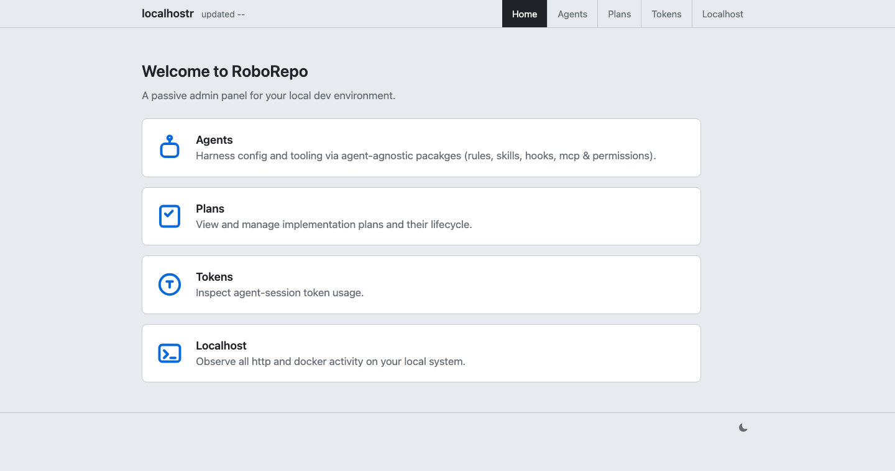

# RoboRepo User Docs

RoboRepo is a local portal for managing agent configuration, development plans, running apps,
and session telemetry. Run `roborepo web`, then choose **Agents**, **Plans**, **Tokens**, or
**Localhost** from the home page.

These docs explain how to install RoboRepo and use those views.

## Start Here

| I need to... | Read |
| --- | --- |
| Install roborepo | [First-Time Setup](guides/first-time-setup.md) |
| Use roborepo day to day | [Setup and Daily Use](guides/setup-and-daily-use.md) |
| Understand install/update choices | [Install Workflows](guides/install-workflows.md) |
| Use the CLI | [roborepo CLI Commands](reference/roborepo-cli.md) |
| Understand exact install collision behavior | [Config Collision Handling](reference/config-collision-handling.md) |
| Browse and manage plan docs | [Plan Docs Walkthrough](guides/plan/lifecycle/plan-docs.md) |
| Investigate token usage and recorded changes | [Tokens Page User Guide](guides/telemetry.md) |

## Reference

| Area | Reference |
| --- | --- |
| CLI surface | [roborepo CLI Commands](reference/roborepo-cli.md) |
| Core behavior | [roborepo CLI Reference](reference/roborepo.md) |
| Filesystem model | [How It Works](reference/architecture.md) |
| Skills | [roborepo Skills Interface](reference/roborepo-skills.md) |
| Hooks | [Claude Hooks](reference/claude-hooks.md), [Codex Hooks](reference/codex-hooks.md) |
| Portal | [Portal](reference/portal.md), [Plans Portal](reference/plans-portal.md) |
| Localhoster | [Localhoster](reference/localhoster.md) |
