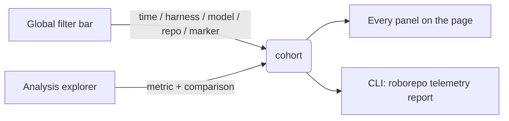
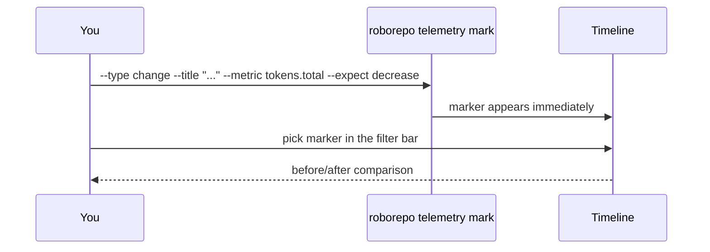
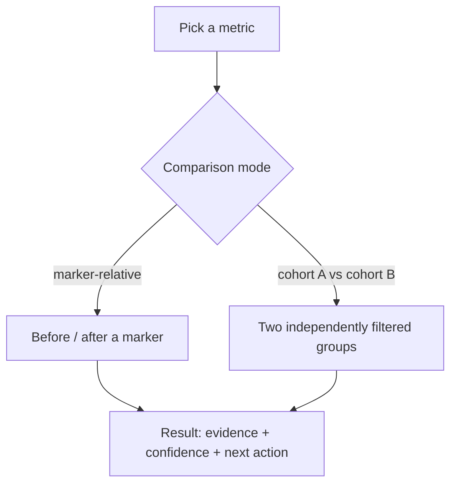
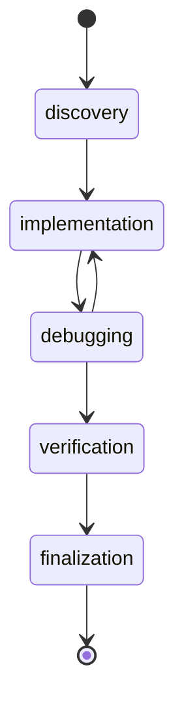

# Telemetry Walkthrough

## Purpose

Telemetry gives you a local, opt-in view of what your Claude/Codex sessions cost — tokens, tool
calls, time — and lets you mark a change you made and see whether sessions after it differ from
sessions before it. Everything stays on your machine; nothing is uploaded.

For the full technical reference (schemas, API routes, privacy details), see
[Telemetry Service Reference](../reference/telemetry.md). This guide is the "what do I
click" version, meant to be read inline from the `/telemetry` page itself.

## Open The Page

```sh
roborepo web
```

```text
http://127.0.0.1:4317/telemetry
```

Local-only, refreshes every 5 seconds. If telemetry isn't on yet, the page shows a "turn on
telemetry" prompt instead of data.

## How A Filter Reaches The Page



Two different things narrow what you see, and they feed the same cohort:

- The **global filter bar** (top of page) — always on, applies to every panel at once.
- The **Analysis explorer** (bottom of page) — a one-off deeper comparison, doesn't change what
  the rest of the page shows.

## Global Filters

| Filter | Where | Narrows to |
| --- | --- | --- |
| Time range | `time range` row | 1h / 6h / 1d / 1w / all, or drag on the chart to pan |
| Source | `source` row | Claude only, Codex only, or both |
| Model | `filters` row → model dropdown | one model |
| Repository | `filters` row → repo dropdown | one repo |
| Marker | `filters` row → marker dropdown | before/after a `change` marker instead of a plain filter |

Model and repository are scoped to whatever source is selected — pick Codex and the model dropdown
only offers models actually used by Codex sessions, not Claude's. Switching source resets model and
repository, since a value picked under one source may not exist under the other.

Every filter serializes into the page URL — a filtered view can be bookmarked or shared and comes
back exactly as left. A small count badge and a **clear** link appear once anything is active.

## Markers

A marker is a timestamped note on the timeline: "I changed X here." Telemetry can then split
sessions into before/after that marker and compare them.



| Marker type | When to use it |
| --- | --- |
| `change` | You changed something (skill, rule, package) and want to measure the effect — the one you'll use most |
| `outcome` | Record whether a session/task succeeded |
| `phase` | Mark an explicit task-phase boundary |
| `note` | Free-form timestamped context |
| `experiment-start` / `experiment-end` | Bookended by `roborepo telemetry experiment start/end` |

**From the UI:** click **"+ mark change"** (top-right, below the filter bar) → title, optional metric, expected
direction → submit. Shows up on the chart immediately.

**From the terminal**, the same thing:

```sh
roborepo telemetry mark --type change --title "Prevent full-suite debugging loops" \
  --metric test.full_suite_calls_per_debug_phase --expect decrease
```

## Panel Map

The page is ordered most-actionable-first, top to bottom:

| # | Panel | Tells you |
| --- | --- | --- |
| ① | what this means · action items | Plain-English findings, ranked — read this first |
| ② | token usage over time | The chart; markers render as colored vertical lines |
| ③ | warnings & abnormalities | Testing efficiency, data quality, repeated reads, tool loops, spikes |
| ④ | cost analysis *(collapsed)* | What each tool/MCP package puts into context |
| ⑤ | sessions *(collapsed)* | Every session ranked by tokens |
| ⑥ | raw breakdowns *(collapsed)* | Supporting totals |
| ⑦ | analysis explorer *(collapsed)* | Deeper comparisons, described below |

### Testing Efficiency

Full vs. targeted test activity, redundant reruns, and how much of captured tokens (v2 report) or
tool time (v1 dashboard) goes to testing — the panel most likely to surface a debugging-loop
problem worth fixing. On the v2 report this includes the targeted-to-full ratio and full-suite
reruns that reproduced an unchanged failure signature.

### Marker-Relative Comparison

When a marker is selected in the filter bar, this replaces the exploratory midpoint regression
with a real before/after comparison anchored to that specific change.

## Analysis Explorer

For anything the global filter bar doesn't cover — a specific metric, or two custom cohorts with
no shared marker to split around:



The metric list comes from one shared registry — the same formulas the CLI report and every
alert use, so a number never means two different things depending on where you're looking at it.

## Session Detail

Click any session chip or flagged row on the Tokens page to open a drill-down popup: what the
session was (opening prompt, repo, agent), what telemetry flagged in it — the same deterministic
findings the Investigate sections show, with the recommended fix — and a ready-to-paste analysis
prompt for your coding agent. When the transcript is still on disk, the heaviest turns are listed
under "Heaviest turns in this chat."

The v1 dashboard (`/tokens_v1`) opens the older detail modal instead: model history,
configuration snapshot, a phase timeline, tool totals, and the outcome/task category if one was
set.



## Related

- [Telemetry Service Reference](../reference/telemetry.md) — schemas, CLI commands, API
  routes, privacy/retention details.
- [Portal Technical Reference](../reference/portal.md) — the shared portal server
  architecture.
