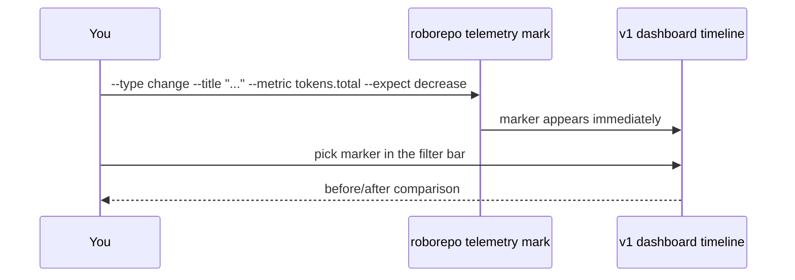
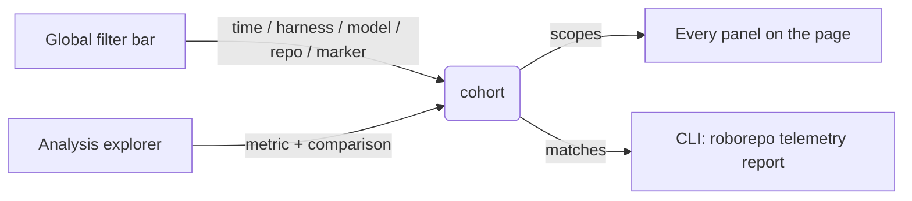
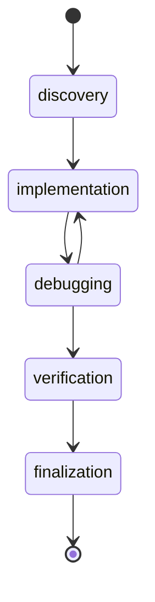
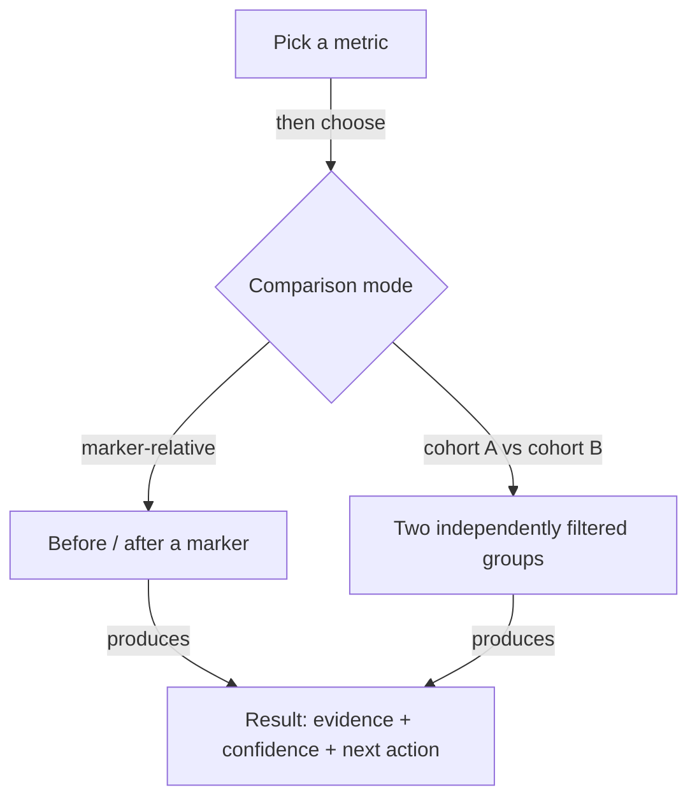

# Telemetry Walkthrough

## Purpose

Telemetry shows what your Claude and Codex sessions cost — tokens, tool calls, and time. Mark a change
you made, and it compares sessions before and after it. It is local and opt-in; nothing leaves your
machine.

This guide walks through the portal page. For schemas, privacy, and retention details, see the
[Telemetry Service Reference](../reference/telemetry.md).

## Open The Page

```sh
roborepo web
```

```text
http://127.0.0.1:4317/tokens
```

Local-only, refreshes every 5 seconds. If telemetry isn't on yet, the page shows a "turn on
telemetry" prompt. Until real sessions are captured, it shows a simulated report under a banner so
you can see what the page will contain.

## Read The Tokens Page

The page is ordered from verdict to evidence, top to bottom:

| Section | Tells you |
| --- | --- |
| Identifiable waste | How much of your token spend went to avoidable patterns, this week and all time, with the top offenders |
| Action items | Plain-English findings, ranked, each with the change to make — read this first |
| Investigate | A set of questions, each with a short answer badge and the evidence behind it (listed below) |
| When did problems happen | A timeline of flagged events; click a mark to open that session |
| Agent-ready prompt | A copyable prompt that hands the evidence above to your coding agent |
| Full data *(collapsed)* | Top-N lists, sessions, and data-quality notes |

The Investigate questions:

| Question | What it looks at |
| --- | --- |
| What made tokens jump | Each spike, tagged with the behavior that drove it |
| Which tools are spike-prone | Tool groups that drive spikes more than their normal share |
| Tools that got stuck | The same tool firing many times in a row — likely a retry loop |
| Context bloat from reads | Large or repeated reads that inflated context |
| Which tool groups cost the most? | Token share by tool group |
| Did anything get more expensive? | The first half of your data against the second half |
| Are you over-testing? | Testing efficiency — see below |

### Testing Efficiency

Full vs. targeted test activity, redundant reruns, and how much of captured tokens goes to testing —
the section most likely to surface a debugging-loop problem worth fixing. It includes the
targeted-to-full ratio and full-suite reruns that reproduced an unchanged failure signature. On
`/tokens` this is the **Are you over-testing?** question; the
[v1 dashboard](#the-v1-dashboard) shows it as a panel measured in tool time.

## Session Detail

Click any session chip or flagged row to open a drill-down popup. It shows what the session was
(opening prompt, repo, agent), what telemetry flagged in it with the recommended fix, and a
ready-to-paste analysis prompt for your coding agent. When the transcript is still on disk, the heaviest turns are listed under "Heaviest
turns in this chat."

## Markers

A marker is a timestamped note on the timeline: "I changed X here." Telemetry can then split
sessions into before/after that marker and compare them.

Create one from the terminal:

```sh
roborepo telemetry mark --type change --title "Prevent full-suite debugging loops" \
  --metric test.full_suite_calls_per_debug_phase --expect decrease
```

| Marker type | When to use it |
| --- | --- |
| `change` | You changed something (skill, rule, package) and want to measure the effect — the one you'll use most |
| `outcome` | Record whether a session/task succeeded |
| `phase` | Mark an explicit task-phase boundary |
| `note` | Free-form timestamped context |
| `experiment-start` / `experiment-end` | Bookended by `roborepo telemetry experiment start/end` |

Creating markers in the browser and comparing sessions across one happen on the
[v1 dashboard](#the-v1-dashboard):


```mermaid
sequenceDiagram
  participant You
  participant CLI as roborepo telemetry mark
  participant Timeline as v1 dashboard timeline
  You->>CLI: --type change --title "..." --metric tokens.total --expect decrease
  CLI->>Timeline: marker appears immediately
  You->>Timeline: pick marker in the filter bar
  Timeline-->>You: before/after comparison
```

## The v1 Dashboard

The earlier dashboard is still served at `/tokens_v1`, hidden from the portal nav. It reads the same
data as `/tokens` and adds the filtering and comparison tools below.

### How A Filter Reaches The Page


```mermaid
flowchart LR
  A[Global filter bar] -->|time / harness / model / repo / marker| B(cohort)
  C[Analysis explorer] -->|metric + comparison| B
  B -->|scopes| D[Every panel on the page]
  B -->|matches| E[CLI: roborepo telemetry report]
```

Two different things narrow what you see, and they feed the same cohort:

- The **global filter bar** (top of page) — always on, applies to every panel at once.
- The **Analysis explorer** (bottom of page) — a one-off deeper comparison, doesn't change what
  the rest of the page shows.

### Global Filters

| Filter | Where | Narrows to |
| --- | --- | --- |
| Time range | `time range` row | 1h / 6h / 1d / 1w / all, or drag on the chart to pan |
| Source | `source` row | Claude only, Codex only, or both |
| Model | `filters` row → model dropdown | one model |
| Repository | `filters` row → repo dropdown | one repo |
| Marker | `filters` row → marker dropdown | before/after a `change` marker instead of a plain filter |

Model and repository are scoped to whatever source is selected — pick Codex and the model dropdown
only offers models actually used by Codex sessions, not Claude's. Switching source resets model and
repository, since a value picked under one source may not exist under the other.

Every filter serializes into the page URL — a filtered view can be bookmarked or shared and comes
back exactly as left. A small count badge and a **clear** link appear once anything is active.

To create a marker here, click **"+ mark change"** (top-right, below the filter bar) → title,
optional metric, expected direction → submit. It shows up on the chart immediately.

### Panel Map

| # | Panel | Tells you |
| --- | --- | --- |
| ① | what this means · action items | Plain-English findings, ranked — read this first |
| ② | token usage over time | The chart; markers render as colored vertical lines |
| ③ | warnings & abnormalities | Testing efficiency, data quality, repeated reads, tool loops, spikes |
| ④ | cost analysis *(collapsed)* | What each tool/MCP package puts into context |
| ⑤ | sessions *(collapsed)* | Every session ranked by tokens |
| ⑥ | raw breakdowns *(collapsed)* | Supporting totals |
| ⑦ | analysis explorer *(collapsed)* | Deeper comparisons, described below |

Clicking a session opens the older detail modal: model history, configuration snapshot, a phase
timeline, tool totals, and the outcome/task category if one was set. The phase timeline uses these
phases:


```mermaid
stateDiagram-v2
  [*] --> discovery
  discovery --> implementation
  implementation --> debugging
  debugging --> implementation
  debugging --> verification
  verification --> finalization
  finalization --> [*]
```

### Marker-Relative Comparison

When a marker is selected in the filter bar, this replaces the exploratory midpoint regression
with a real before/after comparison anchored to that specific change.

### Analysis Explorer

For anything the global filter bar doesn't cover — a specific metric, or two custom cohorts with
no shared marker to split around:


```mermaid
flowchart TD
  A[Pick a metric] -->|then choose| B{Comparison mode}
  B -->|marker-relative| C[Before / after a marker]
  B -->|cohort A vs cohort B| D[Two independently filtered groups]
  C -->|produces| E[Result: evidence + confidence + next action]
  D -->|produces| E
```

The metric list comes from one shared registry — the same formulas the CLI report and every
alert use, so a number never means two different things depending on where you're looking at it.

## Related

- [Telemetry Service Reference](../reference/telemetry.md) — schemas, CLI commands, API
  routes, privacy/retention details.
