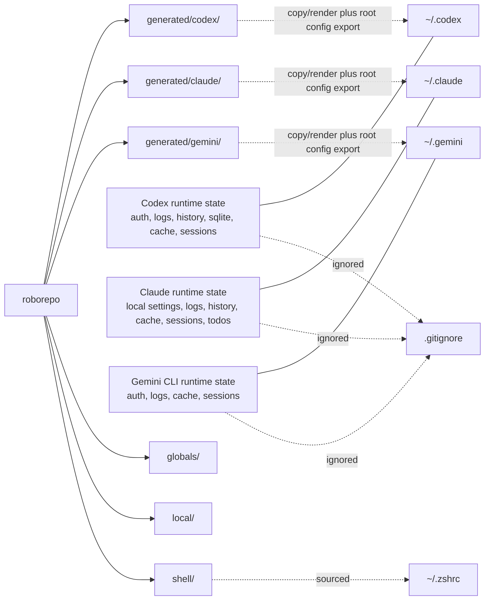
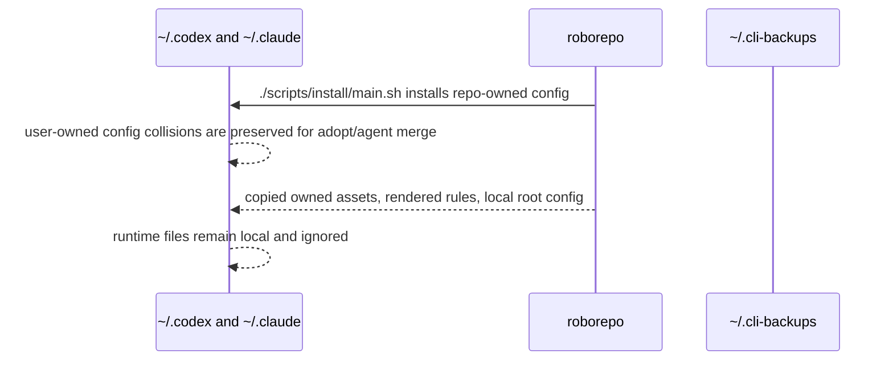

# How It Works

## Relationship

The three harnesses below are the ones registered today, not a fixed set. roborepo renders one
generated tree and one home directory per *discovered* provider, so this diagram grows a branch
whenever a provider is added — see
[Harness Provider Interface](../guides/harnesses/harness-provider-interface.md).



## Materialization Map

Install materializes repo source into harness homes by copying owned files, rendering rules, linking
enabled skills through a machine-local cache, and preserving mutable root config. Home files do not
point back to the checkout, except for the `roborepo` command symlink under `~/.local/bin` and
per-skill links from each harness into `~/.roborepo/skills/<name>`.

Codex (`~/.codex/` from `generated/codex/` plus `globals/harnesses/codex/`, plus enabled skill links
into `~/.codex/skills/` and enabled package command output from `generated/packages/<package>/codex/commands/`):

- `AGENTS.md` rendered from base fragments plus enabled package fragments
- `config.toml` exported as a local active file
- `hooks.json` composed from system hooks plus enabled package hook resources
- `MANAGED_BY_ROBOREPO.md`
- `commands/` composed from enabled packages only
- `rules/`
- `skills/<name>` links to `~/.roborepo/skills/<name>` for each enabled shared skill

Claude (`~/.claude/` from `generated/claude/` plus `globals/harnesses/claude/`):

- `CLAUDE.md` rendered from base fragments plus enabled package fragments
- `settings.json` exported as a local active file, with hooks composed from system hooks plus enabled package hook resources
- `MANAGED_BY_ROBOREPO.md`
- `commands/` composed from enabled packages only
- `skills/<name>` links to `~/.roborepo/skills/<name>` for each enabled shared skill

## Install Workflow Filesystem Shapes

Root config files are mutable user state. The repo keeps portable baseline templates, but active home files are local copies or user-owned files, not direct symlinks.

Package mode separates three roots:

- `appRoot` — immutable release files: built-ins, manifests, scripts, CLI, templates.
- `workspaceRoot` — Git-portable user-authored files: `workspace.json`, `skills/`, `commands/`,
  `mcp/servers.json`, `packages/`, and `overrides/`.
- `stateRoot` — machine-local state: enabled packages, onboarding state, managed skill cache,
  telemetry, and drift hashes.

Workspace resources are typed. Custom skills and commands cannot shadow built-ins. Workspace
packages and MCP server definitions may replace a built-in only when `overrides/resources.json`
contains an explicit `{ "type": "package"|"mcp-server", "id": "...", "mode": "replace" }` entry.
Package-mode `apply` materializes workspace skills and commands after built-ins; npm owns the
`roborepo` executable, so package-mode apply skips `~/.local/bin` and shell profile mutation.

### Managed Copies And Rendered Rules

Repo files are source input. The global harness path receives concrete files or directories.

```text
~/.codex/AGENTS.md              # rendered_rules
~/.codex/commands               # managed_copy
~/.codex/hooks.json             # managed_copy
~/.codex/rules                  # managed_copy
~/.codex/skills/<name>          # symlink to ~/.roborepo/skills/<name>
~/.claude/CLAUDE.md             # rendered_rules
~/.claude/commands              # managed_copy
~/.claude/hooks                 # managed_copy
~/.claude/skills/<name>         # symlink to ~/.roborepo/skills/<name>
~/.roborepo/skills/<name>       # managed skill cache with .builtin-managed marker
```

Implication: updates become active only after `roborepo update`, package enable/disable, or another explicit render/copy action.

### Root Config Export

Repo files are portable baselines. Active global files are local copies or existing user-owned files.

```text
<repo>/generated/codex/config.toml              # repo baseline
~/.codex/config.toml                    # active local file

<repo>/generated/claude/settings.json           # repo baseline
~/.claude/settings.json                 # active local file
```

Implication: runtime trust, hook approvals, local profiles, and machine-specific state stay out of repo source. If both sides exist, the installer keeps the local file and prints merge guidance instead of replacing it.

Agent permission defaults are authored in `manifests/inventory/agent-permissions.json` and rendered by `scripts/build/render-agent-permissions.mjs`.

- `generated/codex/config.toml` receives generated session defaults such as `sandbox_mode`, `approval_policy`, and workspace network access.
- `generated/codex/rules/default.rules` receives generated shell command prefix policy such as allowed local commands and denied Git remote commands.
- `generated/claude/settings.json` receives generated `permissions.allow`, `permissions.deny`, and `permissions.ask` arrays from the same behavior and command buckets.

Because `~/.codex/rules` and root config are copied, repo edits require `roborepo update` or the relevant renderer before they affect an existing machine.

`roborepo mcp add` is the Codex MCP registration exception: it writes active
`~/.codex/config.toml` immediately so the server is usable on this machine without waiting for a
later update. The portable MCP intent remains in `manifests/inventory/mcp-servers.json`.

### Root Config Merge Options

#### Overwrite existing files

Repo version becomes active in the global config location. Existing local files are preserved beside
the active file with an `_original_TIMESTAMP` suffix.

```text
~/.codex/
  config.toml                    # repo version, active
  config_original_20260709-120000.toml

~/.claude/
  settings.json                  # repo version, active
  settings_original_20260709-120000.json
```

Implication: user does not lose old config, but must merge wanted local settings back from the
`*_original_TIMESTAMP` file.

#### Keep existing files

User-owned config remains active. Repo candidates are staged beside the active file with an
`_update_TIMESTAMP` suffix.

```text
~/.codex/
  config.toml                    # existing local version, active
  config_update_20260709-120000.toml

~/.claude/
  settings.json                  # existing local version, active
  settings_update_20260709-120000.json
```

Implication: user keeps current behavior, but must merge wanted repo defaults from the
`*_update_TIMESTAMP` file.

#### Merge review prompt

User-owned config remains active until the selected install mode or collision policy completes. The installer prints a merge prompt that points at both local and repo paths after actions that create backups or staged defaults.

```text
<repo>/generated/codex/config.toml              # repo candidate
~/.codex/config.toml                    # existing local version, active

<repo>/generated/claude/settings.json           # repo candidate
~/.claude/settings.json                 # existing local version, active
```

Implication: no automatic merge. The agent/user compares both sides and applies intentional edits after the installer finishes the backup-producing action.

### Drift-aware root config

Root config rows get an additional drift check before collision policy applies. Roborepo records the
hash of the last root config it wrote under `~/.roborepo/config-state/root-config.json`. If the live
file still matches that hash, a changed repo baseline is a clean update and can be regenerated
silently. If the live file changed after roborepo's last write, it is treated as user drift and goes
through `keep`, `overwrite`, or `abort`.

Package, permission, and MCP mutations share the same state file, but record only when the pre-write
file was already clean/missing or matched the repo baseline. If a mutation merges into an
already-drifted user file, the merged file stays drifted so a later update does not mistake
preserved user content for roborepo-owned baseline.

See [Config Collision Handling](config-collision-handling.md) for the exact collision,
backup, and uninstall behavior.

### Shared skills: canonical source + machine-local cache

Package-owned shared skills are sourced from `globals/packages/<package>/skills/<name>/` (each a
folder with a `SKILL.md`). The required base support skill remains a system skill at
`globals/system/skills/builtin-support/`. Roborepo materializes those skills into a
machine-local cache at `~/.roborepo/skills/<name>` and then symlinks each installed harness view to
that cache entry:

- **Codex** reads `~/.codex/skills`. The installer links enabled shared skills to
  `~/.roborepo/skills/<name>`, and `~/.codex/skills/<name>` points at that cache entry. Codex's
  own native skills are real directories at `~/.codex/skills/.system/` and are left untouched.
- **Claude** reads `~/.claude/skills`. The installer links enabled shared skills to the same
  cache entry, and `~/.claude/skills/<name>` points at it too.

The cache entries carry the `.builtin-managed` marker. Skills are materialized by enumerating the
package catalog plus the required system support skill, not by legacy skill manifest rows.
`scripts/doctor.sh --installed` checks the live cache entry and harness symlinks; `scripts/doctor.sh`
checks that source dirs exist in the repo.

### Two skill layers: shared vs. internal

There are two distinct, firewalled skill layers:

- **Shared** — package-owned `globals/packages/<package>/skills/<name>/` plus the required system
  `globals/system/skills/builtin-support/`. Materialized into `~/.roborepo/skills/<name>` and
  symlinked from each installed harness's native skills dir at install/update time; global on both
  harnesses and exportable to other repos when package-owned. Advisory coding skills any repo may
  receive.
- **Internal** — `local/skills/<name>/`, linked **only** into this repo's own project-scope
  dotdirs (`.claude/skills`, `.codex/skills`) by `link-skills.sh`. These describe how to
  develop/maintain this repo and are **never** global and **never** exported. The separation is
  structural: the export/installer tools read package-owned and system shared skill sources, with
  no code path to `local/skills/`.

### Client utilities (same model, for other repos)

One Node command, `roborepo`, is the consumer front door (see the README for the full subcommand
list). For the dual-harness skill model it offers:

- `skill export-to-project`: bundles shared skills into a `.zip` and copies them into a target
  project's `.claude/skills` and `.codex/skills` folders.
- `skill link-project`: treats the target project's `.codex/skills/<name>` as the canonical project
  skill source, then links those skills into `.claude/skills` when a Claude project root exists.
  Interactive runs ask before creating a missing Claude root; noninteractive runs do not create
  missing agent roots.
- `skill inspect <name>`: reports source ownership, managed cache state, native collisions,
  native-only metadata, and per-harness install state without changing files.
- `skill native`: points users to native Claude/Codex plugin commands for harness-specific actions
  instead of wrapping those commands.

This is purely in-repo and never touches global `~/.claude` or `~/.codex`.

`roborepo` also folds in `mcp add`/`mcp apply`/`index`/`run` and dispatches the lifecycle
verbs `update`/`doctor` to the existing bash scripts (the first install is the
shell bootstrap `install/main.sh`, so there is no root-level `install` verb). Shared skill logic
lives in `scripts/cli/skill-lib.mjs`.

## Runtime State

The materialization map above covers what installation *puts* on disk. This covers what accumulates
there afterwards: observability data roborepo writes while you work, all of it machine-local, none
of it part of the portable profile.

| Store | Path under `<stateRoot>` | Shape | Bound |
| --- | --- | --- | --- |
| Localhoster history | `localhoster/history.jsonl` | append-only JSONL | 14 days (user preference, 1–365), 2MB |
| Telemetry spool | `telemetry/spool/<harness>.jsonl` | append-only JSONL | 25MB per harness |
| Telemetry markers | `telemetry/events/markers.jsonl` | append-only JSONL | 5MB |
| Telemetry snapshots | `telemetry/snapshots/` | one file per id | 5MB total |
| Telemetry experiments | `telemetry/experiments/` | one file per id | 5MB total |
| Dense bash capture | `capture/<harness>/dense-bash.jsonl` | append-only JSONL | 30 days, 10MB |
| Usage snapshots | `usage/latest/<harness>.json` | overwritten per harness | self-bounding |

Each store trims itself on write; nothing runs on a schedule. The decision of *what* is stale lives
in one place (`modules/retention/`), while the write stays with each store, because the correct
write differs by reader: a reader that holds a byte cursor needs an in-place shrink it can detect,
and a reader that reads whole files needs an atomic rename.

Durable user intent — the repository registry, command overrides, enabled packages — is not listed
here. It never expires and is not observability data.

```
roborepo maintenance stores                  # sizes against bounds
roborepo maintenance stores reset <id>       # apply that store's policy now
roborepo maintenance stores reset <id> --all # clear it outright
```

`roborepo doctor --installed` fails when a store is over its cap.

## Sync Flow


