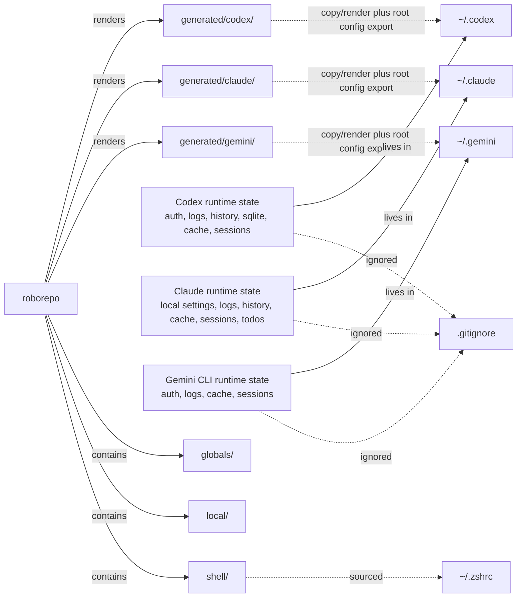
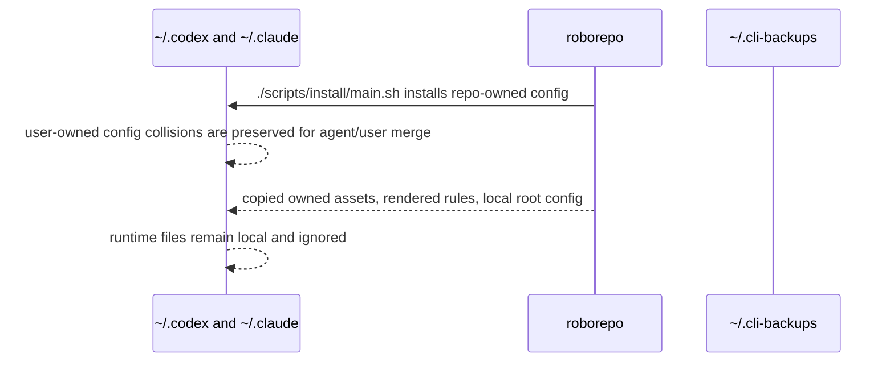

# How It Works

## Relationship

The three harnesses below are the ones registered today, not a fixed set. RoboRepo renders one
generated tree and one home directory per *discovered* provider, so this diagram grows a branch
whenever a provider is added — see
[Harness Provider Interface](../../internal/harness-provider-interface.md).


```mermaid
flowchart LR
  repo["roborepo"]
  codexGen["generated/codex/"]
  claudeGen["generated/claude/"]
  geminiGen["generated/gemini/"]
  codexHome["~/.codex"]
  claudeHome["~/.claude"]
  geminiHome["~/.gemini"]
  codexRuntime["Codex runtime state<br/>auth, logs, history, sqlite, cache, sessions"]
  claudeRuntime["Claude runtime state<br/>local settings, logs, history, cache, sessions, todos"]
  geminiRuntime["Gemini CLI runtime state<br/>auth, logs, cache, sessions"]

  repo -->|renders| codexGen
  repo -->|renders| claudeGen
  repo -->|renders| geminiGen

  codexGen -. copy/render plus root config export .-> codexHome
  claudeGen -. copy/render plus root config export .-> claudeHome
  geminiGen -. copy/render plus root config export .-> geminiHome

  codexRuntime -->|lives in| codexHome
  claudeRuntime -->|lives in| claudeHome
  geminiRuntime -->|lives in| geminiHome

  codexRuntime -. ignored .-> gitignore[".gitignore"]
  claudeRuntime -. ignored .-> gitignore
  geminiRuntime -. ignored .-> gitignore

  shellRepo["shell/"]
  globalsRepo["globals/"]
  localRepo["local/"]
  zshrc["~/.zshrc"]
  repo -->|contains| globalsRepo
  repo -->|contains| localRepo
  repo -->|contains| shellRepo
  shellRepo -. sourced .-> zshrc
```

## Materialization Map

Install materializes repo source into harness homes by copying owned files, rendering rules, linking
enabled skills through a machine-local cache, and preserving mutable root config. Home files do not
point back to the checkout, except for the `roborepo` command symlink under `~/.local/bin` and
per-skill links from each harness into `~/.roborepo/skills/<name>`.

Codex (`~/.codex/` from `generated/codex/` plus `globals/harnesses/codex/`, plus enabled skill links
into `~/.codex/skills/` and enabled package command output from `generated/packages/<package>/codex/commands/`):

- `AGENTS.md` rendered from base fragments plus enabled package fragments
- `config.toml` exported as a local active file
- `hooks.json` composed from system hooks plus enabled package hook resources
- `MANAGED_BY_ROBOREPO.md`
- `commands/` composed from enabled packages only
- `rules/`
- `skills/<name>` links to `~/.roborepo/skills/<name>` for each enabled shared skill

Claude (`~/.claude/` from `generated/claude/` plus `globals/harnesses/claude/`):

- `CLAUDE.md` rendered from base fragments plus enabled package fragments
- `settings.json` exported as a local active file, with hooks composed from system hooks plus enabled package hook resources
- `MANAGED_BY_ROBOREPO.md`
- `commands/` composed from enabled packages only
- `skills/<name>` links to `~/.roborepo/skills/<name>` for each enabled shared skill

## Install Workflow Filesystem Shapes

Root config files are mutable user state. The repo keeps portable baseline templates, but active home files are local copies or user-owned files, not direct symlinks.

In package mode the installed application files are read-only, and machine-local state (enabled
packages, onboarding state, the managed skill cache, telemetry, and drift hashes) lives under
`~/.roborepo`. npm owns the `roborepo` executable, so package-mode apply skips `~/.local/bin` and
shell profile mutation.

### Managed Copies And Rendered Rules

Repo files are source input. The global harness path receives concrete files or directories.

```text
~/.codex/AGENTS.md              # rendered_rules
~/.codex/commands               # managed_copy
~/.codex/hooks.json             # managed_copy
~/.codex/rules                  # managed_copy
~/.codex/skills/<name>          # symlink to ~/.roborepo/skills/<name>
~/.claude/CLAUDE.md             # rendered_rules
~/.claude/commands              # managed_copy
~/.claude/hooks                 # managed_copy
~/.claude/skills/<name>         # symlink to ~/.roborepo/skills/<name>
~/.roborepo/skills/<name>       # managed skill cache with .builtin-managed marker
```

Implication: updates become active only after `roborepo update`, package enable/disable, or another explicit render/copy action.

Which packages are enabled is recorded in `~/.roborepo/enabled-packages.json`; enabling or disabling a
package updates it and re-renders the home rules files.

### Root Config Export

Repo files are portable baselines. Active global files are local copies or existing user-owned files.

```text
<repo>/generated/codex/config.toml              # repo baseline
~/.codex/config.toml                    # active local file

<repo>/generated/claude/settings.json           # repo baseline
~/.claude/settings.json                 # active local file
```

Implication: runtime trust, hook approvals, local profiles, and machine-specific state stay out of repo source. If both sides exist, the installer merges the baseline into the local file rather than replacing it.

Agent permission defaults are authored in `manifests/inventory/agent-permissions.json` and rendered by `roborepo permissions`.

- `generated/codex/config.toml` receives generated session defaults such as `sandbox_mode`, `approval_policy`, and workspace network access.
- `generated/codex/rules/default.rules` receives generated shell command prefix policy such as allowed local commands and denied Git remote commands.
- `generated/claude/settings.json` receives generated `permissions.allow`, `permissions.deny`, and `permissions.ask` arrays from the same behavior and command buckets.

Because `~/.codex/rules` and root config are copied, repo edits require `roborepo update` or the relevant renderer before they affect an existing machine.

`roborepo mcp add` is the Codex MCP registration exception: it writes active
`~/.codex/config.toml` immediately so the server is usable on this machine without waiting for a
later update. The portable MCP intent remains in `manifests/inventory/mcp-servers.json`.

### Drift-aware root config

RoboRepo records a hash of the last root config it wrote (`~/.roborepo/config-state/root-config.json`).
An unchanged file takes baseline updates silently; a file you edited since goes through the
collision policy. The full rules are in
[Root Config Drift Detection](config-collision-handling.md#root-config-drift-detection).

Package, permission, and MCP mutations share the same state file, but record only when the pre-write
file was already clean/missing or matched the repo baseline. If a mutation merges into an
already-drifted user file, the merged file stays drifted so a later update does not mistake
preserved user content for the RoboRepo-owned baseline.

See [Config Collision Handling](config-collision-handling.md) for the exact collision,
backup, and uninstall behavior.

### Shared skills: canonical source + machine-local cache

Package-owned shared skills are sourced from `globals/packages/<package>/skills/<name>/` (each a
folder with a `SKILL.md`). The required base support skill remains a system skill at
`globals/system/skills/builtin-support/`. RoboRepo materializes those skills into a
machine-local cache at `~/.roborepo/skills/<name>` and then symlinks each installed harness view to
that cache entry:

- **Codex** reads `~/.codex/skills`. The installer links enabled shared skills to
  `~/.roborepo/skills/<name>`, and `~/.codex/skills/<name>` points at that cache entry. Codex's
  own native skills are real directories at `~/.codex/skills/.system/` and are left untouched.
- **Claude** reads `~/.claude/skills`. The installer links enabled shared skills to the same
  cache entry, and `~/.claude/skills/<name>` points at it too.

The cache entries carry the `.builtin-managed` marker. Skills are materialized by enumerating the
package catalog plus the required system support skill.
`roborepo doctor --installed` checks the live cache entry and harness symlinks; `roborepo doctor`
checks that source dirs exist in the repo.

### Project skills

`roborepo skill export-to-project` and `roborepo skill link-project` apply the same model to other
repositories' `.claude/skills` and `.codex/skills` folders without touching global `~/.claude` or
`~/.codex`. See [RoboRepo Skills Interface](roborepo-skills.md).

## Accumulated State

The materialization map above covers what installation *puts* on disk. This covers what accumulates
there afterwards: observability data RoboRepo writes while you work, all of it machine-local, none
of it part of the portable profile.

| Store | Path under `<stateRoot>` | Shape | Bound |
| --- | --- | --- | --- |
| Runtime history | `developer-runtime/history.jsonl` | append-only JSONL | 14 days (user preference, 1–365), 2MB |
| Telemetry spool | `telemetry/spool/<harness>.jsonl` | append-only JSONL | 25MB per harness |
| Telemetry markers | `telemetry/events/markers.jsonl` | append-only JSONL | 5MB |
| Telemetry snapshots | `telemetry/snapshots/` | one file per id | 5MB total |
| Telemetry experiments | `telemetry/experiments/` | one file per id | 5MB total |
| Dense bash capture | `capture/<harness>/dense-bash.jsonl` | append-only JSONL | 30 days, 10MB |
| Usage snapshots | `usage/latest/<harness>.json` | overwritten per harness | self-bounding |

Each store trims itself on write; nothing runs on a schedule.

Durable user intent — the repository registry, command overrides, enabled packages — is not listed
here. It never expires and is not observability data.

```
roborepo maintenance stores                  # sizes against bounds
roborepo maintenance stores reset <id>       # apply that store's policy now
roborepo maintenance stores reset <id> --all # clear it outright
```

`roborepo doctor --installed` fails when a store is over its cap.

## Sync Flow


```mermaid
sequenceDiagram
  participant Home as ~/.codex and ~/.claude
  participant Repo as roborepo
  participant Backup as ~/.cli-backups

  Repo->>Home: ./scripts/install/main.sh installs repo-owned config
  Home-->>Home: user-owned config collisions are preserved for agent/user merge
  Repo-->>Home: copied owned assets, rendered rules, local root config
  Home-->>Home: runtime files remain local and ignored
```
