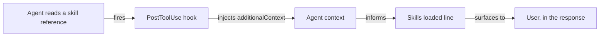

# Skill reference observation

The `skill-visibility` package renders one line at the end of a response:

```text
> 🧩 **Skills loaded:** plan-docs, technical-writing
```

That line was self-reported for its whole life, and it carried the weakness in its own rule text:
an agent that skipped a required reference is exactly the agent that will not report having
skipped it. This document describes the hook that replaced recall with observation, the one
assumption it rests on, and how to re-check that assumption when the harness changes.

## How it works

`globals/packages/skill-visibility/hooks/skill-reference-observer.mjs` runs on `PostToolUse`. When
the read targets a file under a harness skill root's `references/` directory, it writes
`hookSpecificOutput.additionalContext` naming the observed `<skill>/<reference>`. That text lands
in the agent's context mid-turn, and the agent writes the line it already writes — from what it was
told it read, not from what it remembers reading.



Anything else — a read outside a skill root, a `SKILL.md`, a malformed payload — exits 0 with no
output. The hook never blocks, rewrites, or delays a tool call.

`globals/system/hooks/claude/write-guard.mjs` uses the same injection mechanism on
`PreToolUse`, and is the older example of the pattern.

## Match the literal path, never the resolved one

Agents open references through the harness-native directory:

```text
~/.claude/skills/<skill>/references/<file>.md      # what the agent read
~/.roborepo/skills/<skill>/references/<file>.md    # where the file lives
```

The first is a symlink to the second. They name the same file and are different strings, and the
hook must match the first. Calling `realpath` here reports a path the agent never touched, and
would stop matching entirely once installs move. It also throws outright on a path that does not
exist, which would crash the hook on any read of a missing file.

`scripts/test/skill-reference-observer-check.mjs` pins this with a symlink fixture. That case is
the reason the test exists; the happy path alone would pass against a hook that had quietly become
useless.

## Compaction, and why observations are numbered

Injected context is ordinary context. A turn long enough to trigger compaction can summarize these
lines away, and an absent observation is indistinguishable from a reference that was never read —
both are simply not there.

Each injection therefore carries a per-session sequence number:

```text
[skill-visibility] observed reference read: plan-docs/references/plan-schema.md (observation 3 this session)
```

An agent that sees observation 7 without having seen 1–6 knows its earlier observations were
dropped, and reports observation as unavailable rather than computing a tally that would undercount
real reads:

```text
> 🧩 **Skills loaded:** plan-docs, technical-writing — reference observation unavailable (context compacted)
```

A gap is positive evidence. Absence alone is not.

The counter is the only thing this hook persists: one integer per session under
`<stateRoot>/skill-visibility/<session>.count`. No reference name or path is ever written to disk,
and the check asserts that.

## The assumption, and how to re-check it

**The design rests on injected `additionalContext` still being present in the agent's context when
it writes its final message.** If a harness change stops retaining injected context, this line
silently reverts to self-reporting — with no failing test anywhere, because no automated check can
observe it. The assertion is "a live model still had this text in context at the end of its turn",
and the only instrument for that is a live model in a real session.

So it is verified by hand, and the finding carries a date.

### Result

| Checked | Harness | Result |
| --- | --- | --- |
| 2026-08-19 | Claude Code, Opus 5 | **Survived.** Two injections remained readable verbatim after 11 intervening tool calls and roughly 6k tokens of unrelated output |

Not tested: survival across compaction. Injected lines are ordinary context and are expected to be
summarizable away, which is what the sequence numbering exists to detect rather than prevent.

### Procedure

Re-run this after a harness upgrade that touches hook handling or context management.

1. Install the probe into live settings. It is the shipped hook plus a unique token, so a real
   session fires it:

   ```bash
   node scripts/dev/skill-observation-probe/install.mjs
   ```

2. In a Claude Code session, read any installed skill reference, for example
   `~/.claude/skills/plan-docs/references/plan-schema.md`. Confirm the injection appears.

3. Run at least ten unrelated tool calls with substantial output. Real work is fine and preferable.

4. At the end of that same turn, ask whether `PROBETOKEN` is still visible in context. Present and
   verbatim means the assumption holds.

5. Restore settings:

   ```bash
   node scripts/dev/skill-observation-probe/restore.mjs
   ```

6. Record the date, harness version, and result in the table above.

The probe writes each fire to `fired.log` beside itself, so step 2 can be confirmed independently of
what the agent reports seeing.
